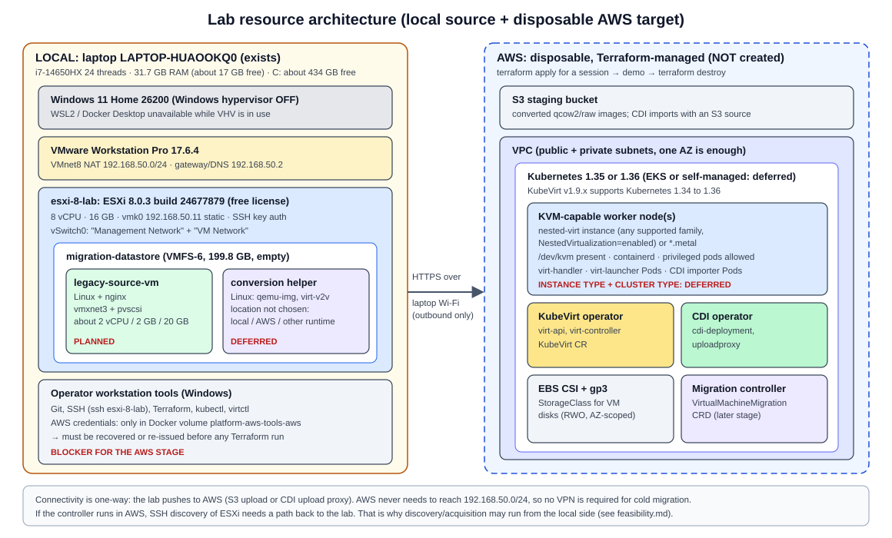

# Project 1.5 architecture (Stage 0 view)

This document ties the Stage 0 material together: the end-to-end architecture, the lab resource architecture (request section 19), and the boundaries between components. It is a design, not a build. **No AWS resources, clusters or VMs were created in Stage 0.**

## 1. End-to-end view

```
SOURCE (local, exists)                     TRANSFER                   DESTINATION (AWS, planned, disposable)
------------------------                   --------                   --------------------------------------
Windows 11 + VMware Workstation 17.6.4                                Terraform-built VPC + Kubernetes cluster
  esxi-8-lab (ESXi 8.0.3, 192.168.50.11)                              (Kubernetes 1.35 or 1.36)
    migration-datastore (VMFS-6)                                        KVM-capable workers (nested-virt EC2 or .metal)
      legacy-source-vm (planned)                                        KubeVirt v1.9 + CDI v1.66.x
        .vmx + .vmdk                                                    EBS CSI (gp3) for VM disks
            |                                                           S3 bucket for image staging
            | discover (SSH + vim-cmd), power off, copy VMDK                  |
            v                                                                |
   conversion (qemu-img / virt-v2v)  --- upload converted image --->  S3 --> CDI DataVolume --> PVC
   location deferred: helper VM on ESXi,                                        |
   or a conversion step in AWS                                                  v
                                                                      KubeVirt VirtualMachine -> VMI -> virt-launcher
                                                                        -> QEMU/KVM -> guest (nginx)
                                                                                |
                                                                      validation (HTTP via Service)
                                                                                |
                                                                      modernization: same nginx content as a
                                                                      container image -> Deployment -> Service
```

Detailed views:

- Layers and owners: [virtualization-fundamentals.md](virtualization-fundamentals.md), 
- KubeVirt internals: [kubevirt-architecture.md](kubevirt-architecture.md)
- Disk path: [cdi-storage-model.md](cdi-storage-model.md)
- Workflow, CRD and demo: [migration-architecture.md](migration-architecture.md)
- State machine: [migration-state-machine.md](migration-state-machine.md)
- Networking: [networking-model.md](networking-model.md)

## 2. Component responsibilities

| Component | Responsibility | Does NOT do |
|---|---|---|
| ESXi source | Runs the legacy VM; exposes SSH for discovery and disk read | Push anything to AWS |
| Migration controller (future) | Owns the `VirtualMachineMigration` state machine; calls actions; writes status | Hypervisor work, disk import internals |
| Conversion worker (future) | Converts VMDK -> qcow2/raw, optionally virt-v2v guest conversion; uploads to staging | Decide phases |
| S3 staging | Holds converted images temporarily | Long-term storage (lifecycle-expire) |
| CDI | Imports the image into a PVC (converts to raw) | Create or start VMs |
| KubeVirt | Runs the VM from the PVC | Import disks, know about VMware |
| EBS CSI | Provisions gp3 volumes for PVCs | Cross-AZ attach, RWX |
| Terraform | Creates and destroys all AWS infrastructure | Day-2 app config (that is GitOps) |

## 3. Lab resource architecture



### Local (exists today, OBSERVED)

| Resource | Value |
|---|---|
| Laptop | Intel i7-14650HX (16 cores / 24 threads), 32 GB RAM, ~434 GB free on C: |
| OS | Windows 11 Home 10.0.26200, Windows hypervisor **off** (so WSL2 and Docker Desktop are unavailable) |
| Hypervisor | VMware Workstation Pro 17.6.4, native CPL0 monitor |
| Network | VMnet8 NAT 192.168.50.0/24, gateway/DNS .2, DHCP .128-.254; avoid .10, .20, .25 (upstream conflict) |
| Nested ESXi | `esxi-8-lab`: 8 vCPU, 16 GB, VHV on, ESXi 8.0.3 build 24677879, 192.168.50.11 static |
| Datastore | `migration-datastore`, VMFS-6, 199.8 GB (198.3 GB free) |
| Source VM | **Not created** (planned `legacy-source-vm`, e.g. 2 vCPU / 2 GB / 20 GB thin) |

Resource budget inside ESXi: 8 vCPU and ~14 GB usable for nested guests. A small source VM plus an optional Linux helper VM for conversion (for example 2 vCPU / 4 GB) fit comfortably (INFERRED).

### Cloud (planned, **not created**, disposable, Terraform only)

| Resource | Proposal (to be decided in a later stage) |
|---|---|
| Region | One region, one AZ for the VM worker (EBS is AZ-scoped) |
| Network | Small VPC, public + private subnets, NAT or VPC endpoints for S3/ECR |
| Cluster | EKS (familiar from Project 1) **or** self-managed kubeadm on EC2. EKS custom launch template support for nested virtualization and the node OS kernel are open questions. |
| Kubernetes version | 1.35 or 1.36 (inside KubeVirt v1.9 support; 1.34 EOL 2026-10-27) |
| VM worker nodes | 1 node with nested virtualization enabled (for example `m8i.xlarge` or `c8i.2xlarge` class) - or `*.metal` if nested virt is not workable |
| System nodes | Small general-purpose node(s) for KubeVirt/CDI control components |
| Storage | EBS CSI driver, `gp3` StorageClass (RWO, `WaitForFirstConsumer`) |
| Staging | S3 bucket, block public access, SSE, lifecycle expiry |
| Access | Short-lived credentials; no long-lived keys in the repo |
| Cost control | Everything created by `terraform apply` and removed by `terraform destroy` after each session; tags on every resource |

**Why disposable:** VM-capable instances cost money every hour; the source of truth is Git + Terraform, so the environment can be rebuilt on demand. Recorded in [ADR 002](../adr/002-aws-disposable-target.md).

### Connectivity

- Lab -> AWS: outbound HTTPS only (S3 upload, or CDI upload proxy through an exposed endpoint). No inbound path to the laptop is needed for cold migration.
- AWS -> lab: none required. VPN is deferred until a use case needs it (for example warm migration or direct VDDK reads, both out of scope).

### Current blockers for the cloud side

1. **AWS credentials** are only in the Docker volume `platform-aws-tools-aws`, which cannot be read while Docker Desktop is down (hypervisor off). They must be recovered or re-issued before any Terraform work.
2. **Conversion host**: conversion tools need Linux. WSL/Docker are unavailable locally while VHV is required. Options: a Linux helper VM on ESXi, or run conversion in AWS. Deferred decision.

## 4. Decisions

| Decision | ADR |
|---|---|
| Local nested ESXi is the migration source | [ADR 001](../adr/001-local-esxi-migration-source.md) |
| AWS is the disposable migration target, Terraform only | [ADR 002](../adr/002-aws-disposable-target.md) |
| Cold migration before warm; no custom warm engine | [ADR 003](../adr/003-cold-before-warm.md) |
| KubeVirt (with CDI) is the VM destination | [ADR 004](../adr/004-kubevirt-vm-destination.md) |
| A custom Kubernetes controller (not scripts) will own the migration workflow | [ADR 005](../adr/005-custom-controller-vs-scripts.md) |
