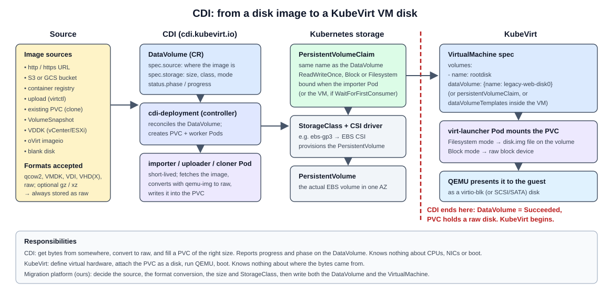

# CDI, disk formats and storage mapping

Stage 0 learning document for request sections 6 (CDI), 7 (VM disk formats) and 16 (storage mapping).

### Versions: observed, not chosen

- Observed on 2026-09-27: the newest CDI release is **v1.66.1** ([CDI releases](https://github.com/kubevirt/containerized-data-importer/releases); also the newest tagged version in the [CDI API reference](https://kubevirt.io/cdi-api-reference/)). The newest KubeVirt release is **v1.9** ([KubeVirt release notes](https://kubevirt.io/user-guide/release_notes/)).
- CDI and KubeVirt are separate projects with separate release trains. The KubeVirt user guide's CDI page installs "the latest CDI release" ([KubeVirt: Containerized Data Importer](https://kubevirt.io/user-guide/storage/containerized_data_importer/)) but, in the sources reviewed, does not publish a KubeVirt-to-CDI compatibility matrix. **We therefore make no claim that any specific CDI/KubeVirt pairing is officially supported.**
- Project principle: **do not hard-code CDI just because it is the latest release at documentation time.** At deployment time, select the CDI release explicitly validated for the chosen KubeVirt/Kubernetes combination, and record the three versions as one **compatibility tuple** (KubeVirt, Kubernetes, CDI). The tuple and the runtime validation gate are defined in [feasibility.md](feasibility.md#3-compatibility-tuple-and-runtime-validation-gate).
- The same page notes that the container runtime may need to be configured to handle device ownership through the security context. That is part of the host-requirements check in [feasibility.md](feasibility.md).

---

## 1. CDI: Containerized Data Importer

### What problem CDI solves

A KubeVirt VM disk is just a PVC. But a new PVC is empty. Something has to put a bootable disk image into it: download it, convert it from qcow2 or VMDK to raw, resize it, and do all that inside the cluster with normal Kubernetes permissions. That is CDI's job.

DOCUMENTED: [CDI README](https://github.com/kubevirt/containerized-data-importer), [KubeVirt user guide: Containerized Data Importer](https://kubevirt.io/user-guide/storage/containerized_data_importer/).

### The core objects

| Object | Owner | What it is |
|---|---|---|
| **PVC** (PersistentVolumeClaim) | Kubernetes | A request for storage of a size, access mode and StorageClass. Bound to a PV provisioned by a CSI driver (for example EBS gp3). |
| **DataVolume** | CDI | A CR that says "create a PVC and fill it from this source". CDI creates the PVC, runs an importer/uploader/cloner Pod, converts the data, and reports progress and phase. |
| **CDI** CR | CDI operator | Install configuration for CDI (like the `KubeVirt` CR). |
| **StorageProfile** | CDI | Per-StorageClass defaults (access mode, volume mode) that CDI uses when a DataVolume does not specify them. |
| **Scratch space** | CDI | A temporary PVC used when data must be downloaded or converted before being written to the target (for example some archive formats or registry imports). |

### Operations

| Operation | DataVolume source | How it works |
|---|---|---|
| **Import** | `http`, `s3`, `gcs`, `registry`, `imageio` (oVirt), `vddk` (VMware) | An importer Pod fetches the image, converts it to raw with qemu-img, and writes it to the PVC. |
| **Upload** | `upload` | CDI creates the PVC and an upload server Pod. A client (`virtctl image-upload`) sends the image through `cdi-uploadproxy` using a token from an `UploadTokenRequest`. |
| **Clone** | `pvc`, `snapshot` | Copy an existing PVC or VolumeSnapshot, using CSI clone, snapshot, or a host-assisted copy. |
| **Blank** | `blank` | Create an empty disk (for data disks, or as the target for a tool that writes the disk itself, which is how MTV's virt-v2v path works). |

Supported input formats: qcow2, VMDK, VDI, VHD, VHDX and raw, optionally xz or gz compressed. **All are converted to raw** on the target PVC. DOCUMENTED: [CDI supported operations](https://github.com/kubevirt/containerized-data-importer/blob/main/doc/supported_operations.md), [DataVolumes](https://github.com/kubevirt/containerized-data-importer/blob/main/doc/datavolumes.md), [Upload](https://github.com/kubevirt/containerized-data-importer/blob/main/doc/upload.md), [Scratch space](https://github.com/kubevirt/containerized-data-importer/blob/main/doc/scratch-space.md).

The `vddk` source can import directly from vCenter/ESXi using VMware's proprietary VDDK library. It needs a credentials Secret, the VM's disk path, the host thumbprint (or a `certConfigMap`), and a VDDK init image that you build yourself (`initImageURL`). It also supports multi-stage (warm) imports using CBT checkpoints and a `finalCheckpoint`. DOCUMENTED: [CDI DataVolumes, VDDK source](https://github.com/kubevirt/containerized-data-importer/blob/main/doc/datavolumes.md). v1.66.1 release notes also add an nbdkit NFC path for vSphere imports. For our free standalone ESXi, the API-based paths are a risk (see [vmware-source-model.md](vmware-source-model.md)).

### DataVolume phases worth knowing

`Pending`, `WaitForFirstConsumer` (the StorageClass binds late, so the PVC waits for a Pod), `ImportScheduled`, `ImportInProgress`, `UploadReady`, `CloneInProgress`, `Paused` (multi-stage import waiting for the next checkpoint), `Succeeded`, `Failed`. `status.progress` is a percentage string.

### A minimal import example (conceptual, not applied)

```yaml
apiVersion: cdi.kubevirt.io/v1beta1
kind: DataVolume
metadata:
  name: legacy-source-vm-disk-0
spec:
  source:
    http:
      url: "https://<staging-bucket-presigned-url>/legacy-source-vm-disk-0.qcow2"
  storage:
    resources:
      requests:
        storage: 20Gi
    storageClassName: gp3
```

### Source -> CDI -> DataVolume -> PVC -> KubeVirt VM disk



```
source disk/image (qcow2 in S3, or uploaded from a laptop)
   |
   v
CDI (controller + importer or upload Pod; qemu-img converts to raw)
   |
   v
DataVolume (CR: source, target size, StorageClass; status.phase + progress)
   |
   v
PVC (bound to a PV from the CSI driver, e.g. EBS gp3; contains disk.img or a raw block device)
   |
   v
KubeVirt VM disk (VM spec: volumes[].dataVolume or persistentVolumeClaim -> disks[].disk.bus: virtio)
```

### Where CDI ends and KubeVirt begins

- **CDI ends** when the DataVolume reaches `Succeeded`. At that point the PVC holds a raw, bootable disk. CDI knows nothing about CPUs, NICs, or whether the guest boots.
- **KubeVirt begins** when a `VirtualMachine` references that PVC or DataVolume as a volume. virt-controller mounts the PVC into the virt-launcher Pod, and QEMU presents it to the guest as a virtio disk.
- The seam is the **PVC**. That is also a nice test boundary for our controller: "import succeeded" and "VM boots" are separate conditions.
- A VM can embed DataVolume templates (`spec.dataVolumeTemplates`) so that creating the VM also creates the DataVolume. For migration we plan to create the DataVolume separately first, so a failed import never leaves a half-created VM.
- With a `WaitForFirstConsumer` StorageClass (EBS gp3 is typically configured that way), the PVC binds only when a consuming Pod is scheduled. CDI's importer Pod counts as that consumer. Otherwise the DataVolume sits in `WaitForFirstConsumer`.

---

## 2. VM disk formats

### VMDK (VMware)

A VMDK is a VMware virtual-disk representation whose **on-disk layout depends on the disk format and the provisioning mode**. Some VMDK layouts use a small text descriptor plus separate extent (data) files; others use a single monolithic sparse file with the descriptor embedded. Do not assume every VMDK has the same file layout.

Several different aspects of a VMware virtual disk are easy to blur together. They are separate things:

| Aspect | What it describes | Examples |
|---|---|---|
| **Descriptor** | Text metadata: disk geometry, adapter type, CID/parentCID, and the list of extents. It can be a separate small `.vmdk` file or embedded inside a sparse extent. | `vm.vmdk` next to `vm-flat.vmdk`; embedded in a `monolithicSparse` file |
| **Extent** | Where the data bytes live. A disk can have one or many extents. | `-flat.vmdk` (flat extent), `-s001.vmdk` ... (split sparse extents) |
| **Layout / subformat** | How descriptor and extents are packaged. | `monolithicSparse` (one growable file), `monolithicFlat` (descriptor + one preallocated flat extent), `twoGbMaxExtentSparse` / `twoGbMaxExtentFlat` (split into 2 GB pieces), `streamOptimized` (compressed, used inside OVA/OVF exports), `vmfs` (ESXi datastore disks: descriptor + `-flat.vmdk`) |
| **Provisioning mode** | How space is allocated on the underlying storage. | Thin, lazy-zeroed thick, eager-zeroed thick on VMFS; growable vs preallocated on Workstation. On VMFS, "thin" is a property of how VMFS allocates blocks for the flat extent, not a different file layout. |
| **Snapshot chain** | Delta disks that record writes after a snapshot and point to a parent via `parentCID` / `parentFileNameHint`. | `vm-000001.vmdk` descriptor + `vm-000001-sesparse.vmdk` (SEsparse, the VMFS-6 default) or `-delta.vmdk` |

Our own lab shows that layouts differ:

- The **Workstation-hosted ESXi VM's boot disk** (`esxi-8-lab.vmdk`, 100 GiB) and its data disk are **thin/growable `monolithicSparse` VMware Workstation VMDKs**: one file each, descriptor embedded, only ~0.65 GB and ~0.04 GB allocated (OBSERVED, [handoff section 6](../project-context/project1-5-context-handoff.md)).
- A VM created **on ESXi's VMFS-6 datastore** (the future `legacy-source-vm`) will most likely get the ESXi layout: a descriptor `.vmdk` plus a `-flat.vmdk` extent, thin-provisioned by VMFS (INFERRED; to be observed when the VM exists).

Migration impact:

- Discovery must record the **actual** layout, provisioning mode and snapshot chain from the descriptor, not assume one.
- Copying only a descriptor, or only a delta, produces an unusable disk. Copy the whole chain or consolidate first.
- Tools: `vmkfstools` on ESXi clones between VMDK types. qemu-img reads the common VMDK subformats ([QEMU disk images](https://www.qemu.org/docs/master/system/images.html)) and `qemu-img info --backing-chain` shows what it sees.

### QCOW2 (QEMU copy-on-write v2)

- QEMU's native format. Allocates space on demand (thin by nature), supports internal snapshots, compression, encryption, and **backing files**.
- A backing file is a read-only base image. The qcow2 overlay stores only changed clusters. Chains can be several levels deep.

### RAW

- A byte-for-byte image of the disk. No metadata, no features, fastest and simplest.
- It can still be **sparse** at the filesystem level: unwritten regions are "holes" that take no space on disk.
- CDI stores imported disks as raw (a `disk.img` file on a filesystem PVC, or directly on a block-mode PVC).

### Concepts

| Concept | Meaning | Migration impact |
|---|---|---|
| **Thin provisioning** | Allocate storage as it is written, not up front. | A 40 GB thin VMDK with 3 GB written should move as ~3 GB, not 40 GB. |
| **Sparse disk** | A file with holes. Reported size > allocated size. | Copy tools must preserve holes (`qemu-img convert -S`, `cp --sparse`), or the transfer and target grow to full size. |
| **Snapshot** | Point-in-time state, usually as a delta on top of a base. | A VM with snapshots has a chain. We must flatten (consolidate) or read the right leaf. virt-v2v's `-i vmx` over SSH does not support snapshots. |
| **Backing file** | Base image that an overlay depends on. | Never copy only the overlay. `qemu-img info --backing-chain` shows the chain. |
| **Conversion** | Changing the container format (VMDK -> qcow2/raw). | Changes the format only. It does **not** change the guest's drivers. |

### The tools, and what each one is for

| Tool | What it does | What it does not do |
|---|---|---|
| **qemu-img** | Inspect, create, convert, check and resize images. `qemu-img info`, `qemu-img convert -f vmdk -O qcow2 -S 4k in.vmdk out.qcow2`, `qemu-img check` (qcow2/vmdk), `qemu-img rebase` (qcow2/qed overlays). CDI uses it internally. | Does not look inside the guest. Does not change drivers or config. |
| **libguestfs** | A library (and tools like `guestfish`, `virt-inspector`, `virt-customize`) that opens a disk image in a small appliance VM and safely reads or edits files inside the guest filesystem. | Not a converter by itself. Needs a Linux host. |
| **virt-v2v** | Built on libguestfs. Converts a **whole guest** from VMware (or others) to run on KVM: copies disks, installs virtio drivers (Windows) or ensures virtio modules in the initramfs (Linux), removes VMware Tools, fixes bootloader and fstab device names, and writes output for libvirt, local disk, or KubeVirt. | Does not migrate live. Its VMware inputs need either the guest shut down (`-i vmx`) or VDDK/NFC access. |

DOCUMENTED: [qemu-img](https://www.qemu.org/docs/master/tools/qemu-img.html), [libguestfs](https://libguestfs.org/), [virt-v2v(1)](https://libguestfs.org/virt-v2v.1.html), [virt-v2v-input-vmware(1)](https://libguestfs.org/virt-v2v-input-vmware.1.html).

virt-v2v VMware input modes relevant to us ([virt-v2v-input-vmware](https://libguestfs.org/virt-v2v-input-vmware.1.html)):

| Mode | Needs | Fits our free, standalone ESXi? |
|---|---|---|
| `-i vmx -it ssh` (read `.vmx` and disks over SSH) | SSH to ESXi, guest shut down, no snapshots | **Likely yes.** SSH works today. To be validated. |
| `-ic vpx://` (vCenter) | vCenter | No (no vCenter). |
| `-ic esx:// -it vddk` | VMware VDDK (proprietary download) + API access | Unlikely (free-edition API is unsupported / read-only). |
| `-i ova` | An exported OVA | Possible, if we export an OVA manually. |

**Format conversion is not guest conversion.** `qemu-img convert` of a VMware Linux guest to raw gives you a disk KubeVirt can attach. Whether it boots on virtio depends on the guest's initramfs. Modern Linux distributions usually include virtio drivers, so a qemu-img-only path may work for a simple Linux VM. virt-v2v makes it reliable. Stage 0 does not choose between them. It records both as candidates to test.

---

## 3. Storage mapping

### The chain

```
VMware datastore (VMFS-6 "migration-datastore")
   |
   v
extracted disk (all files of the VM's VMDK, e.g. descriptor + extent(s), VM powered off, no snapshot chain)
   |
   v
image conversion (qemu-img or virt-v2v -> qcow2 or raw; guest drivers fixed if virt-v2v)
   |
   v
DataVolume (CDI imports/uploads it)
   |
   v
PVC (StorageClass gp3 -> EBS volume)
   |
   v
VM disk (virtio disk in the KubeVirt VirtualMachine)
```

### Concept mapping

| VMware | Kubernetes / KubeVirt | Notes |
|---|---|---|
| Datastore (VMFS, shared across hosts) | StorageClass (a template for provisioning volumes) | A StorageClass is not a pool you browse. It is a policy that creates one volume per claim. |
| VMDK | PVC (+ the PV behind it) | One virtual disk = one PVC. |
| Disk provisioning (thin/thick) | StorageClass parameters, PVC size, sparse raw | |
| Storage policy (SPBM) | StorageClass parameters (type, IOPS, encryption) | |
| Shared datastore (enables vMotion) | Access mode `ReadWriteMany` | EBS gp3 is `ReadWriteOnce` and bound to one AZ. No live migration between nodes with EBS alone. |
| Datastore browser upload | CDI upload / DataVolume import | |

### Why storage mapping is a first-class migration concern

- **Capacity and sparseness**: the target must fit the provisioned size, and the transfer should move only allocated data.
- **Access mode and volume mode**: RWO vs RWX, Filesystem vs Block. These decide whether live migration is possible later and how CDI writes the disk.
- **Topology**: EBS volumes live in one Availability Zone, so the VM can only run on nodes in that AZ.
- **Performance class**: a database VM on a fast VMFS LUN should not land on the slowest StorageClass.
- **Multiple disks**: each source disk maps to its own DataVolume/PVC, and the boot disk and order must be preserved.
- **Cost and cleanup**: staging copies (S3, scratch PVCs) must be deleted after success.

This is why MTV has a dedicated `StorageMap` object, and why our CRD has a `spec.storage` section (see [migration-architecture.md](migration-architecture.md)).
