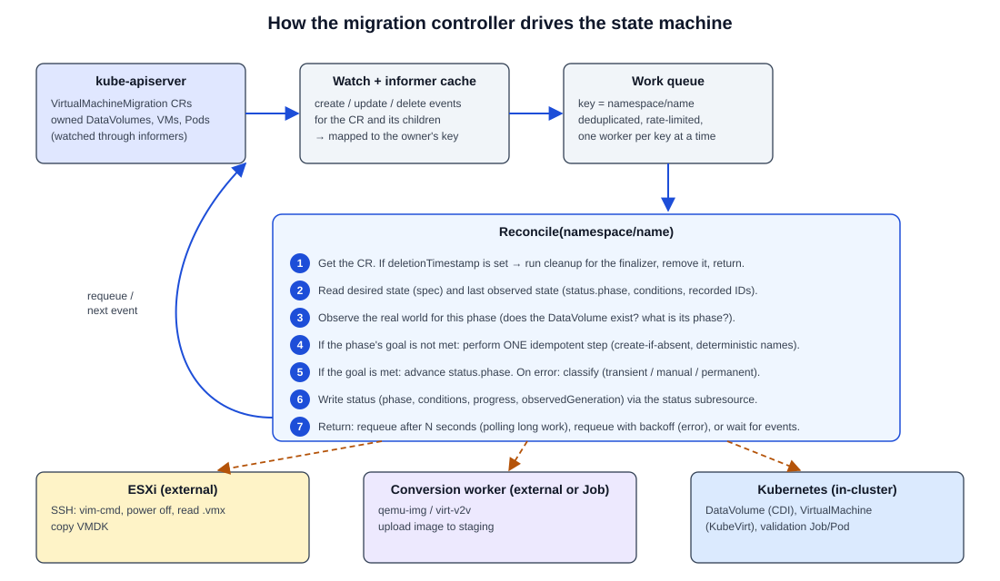

# CRDs and controllers from first principles

Stage 0 learning document for request sections 5 (KubeVirt CRDs) and 14 (controller / operator model). Nothing in this document is implemented yet.

References: [Custom resources](https://kubernetes.io/docs/concepts/extend-kubernetes/api-extension/custom-resources/), [Extend the Kubernetes API with CRDs](https://kubernetes.io/docs/tasks/extend-kubernetes/custom-resources/custom-resource-definitions/), [Controllers](https://kubernetes.io/docs/concepts/architecture/controller/), [Operator pattern](https://kubernetes.io/docs/concepts/extend-kubernetes/operator/), [Finalizers](https://kubernetes.io/docs/concepts/overview/working-with-objects/finalizers/), [Owners and dependents](https://kubernetes.io/docs/concepts/overview/working-with-objects/owners-dependents/), [API conventions: spec and status](https://github.com/kubernetes/community/blob/master/contributors/devel/sig-architecture/api-conventions.md#spec-and-status).

---

## 1. The vocabulary

| Term | Meaning |
|---|---|
| **Resource** | A kind of object the Kubernetes API serves, such as `pods` or `deployments`. |
| **CRD** (CustomResourceDefinition) | An object that tells the API server "serve a new resource type with this group, version, kind and OpenAPI schema". After you apply a CRD, the API server stores and validates objects of that type in etcd, exactly like built-in types. |
| **Custom Resource (CR)** | One object of a CRD-defined type, for example one `VirtualMachine` named `legacy-source-vm`. |
| **Controller** | A loop that watches objects and acts to make the real world match what they ask for. A CRD on its own only stores data. Without a controller, nothing happens. |
| **Operator** | A controller (or set of controllers) that encodes operational knowledge for one application, usually installed with its own CRDs. virt-operator is one. |
| **Desired state** | What the user wants. Lives in `spec`. Written by users. |
| **Observed state** | What the controller last saw in reality. Lives in `status`. Written only by the controller, through the **status subresource**. |
| **Reconcile loop** | The function the controller runs for one object: read desired state, observe actual state, take one step to close the gap, record status, repeat. |
| **Conditions** | A list in `status` of typed booleans with reasons, for example `type: Ready, status: "False", reason: ImportInProgress`. Machines and humans read them. |
| **Finalizer** | A string in `metadata.finalizers`. While it is present, a delete request only sets `metadata.deletionTimestamp`. The object stays until the controller finishes cleanup and removes the finalizer. |
| **Owner reference** | A pointer from a child object to its parent. When the parent is deleted, garbage collection deletes the children. |

## 2. A very small example first

Imagine a CRD for a greeting web page. The user writes only the desired state:

```yaml
apiVersion: demo.example/v1
kind: Greeting
metadata:
  name: hello
spec:
  message: "Hello from the lab"
  replicas: 2
```

A controller for `Greeting` would:

1. **Watch** `Greeting` objects and the `Deployment`s and `ConfigMap`s it creates.
2. On any event, **reconcile** `hello`:
   - Does a `ConfigMap` named `hello` with this message exist? If not, create it. If it differs, update it.
   - Does a `Deployment` named `hello` with 2 replicas mounting that ConfigMap exist? If not, create it.
   - Set owner references so deleting the `Greeting` deletes both children.
3. **Write status:**

```yaml
status:
  observedGeneration: 3
  readyReplicas: 2
  conditions:
  - type: Ready
    status: "True"
    reason: DeploymentAvailable
    lastTransitionTime: "2026-09-27T10:00:00Z"
```

If someone deletes the Deployment by hand, the watch fires and the next reconcile recreates it. That is the core idea: **the controller does not run a script once; it keeps converging reality to the spec.**

## 3. KubeVirt's CRDs are the same idea

- `VirtualMachine` is a CR. Its controller (inside virt-controller) watches it and creates or deletes a `VirtualMachineInstance` to match `spec.runStrategy`.
- `VirtualMachineInstance` is a CR. Its controller creates a virt-launcher Pod. virt-handler, a node-level controller, makes the libvirt domain match the VMI.
- Status flows back up: domain state -> VMI `status.phase` -> VM `status.printableStatus` and conditions.
- KubeVirt also uses CRDs for `KubeVirt` (install config), `VirtualMachineInstanceMigration` (live migration), `VirtualMachineSnapshot`, instance types and preferences. CDI adds `DataVolume`, `CDI`, `StorageProfile` and others.

See [kubevirt-architecture.md](kubevirt-architecture.md).

## 4. Why the migration platform should be a Kubernetes-native controller, not scripts

A migration is long-running (minutes to hours), multi-step, and touches external systems (ESXi, object storage, CDI, KubeVirt). Things fail halfway.

| Concern | Collection of scripts | Kubernetes-native controller |
|---|---|---|
| Where is the state? | In a terminal, a log file, or a person's head | In the CR's `status`, stored in etcd, visible with `kubectl get` |
| Crash halfway | Re-run and hope; may duplicate work | Reconcile resumes from the recorded phase |
| Retries | Hand-written loops | Built into the work queue with rate limiting and backoff |
| Concurrency | Two people can run the same script | One object key is processed by one worker at a time |
| Audit / history | Whatever was logged | Conditions, Kubernetes Events, timestamps |
| Access control | SSH keys and shell access | Kubernetes RBAC on the CR |
| Declarative / GitOps | No | The migration request is YAML in Git |
| Cleanup | Manual | Finalizers and owner references |
| Integration | Custom | Watches DataVolume / VM status natively |

Scripts are still useful. They are how we will learn each step by hand in early stages, and they can become the "actions" the controller calls. The decision is recorded in [ADR 005](../adr/005-custom-controller-vs-scripts.md).

---

## 5. The controller model in detail



### Watch

The controller uses informers: a long-lived watch against the API server plus a local cache. It watches the primary type (`VirtualMachineMigration`) and the secondary types it creates (`DataVolume`, `VirtualMachine`, Jobs). Events on a child are mapped back to the owner's key through owner references.

### Queue

Events do not call the reconcile function directly. They put a key (`namespace/name`) on a work queue. The queue:

- **deduplicates**: ten events for the same object become one reconcile;
- **serializes per key**: one object is never reconciled by two workers at once;
- **rate-limits and backs off**: failed keys are retried with increasing delay.

### Reconcile

`Reconcile(namespace/name)` must be written as "look at the world, do the next step", never as "remember what I did last time in memory". It may be called at any moment, any number of times, including after a controller restart.

### Desired vs observed state

- Desired: the `spec` (which VM, which destination namespace, which StorageClass, which network mapping).
- Observed: `status` plus what the controller can see right now (does the DataVolume exist, what is its phase).

### Idempotency

Calling reconcile twice must have the same effect as calling it once. Techniques:

- **Deterministic names** for everything the controller creates (for example `DataVolume` = `<migration-name>-disk-0`). Before creating, check whether it already exists.
- **Create-if-absent / update-if-different** instead of "create".
- **Record external IDs in status** before moving on (for example the staged image URL and checksum).
- **Check the external state before acting** (is the source VM already powered off? is the image already uploaded?).
- **Advance the phase only after the step's outcome is observed**, and write the new phase in the same status update as the evidence for it.

### Retries

- **Transient** errors (network timeout, API conflict, ESXi busy): return an error or requeue with backoff. Phase stays the same, and a counter in status tracks attempts.
- **Retryable-but-bounded** errors (conversion failed once): move to a `Retryable` state with a retry budget.
- **Permanent** errors (unsupported guest OS, source VM missing): stop and mark `Failed` or `ManualInterventionRequired` with a clear reason.

### Conditions

Conditions summarize state for humans and tools independently of the phase, for example:

| Type | Meaning |
|---|---|
| `SourceDiscovered` | Inventory read successfully |
| `Validated` | Pre-flight checks passed |
| `DiskConverted` | Converted image exists and checksum recorded |
| `DiskImported` | DataVolume `Succeeded` |
| `VMCreated` | `VirtualMachine` exists |
| `GuestReady` | Guest booted and validation passed |
| `Ready` | Whole migration done |

Each condition has `status`, `reason`, `message`, `lastTransitionTime` and `observedGeneration`, following [Kubernetes API conventions](https://github.com/kubernetes/community/blob/master/contributors/devel/sig-architecture/api-conventions.md#typical-status-properties).

### Finalizers

Our CR would carry a finalizer such as `migration.platform.example/cleanup`. If a user deletes a migration halfway, the controller gets a chance to delete staging images, conversion Jobs and half-imported DataVolumes before the object disappears. Finalizer names must be qualified (domain-prefixed). The controller must never touch the source VM during cleanup, other than returning it to its original power state if the spec asked for that.

## 6. Mapping the state machine onto reconciliation

```
VirtualMachineMigration CR
        |
        v
   controller (Reconcile)
        |
        v
   read status.phase  ---------------------------+
        |                                        |
        v                                        |
   external action for that phase               |
   (idempotent, one step)                        |
        |                                        |
        v                                        |
   observe result                                |
   (DataVolume phase, Job status, ESXi state)    |
        |                                        |
        v                                        |
   update status (phase, conditions, progress)   |
        |                                        |
        v                                        |
   reconcile again (requeue / watch event) ------+
```

Example for the `Importing` phase:

1. Phase is `Importing`.
2. Ensure DataVolume `<name>-disk-0` exists (create if absent, with an owner reference).
3. Read its `status.phase` and `status.progress`.
4. If `ImportInProgress`: copy progress into our status and requeue in 30 seconds.
5. If `Succeeded`: set condition `DiskImported=True` and phase `CreatingVM`.
6. If `Failed`: classify the error. Either set `Retryable` (delete and recreate the DataVolume within budget) or `Failed`.

The full state machine is in [migration-state-machine.md](migration-state-machine.md).
