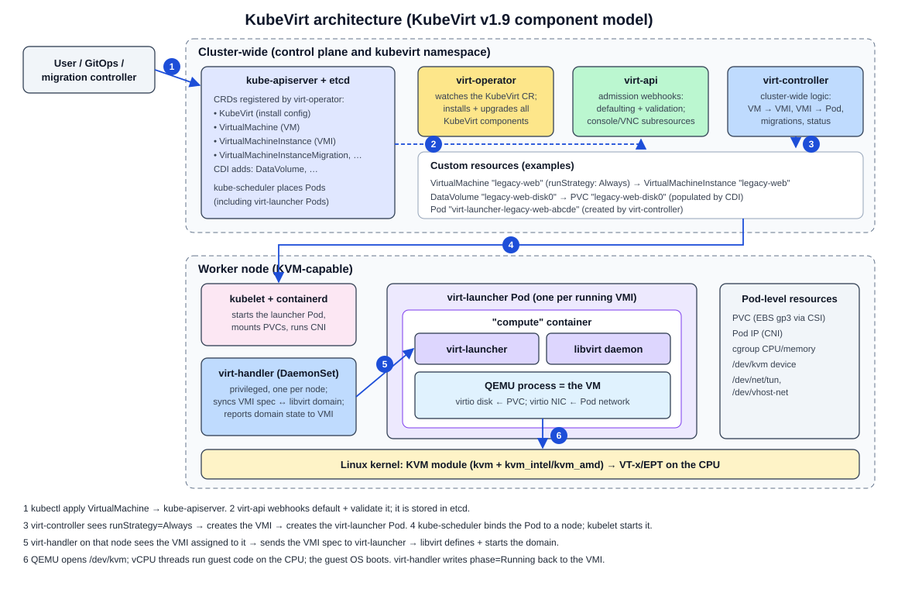

# KubeVirt architecture

Stage 0 learning document for request section 4. Version-sensitive facts come from current official sources, checked on 2026-09-27.

## Current version facts

| Item | Current fact (2026-09-27) | Source |
|---|---|---|
| KubeVirt release | v1.9 (released July 2026) | [KubeVirt release notes](https://kubevirt.io/user-guide/release_notes/), [kubevirt/kubevirt releases](https://github.com/kubevirt/kubevirt/releases) |
| Kubernetes support | v1.9 is built for Kubernetes 1.36 and also supported on the previous two minors (1.35, 1.34) | [KubeVirt support matrix](https://github.com/kubevirt/sig-release/blob/main/releases/k8s-support-matrix.md), [kubernetes-compatibility.md](https://github.com/kubevirt/kubevirt/blob/main/docs/kubernetes-compatibility.md) |
| Kubernetes releases | 1.37 is the newest upstream minor; 1.34 reaches end of life 2026-10-27 | [kubernetes.io/releases](https://kubernetes.io/releases/) |
| EKS | Standard support for 1.36, 1.35, 1.34 | [EKS Kubernetes versions](https://docs.aws.amazon.com/eks/latest/userguide/kubernetes-versions.html) |

INFERRED: for Stage 1, target Kubernetes **1.35 or 1.36** with KubeVirt **v1.9**. Avoid 1.34 (EOL next month) and 1.37 (not yet in the KubeVirt v1.9 support window).

## The big picture



KubeVirt extends Kubernetes with three things ([KubeVirt architecture](https://kubevirt.io/user-guide/architecture/)):

1. **New types** (CRDs) such as `VirtualMachine` and `VirtualMachineInstance`.
2. **Cluster-wide controllers** for those types (virt-controller).
3. **Node daemons** for node-specific work (virt-handler).

Scheduling, networking and storage are delegated to Kubernetes. KubeVirt only adds virtualization. All KubeVirt components run as Pods on the cluster; they are not installed on the hosts like a package.

## Components

| Component | Kind | Runs where | What it does |
|---|---|---|---|
| **virt-operator** | Deployment | Control-plane / infra nodes | Installs, upgrades and removes the rest of KubeVirt. It watches the `KubeVirt` custom resource. |
| **`KubeVirt` CR** | Custom resource (one per cluster, usually `kubevirt/kubevirt`) | API server | The install configuration: feature gates, node placement (`.spec.infra.nodePlacement`, `.spec.workloads.nodePlacement`), `useEmulation`, and so on. |
| **virt-api** | Deployment | Infra nodes | Serves KubeVirt's API pieces: defaulting and validating admission webhooks for VMs/VMIs, and subresources such as `start`, `stop`, `restart`, `console`, `vnc`, `migrate`. |
| **virt-controller** | Deployment | Infra nodes | Cluster-wide reconciliation: VM -> VMI, VMI -> virt-launcher Pod, migrations, and similar. |
| **virt-handler** | DaemonSet (privileged) | Every node that can run VMs | Watches VMIs assigned to its node, tells virt-launcher to define and start the libvirt domain, keeps domain state and VMI status in sync, sets up node-level networking and devices, and advertises `/dev/kvm` as a node resource. |
| **virt-launcher** | One Pod per running VMI | The node the scheduler chose | Its `compute` container runs the virt-launcher process, a private libvirtd, and the QEMU process for that one VM. |
| **libvirt** | Daemon inside virt-launcher | Per VM | Receives domain XML (generated from the VMI) and manages the QEMU process. |
| **QEMU** | Process inside virt-launcher | Per VM | Emulates the machine and devices. Uses KVM for CPU/memory virtualization. |
| **KVM** | Kernel module | Node kernel | Hardware-accelerated execution through `/dev/kvm`. |

References: [KubeVirt architecture](https://kubevirt.io/user-guide/architecture/), [components.md](https://github.com/kubevirt/kubevirt/blob/main/docs/components.md), [KubeVirt installation](https://kubevirt.io/user-guide/cluster_admin/installation/).

## VirtualMachine vs VirtualMachineInstance

This is the most important distinction to learn.

| | `VirtualMachine` (VM) | `VirtualMachineInstance` (VMI) |
|---|---|---|
| Analogy | A StatefulSet with `replicas: 1`, or the VM in vCenter inventory | A Pod, or "the VM while it is powered on" |
| Lifetime | Persistent. Exists while stopped. | Ephemeral. Created when the VM starts, deleted when it stops. |
| Holds | `spec.template` (what a VMI should look like) and `spec.runStrategy` (whether one should exist) | The concrete running spec, plus live status: phase, node, interfaces, guest info |
| Created by | You, GitOps, or our migration controller | virt-controller, from the VM template |
| Status field of interest | `status.printableStatus` (Stopped, Provisioning, Starting, Running, Paused, Migrating, Stopping, Terminating, Unknown, ...) | `status.phase` (Pending, Scheduling, Scheduled, Running, Succeeded, Failed, ...) |

`spec.runStrategy` values ([Run Strategies](https://kubevirt.io/user-guide/compute/run_strategies/)):

- **Always**: keep a VMI running; recreate it if it stops for any reason.
- **RerunOnFailure**: recreate only after an uncontrolled failure (for example a node crash), not after a guest-initiated shutdown.
- **Manual**: the system does nothing automatically; you use `virtctl start` / `stop`.
- **Halted**: make sure no VMI is running.

You can also create a bare VMI without a VM. It will not be restarted if it stops. For migration we will always create a `VirtualMachine`, because a migrated server must survive restarts.

## Lifecycle: from `kubectl apply` to a running guest

```
kubectl apply -f vm.yaml
  |
  v
kube-apiserver  -- virt-api webhooks default + validate the VirtualMachine -->  stored in etcd
  |
  v
VirtualMachine CR (runStrategy: Always)
  |  virt-controller watches VMs; sees "should run, no VMI exists"
  v
VirtualMachineInstance CR (owner reference -> VM)
  |  virt-controller watches VMIs; renders a virt-launcher Pod spec
  |  (requests: CPU, memory + overhead, devices.kubevirt.io/kvm; volumes: PVCs; network: pod network / Multus)
  v
virt-launcher Pod  -- kube-scheduler picks a node; kubelet starts the Pod; CNI wires the network; CSI mounts the PVC
  |  virt-controller records the node on the VMI; virt-handler on that node takes over
  v
virt-handler  -- converts the VMI into libvirt domain XML and asks virt-launcher to define + start it
  |
  v
libvirtd (in the Pod)  -- starts QEMU with the right devices
  |
  v
QEMU  -- opens /dev/kvm, creates vCPU threads, loads firmware
  |
  v
KVM  -- runs guest code on the CPU with VT-x/EPT
  |
  v
guest OS boots (bootloader -> kernel -> initramfs -> systemd -> nginx)
  |
  v
virt-handler reports status back: VMI phase Running, IPs (from the guest agent if installed); VM printableStatus Running
```

Stopping reverses this: set `runStrategy: Halted` (or `virtctl stop`), virt-controller deletes the VMI, the guest receives an ACPI shutdown, the Pod terminates, and the VM object remains with `printableStatus: Stopped`.

## Installation requirements that matter to us

DOCUMENTED in [KubeVirt installation](https://kubevirt.io/user-guide/cluster_admin/installation/):

- A Kubernetes cluster on one of the latest three releases supported by the KubeVirt version.
- The API server must allow privileged containers (`--allow-privileged=true`), because virt-handler and parts of virt-launcher need privileges.
- A supported container runtime: containerd or CRI-O.
- Hardware virtualization on the nodes. `virt-host-validate qemu` checks for `/dev/kvm`, `/dev/vhost-net` and `/dev/net/tun`.
- If there is no hardware virtualization, software emulation can be enabled (`useEmulation`). This is slow and only suitable for testing.
- Host kernel note: virt-launcher images are built on an Enterprise Linux (CentOS Stream) userland. The documentation recommends host kernels compatible with that userland. INFERRED risk: Amazon Linux 2023 or Bottlerocket nodes are not EL, so this must be validated in Stage 1 (see [feasibility.md](feasibility.md)).

Nothing here was installed in Stage 0.
