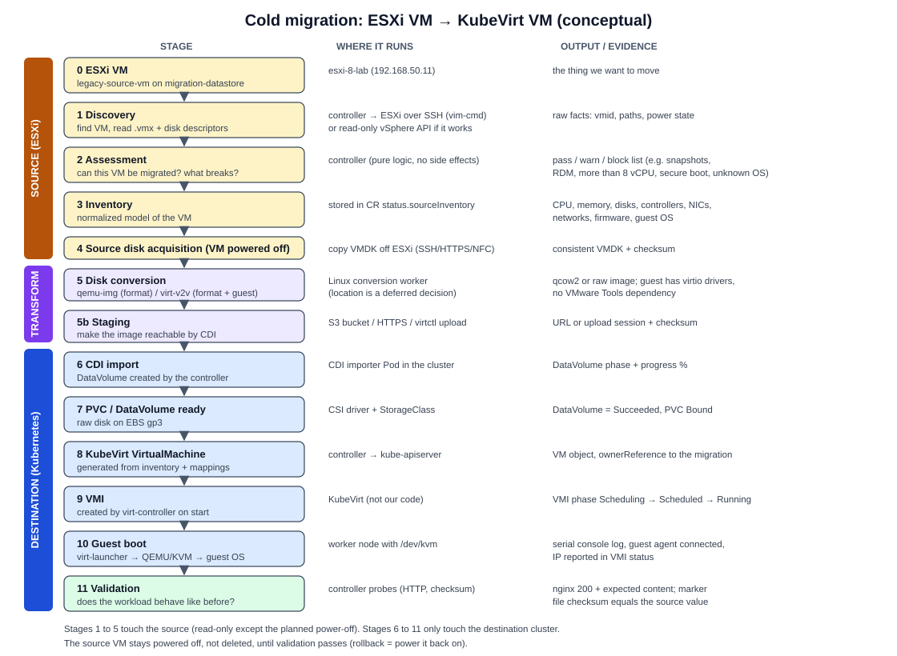

# Migration architecture

Stage 0 learning and design document for request sections 9 (migration flow), 10 (cold vs warm), 11 (MTV / Forklift), 12 (custom migration CRD) and 18 (first demonstration). Everything here is **conceptual**. Nothing is implemented.

---

## 1. VMware -> KubeVirt migration flow



```
ESXi VM
  -> discovery
  -> assessment
  -> inventory
  -> source disk acquisition
  -> disk conversion
  -> CDI import
  -> PVC / DataVolume
  -> KubeVirt VirtualMachine
  -> VMI
  -> guest boot
  -> validation
```

| # | Stage | What happens | Output | Key risk |
|---|---|---|---|---|
| 0 | **ESXi VM** | The source exists and runs its workload. | - | - |
| 1 | **Discovery** | Connect to ESXi (SSH + `vim-cmd`, read `.vmx`) and find the VM by name or UUID. | Raw facts | Wrong VM selected; free-edition API limits |
| 2 | **Assessment** | Check whether the VM is migratable: supported guest OS, firmware (BIOS/UEFI), no snapshots, no RDM or shared disks, no passthrough devices, disk sizes fit the target, network mapping exists. | Pass / warnings / blockers | Silent incompatibility discovered only at boot |
| 3 | **Inventory** | Normalize facts into a stable record (identity, CPU, memory, disks, controllers, NICs, networks, guest, power). | `status.sourceInventory` | Inventory drifts if the VM changes during migration |
| 4 | **Source disk acquisition** | Power off the VM (cold), confirm it is off, then copy every file that makes up each VMDK (the layout varies: descriptor + extent(s), or one sparse file) off the datastore, preserving sparseness and recording checksums. | Disk files + checksums | Copying a running disk gives an inconsistent image |
| 5 | **Disk conversion** | Convert VMDK to qcow2 or raw (qemu-img), and optionally convert the guest for KVM (virt-v2v: virtio drivers, remove VMware Tools, fix fstab/bootloader). | Converted image | Guest does not boot on virtio |
| 5b | **Staging** | Put the converted image where CDI can reach it: an S3 bucket (presigned URL) or a direct upload through `cdi-uploadproxy`. | Image URL or upload | Transfer size and time over the laptop uplink |
| 6 | **CDI import** | Create a DataVolume that imports or receives the image into a new PVC. | DataVolume | Scratch space, StorageClass, quota |
| 7 | **PVC / DataVolume** | Wait for `Succeeded`. The PVC now holds a raw bootable disk. | Bound PVC | Import failures, wrong size |
| 8 | **KubeVirt VirtualMachine** | Translate the inventory into a `VirtualMachine`: CPU, memory, firmware, virtio disks from the PVCs, interfaces mapped to destination networks. | `VirtualMachine` | Wrong firmware or bus type |
| 9 | **VMI** | Set `runStrategy` so virt-controller creates the VMI and virt-launcher Pod. | Running VMI | Scheduling (no `/dev/kvm`, not enough memory) |
| 10 | **Guest boot** | Firmware -> bootloader -> kernel -> initramfs (needs virtio modules) -> systemd. | Guest up | Kernel panic: cannot find root device |
| 11 | **Validation** | Check VMI `Running`, guest agent connected (if installed), IP present, and application-level checks (for example `curl` nginx returns HTTP 200 and the expected content). | Pass / fail | "Running" but app is broken |

After validation, a real migration has **cutover** (point DNS/traffic to the new VM) and **decommission** (remove or archive the source). In our lab the source is left powered off, not deleted, so we can roll back.

### Stages are reconciliation checkpoints, not a script

The table reads like a sequence, but the controller does **not** execute it as a procedural script. **The migration state machine represents declarative reconciliation checkpoints.** For each stage the controller holds a *desired state* ("a valid converted artifact exists"), re-reads the *observed state* on every reconcile (absent / partial / complete / failed), takes whatever idempotent action closes the gap (start, resume, clean up and retry, or nothing), records phase, conditions, progress and errors, and reconciles again. `status.phase` is the controller's current reconciliation state, not a log of what already ran. This is what gives the platform **idempotency**, **resumability** and **retry safety**. Details and per-phase examples: [migration-state-machine.md](migration-state-machine.md#1-reconciliation-checkpoints-not-a-procedural-script).

---

## 2. Cold vs warm migration

| Term | Meaning |
|---|---|
| **Cold migration** | Power off the source, copy all disks, start the target. Simple and consistent. Downtime = whole copy + conversion + boot. |
| **Warm migration** | Copy disks while the source keeps running, then repeatedly copy only the changed blocks, then briefly power off for a final delta copy and start the target. Downtime = final delta + conversion + boot. |
| **Precopy** | The warm-migration phase that copies data while the source runs. |
| **CBT (Changed Block Tracking)** | A VMware feature that tracks which disk blocks changed since a given point (a "change ID"). Warm migration asks for "blocks changed since the last snapshot" instead of copying everything again. Needs API access and snapshots. |
| **Cutover** | The moment you stop the source and switch to the target. In warm migration it triggers the final delta copy. |

### How MTV does warm migration (industry reference)

DOCUMENTED in [MTV 2.11: Planning your migration](https://docs.redhat.com/en/documentation/migration_toolkit_for_virtualization/2.11/html-single/planning_your_migration_to_red_hat_openshift_virtualization/index):

- Precopy: MTV creates VM snapshots and copies changed data using CBT. A new snapshot is taken every `controller_precopy_interval` minutes (default **60**).
- A VM supports up to **28 CBT snapshots**. If the limit is reached and MTV cannot create a new snapshot, warm migration may fail.
- Cutover: the VM is shut down and the remaining data is copied. **Data in RAM is not migrated.** Cutover can be started manually or scheduled in the `Migration` CR.
- The guest is converted (virt-v2v) during cutover.

### Our constraints and decision

- The free ESXi edition does not support API management and may be read-only, so **snapshot creation and CBT through the API are expected not to work** (INFERRED from [Broadcom KB 399823](https://knowledge.broadcom.com/external/article/399823); to validate only if warm migration is ever attempted).
- No vCenter.
- One small Linux VM with nginx. Minutes of downtime are acceptable in a lab.

**Our first real migration is COLD.** Warm migration stays **theory and industry reference only**. We do **not** design a custom warm-migration engine. Recorded in [ADR 003](../adr/003-cold-before-warm.md).

---

## 3. MTV / Forklift as the industry reference

**Red Hat Migration Toolkit for Virtualization (MTV)** is the supported product. **Forklift** ([kubev2v/forklift](https://github.com/kubev2v/forklift)) is the upstream open-source project. Current MTV is **2.11**, which runs on **Red Hat OpenShift** (4.19-4.21) with OpenShift Virtualization (Red Hat's KubeVirt distribution). DOCUMENTED: [MTV 2.11 planning guide](https://docs.redhat.com/en/documentation/migration_toolkit_for_virtualization/2.11/html-single/planning_your_migration_to_red_hat_openshift_virtualization/index), [MTV 2.11: Migrating your VMs](https://docs.redhat.com/en/documentation/migration_toolkit_for_virtualization/2.11/html/migrating_your_virtual_machines_to_red_hat_openshift_virtualization/assembly_migrating-from-rhv_mtv).

### What problem MTV solves

Moving **many** VMs from VMware vSphere, RHV, OpenStack, OVA or another OpenShift cluster into OpenShift Virtualization, repeatably and at scale: discovering source inventory, validating VMs, mapping networks and storage, converting guests, copying disks (cold or warm), creating the target VMs, and tracking progress per VM.

### MTV custom resources

| CR | Role |
|---|---|
| **Provider** | A connection to a source or destination platform. For VMware: URL, credentials Secret, and `sdkEndpoint: vcenter` or `esxi`. |
| **Inventory** (a service, not a CR) | Continuously reads provider inventory (VMs, networks, datastores) and serves it to the UI and to validation. |
| **NetworkMap** | Maps source networks (port groups) to destination networks (pod network or a Multus NAD). |
| **StorageMap** | Maps source datastores to destination StorageClasses. |
| **Plan** | Which VMs to migrate, from which Provider to which, using which maps, into which `targetNamespace`, cold or `warm`, plus options such as `preserveStaticIPs` and `skipGuestConversion` (raw copy mode, no virt-v2v). |
| **Migration** | Runs a Plan. Holds per-VM progress. For warm migration it holds the `cutover` time. |
| **Hook** | Optional custom code (an Ansible playbook in a container) run before or after migration. |

MTV services: an **Inventory** service, a **Validation** service (rules in the `forklift-validation-config` ConfigMap), and the **Migration Controller**. For VMware cold migration, MTV creates a blank DataVolume/PVC per disk, runs a **virt-v2v conversion Pod** that reads the source disks and writes the converted guest into those PVCs (installing virtio drivers and the guest agent as needed), and then creates the `VirtualMachine`.

### Industry reference vs our custom learning platform

| | **INDUSTRY REFERENCE: MTV / Forklift** | **OUR CUSTOM LEARNING PLATFORM** |
|---|---|---|
| Goal | Production migration at scale | Learn every layer by building a small, honest version |
| Platform | OpenShift + OpenShift Virtualization | Upstream Kubernetes (EKS or self-managed) + upstream KubeVirt + CDI |
| Source access | vCenter or ESXi API, VDDK, snapshots/CBT | SSH + `vim-cmd` + reading `.vmx`/VMDK (fits free standalone ESXi) |
| Scope | Many VMs, many source platforms | One VM at a time, VMware only |
| Migration types | Cold, warm, live (some sources) | Cold only |
| Objects | Provider, NetworkMap, StorageMap, Plan, Migration, Hook | One CR: `VirtualMachineMigration` with inline source, storage and network mapping |
| Conversion | virt-v2v in a conversion Pod | qemu-img and virt-v2v both candidates; where conversion runs is a deferred decision (see [feasibility.md](feasibility.md#6-conversion-host-deferred-decision)) |
| Inventory | Continuous inventory service | One-shot discovery per migration, frozen into status |
| Support | Red Hat supported | None; a portfolio and learning project |

We borrow MTV's **concepts** (explicit network and storage mapping, validation before copy, per-VM status, cutover as a separate step), not its code or object model. We do not try to reproduce MTV.

---

## 4. Conceptual `VirtualMachineMigration` CRD

**Do not implement yet.** This is a design sketch to reason about fields.

```yaml
apiVersion: migration.platform.example/v1alpha1
kind: VirtualMachineMigration
metadata:
  name: legacy-source-vm-to-kubevirt
  namespace: migrations
  finalizers:
    - migration.platform.example/cleanup
spec:
  source:
    type: esxi                              # only esxi in v1alpha1
    host: esxi-8-lab.localdomain
    address: 192.168.50.11
    credentialsSecretRef:
      name: esxi-8-lab-ssh                  # SSH private key + known_hosts; never inline
    vm:
      name: legacy-source-vm
      biosUuid: ""                          # optional; pins the exact VM if names change
    powerOffPolicy: GracefulThenFail        # GracefulThenFail | Graceful | Never (require already off)
  destination:
    namespace: legacy-vms
    vmName: legacy-source-vm
    runStrategy: Always
    firmware: auto                          # auto (from inventory) | bios | efi
  strategy:
    type: Cold                              # Cold only; Warm reserved
    conversion: QemuImg                     # QemuImg | VirtV2V
    retryLimit: 3
  storage:
    mappings:
      - sourceDatastore: migration-datastore
        storageClassName: gp3
        volumeMode: Filesystem
        accessModes: ["ReadWriteOnce"]
    staging:
      type: S3                              # S3 | Upload
      bucket: example-migration-staging
      credentialsSecretRef:
        name: staging-s3
  network:
    mappings:
      - sourcePortGroup: "VM Network"
        destination:
          type: Pod                         # Pod | Multus
          binding: masquerade               # masquerade | bridge
    preserveMacAddress: false
  validation:
    requireGuestAgent: false
    bootTimeoutSeconds: 600
    checks:
      - type: HTTP
        port: 80
        path: /
        expectStatus: 200
        expectBodyContains: "legacy-source-vm"
status:
  phase: Importing
  observedGeneration: 1
  conditions:
    - type: SourceDiscovered
      status: "True"
      reason: InventoryRead
      lastTransitionTime: "2026-10-01T10:00:05Z"
    - type: DiskImported
      status: "False"
      reason: ImportInProgress
      message: "DataVolume legacy-source-vm-disk-0 at 42%"
  progress:
    currentStep: "Importing disk 1 of 1"
    disks:
      - name: disk-0
        bytesTotal: 21474836480
        bytesDone: 9019431321
        percent: 42
  sourceInventory: {}                       # frozen copy of the inventory model (see vmware-source-model.md)
  destinationVM:
    name: legacy-source-vm
    namespace: legacy-vms
    dataVolumes: ["legacy-source-vm-disk-0"]
    uid: ""
  errors:
    - phase: Converting
      attempt: 1
      reason: ConversionFailed
      message: "qemu-img: Could not open ..."
      time: "2026-10-01T10:03:00Z"
  retryCount: 1
  timestamps:
    created: "2026-10-01T10:00:00Z"
    started: "2026-10-01T10:00:01Z"
    sourcePoweredOff: "2026-10-01T10:01:10Z"
    diskAcquired: "2026-10-01T10:02:30Z"
    converted: "2026-10-01T10:04:10Z"
    imported: null
    vmStarted: null
    completed: null
```

### Why each field exists

| Field | Why |
|---|---|
| `metadata.finalizers` | Lets the controller clean staging data and half-created objects on delete. |
| `spec.source.type` | Leaves room for other sources later without changing the shape. |
| `spec.source.host` / `address` | Where to connect. Both, because our lab has no DNS record. |
| `spec.source.credentialsSecretRef` | Credentials never live in the CR or in Git. |
| `spec.source.vm.name` / `biosUuid` | Human-friendly selector plus an exact, stable identity. |
| `spec.source.powerOffPolicy` | Powering off is the one action that affects the source service. It must be explicit. |
| `spec.destination.*` | Where the VM lands and how it should run. `firmware: auto` means copy from inventory. |
| `spec.strategy.type` | Cold now. The field makes the choice visible and reserves Warm. |
| `spec.strategy.conversion` | We want to compare qemu-img-only vs virt-v2v. |
| `spec.strategy.retryLimit` | Bounded retries; a never-ending retry loop is a bug. |
| `spec.storage.mappings` | Datastore -> StorageClass mapping is a first-class decision (see [cdi-storage-model.md](cdi-storage-model.md)). |
| `spec.storage.staging` | The converted image needs a place CDI can reach. |
| `spec.network.mappings` | Port group -> pod network or NAD, and which binding (see [networking-model.md](networking-model.md)). |
| `spec.validation` | "Migrated" means the application works, not just "VMI Running". |
| `status.phase` | The current reconciliation checkpoint: which desired state the controller is working to make true right now. Not a history log (history is in `errors`, `timestamps`, conditions and Events). |
| `status.observedGeneration` | Shows whether status reflects the latest spec. |
| `status.conditions` | Independent, machine-readable facts with reasons. |
| `status.progress` | Long steps (copy, import) need visible progress. |
| `status.sourceInventory` | What we discovered, frozen, so the VM spec is built from a stable snapshot and we can detect drift. |
| `status.destinationVM` | What we created, for cleanup, idempotency and the user. |
| `status.errors` / `retryCount` | History of what failed and how often; drives the retry budget. |
| `status.timestamps` | Duration per phase, downtime measurement (source off -> VM started) and audit. |

---

## 5. First demonstration (designed, not built)

The demo shows **both** paths on the **same** application. Nothing below is created in Stage 0.

### Source

```
ESXi (esxi-8-lab)
  -> small Linux VM "legacy-source-vm" (2 vCPU, 2 GB, 20 GB thin, "VM Network")
     -> nginx serving a page that prints its hostname and a marker string
```

### Migration (rehost to KubeVirt)

```
discover        vim-cmd over SSH; read .vmx; build inventory
  -> power off  graceful guest shutdown; confirm poweredOff
  -> extract    copy the VMDK off migration-datastore to the conversion location
  -> convert    qemu-img (and/or virt-v2v) -> qcow2
  -> import     stage to S3 or upload; CDI DataVolume -> PVC (gp3)
  -> create VM  KubeVirt VirtualMachine: 2 vCPU, 2 Gi, virtio disk, masquerade on the pod network
  -> boot       VMI Running
  -> validate   Service -> VM port 80; curl returns 200 and the marker string
```

Proof points: the page content and nginx config came from the old disk (not rebuilt), the guest kernel is the same, and the NIC and disk are now virtio.

### Modernization

```
same application (nginx config + site content from the VM)
  -> container image (FROM nginx pinned; COPY site + config; push by digest)
  -> Kubernetes Deployment (replicas 2, probes, resources)
  -> Service
```

Proof points: no guest OS, horizontal scaling, rolling updates, GitOps-managed. See [modernization-model.md](modernization-model.md).

### Demo success criteria (for a later stage)

1. Source page reachable on ESXi before migration.
2. Migrated VM serves the same page on KubeVirt, and the disk came from the source VMDK.
3. Containerized version serves the same content from a Deployment.
4. Downtime and each phase duration are recorded in the migration status.
