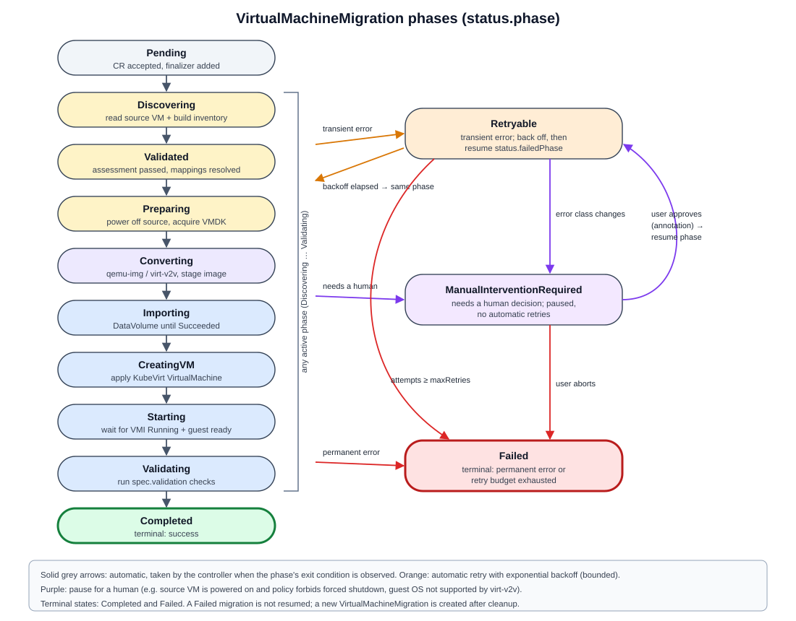

# Migration state machine

Stage 0 design document for request section 13. It defines the `status.phase` values of the conceptual `VirtualMachineMigration` CR (see [migration-architecture.md](migration-architecture.md)) and how a controller moves between them (see [crd-controller-fundamentals.md](crd-controller-fundamentals.md)). Not implemented.



## 1. Phases

```
Pending
  -> Discovering
  -> Validated
  -> Preparing
  -> Converting
  -> Importing
  -> CreatingVM
  -> Starting
  -> Validating
  -> Completed

Failure states: Retryable, ManualInterventionRequired, Failed
```

| Phase | Goal of the phase (what must be true to leave it) | External action (idempotent) | Observed result that advances it |
|---|---|---|---|
| **Pending** | The CR is accepted and has a finalizer. | Add finalizer; set `timestamps.created`. | Finalizer present. |
| **Discovering** | Source VM found and inventory recorded. | SSH to ESXi, `vim-cmd` + read `.vmx`. Read-only. | `status.sourceInventory` written; `SourceDiscovered=True`. |
| **Validated** | Pre-flight checks pass. (Named for its result: while in this phase the controller runs the checks.) | Evaluate rules: guest OS, firmware, no snapshots, disk sizes vs quota, StorageClass exists, network mapping covers every NIC, destination name free. | `Validated=True`, or blockers recorded. |
| **Preparing** | Source is quiesced and the disk is acquired. | Power off per `powerOffPolicy`; confirm `poweredOff`; copy VMDK; record checksum. | `SourcePoweredOff=True`, `DiskAcquired=True`. |
| **Converting** | Converted image exists and is staged. | qemu-img / virt-v2v; upload to staging; record URL + checksum. | `DiskConverted=True`. |
| **Importing** | Every disk is imported into a PVC. | Ensure DataVolume per disk (deterministic names). | All DataVolumes `Succeeded`; `DiskImported=True`. |
| **CreatingVM** | The `VirtualMachine` exists with the right spec. | Create-or-update `VirtualMachine` (initially `runStrategy: Halted`). | VM exists and matches the rendered spec; `VMCreated=True`. |
| **Starting** | The VMI is running. | Set `runStrategy` to the requested value (for example `Always`). | VMI `status.phase == Running` within the timeout. |
| **Validating** | The application works. | Run `spec.validation.checks` (HTTP probe through a Service, guest agent, IP). | All checks pass; `GuestReady=True`. |
| **Completed** | Terminal success. | Clean staging data; set `Ready=True`, `timestamps.completed`. | - |
| **Retryable** | A step failed in a way that may succeed on retry. | Wait with backoff; undo the partial step if needed; go back to the failed phase. | Retry started, or budget exhausted -> Failed. |
| **ManualInterventionRequired** | A human decision or fix is needed. | Nothing automatic. Record reason; emit Event. | A human changes spec or adds an annotation (for example `migration.platform.example/retry: "true"`). |
| **Failed** | Terminal failure. | Clean up destination artifacts per policy; never touch the source disk. | - |

## 2. Transition types

### Automatic (controller advances on observed success)

`Pending -> Discovering -> Validated -> Preparing -> Converting -> Importing -> CreatingVM -> Starting -> Validating -> Completed`

Each arrow is taken **only** after the controller has **observed** the phase's goal, not merely after it issued a command.

### Retryable (go to `Retryable`, then back to the same phase)

| From | Example causes |
|---|---|
| Discovering | SSH timeout, ESXi busy |
| Preparing | Copy interrupted, checksum mismatch, transient disk-full on the conversion host |
| Converting | Conversion process killed, staging upload failed |
| Importing | DataVolume `Failed` with a transient reason (network, pod eviction) |
| CreatingVM | API conflict (optimistic concurrency), webhook timeout |
| Starting | VMI failed to schedule because of temporary capacity |
| Validating | Application not yet ready within the first timeout |

Rules: bounded by `spec.strategy.retryLimit`, exponential backoff, the attempt is recorded in `status.errors`, and the retry resumes the **same phase**, never restarts from `Pending`.

### Manual intervention (go to `ManualInterventionRequired`)

| From | Example causes |
|---|---|
| Validated | Source VM has snapshots; unsupported firmware; a NIC has no network mapping |
| Preparing | Guest will not shut down gracefully and policy forbids a hard power-off |
| Starting | Guest boots but kernel cannot find root disk (driver problem) |
| Validating | App reachable but returns wrong content |
| Retryable | Retry budget exhausted for a step that a human may fix (optionally, instead of Failed) |

### Terminal

- **Completed**: success.
- **Failed**: permanent error (source VM does not exist, spec invalid and immutable, destination exists and is not ours) or retries exhausted.

Terminal states are never left automatically. Re-running means creating a new CR (or an explicit, documented reset annotation).

## 3. Where idempotency is required

**Everywhere a phase can be re-entered.** Because reconcile can run many times for the same phase (requeues, watch events, controller restarts), every external action must be safe to repeat.

| Phase | What could be duplicated | Idempotency technique |
|---|---|---|
| Discovering | None (read-only) | Overwrite inventory; compare with the previous one to detect drift. |
| Preparing: power off | Second power-off on an already-off VM | Check `power.getstate` first; treat "already off" as success. Record `timestamps.sourcePoweredOff` once. |
| Preparing: disk copy | Partial or duplicate copies | Deterministic target path; compare size + checksum; resume or overwrite, never append. |
| Converting | Double conversion, duplicate uploads | Deterministic object key (`<migration-uid>/disk-0.qcow2`); skip if an object with the recorded checksum exists. |
| Importing | Two DataVolumes for one disk | Deterministic name `<name>-disk-<n>`; create-if-absent; owner reference to the migration CR. |
| CreatingVM | Two VMs, or overwriting someone else's VM | Deterministic name; if it exists, check the owner reference / label. Ours: update to match. Not ours: ManualInterventionRequired. |
| Starting | Repeated starts | Setting `runStrategy` is declarative; re-applying the same value is a no-op. |
| Validating | Repeated probes | Read-only checks. |
| Completed / cleanup | Deleting twice | Treat "not found" as success. |

Two more rules:

1. **Record before you advance.** Write evidence (checksum, URL, object name) and the new phase in the same status update. If the update fails, the next reconcile repeats the step, which is safe because the step is idempotent.
2. **Irreversible actions need a guard.** Powering off the source is the only action that affects the running service. It happens only after `Validated=True`, only per `powerOffPolicy`, and it is recorded with a timestamp so it is never "re-decided".

## 4. Failure halfway: what the state machine guarantees

- The source disk is **never modified**. Cold migration only reads it after power-off.
- Rollback for our lab is simple: power the source VM back on. The controller can offer this as a cleanup policy, but never does it silently after the target VM has started (to avoid two copies of the same server with the same identity on the network).
- Partial destination artifacts (DataVolumes, VM) are owned by the migration CR, so deleting the CR (with the finalizer) cleans them up.
