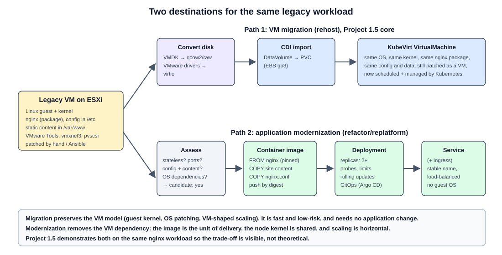

# VM migration vs application modernization

Stage 0 learning document for request section 17. This distinction is a core purpose of Project 1.5.



## 1. Two different things

| | **VM migration (rehost)** | **Application modernization (replatform / refactor)** |
|---|---|---|
| What moves | The whole machine: OS, kernel, packages, config, data | Only the application and its configuration/content |
| Unit after the move | A KubeVirt `VirtualMachine` | A container image, run by a `Deployment` |
| Guest OS | Kept. Still patched, hardened and backed up like a VM. | Gone. The node kernel is shared; the image contains only user space. |
| Application change | None | Some: packaging, config via env/ConfigMap, logs to stdout, health endpoints |
| Scaling | Vertical (bigger VM); one instance unless you clone VMs | Horizontal (replicas), autoscaling |
| Updates | In-place (apt/yum inside the guest) | Build a new image, roll out by digest |
| Speed and risk | Fast, low risk, repeatable at scale | Slower, needs app knowledge and testing |
| When to choose | Many VMs, deadline, vendor appliances, apps you cannot change, stateful legacy | Apps you own, stateless or cleanly stateful, where Kubernetes benefits matter |

**Migration to KubeVirt preserves the VM model. Modernization removes the VM dependency.**

KubeVirt is valuable precisely because it lets both live on one platform: migrate everything first (one control plane, one GitOps flow, one observability stack), then modernize the workloads that justify it, one by one.

## 2. Worked example: the legacy nginx VM

```
legacy VM (Linux + nginx on ESXi)
  -> nginx
  -> assess workload
  -> containerization candidate
  -> container image
  -> Deployment
  -> Service
```

### Assess the workload

| Question | Answer for our demo VM | Why it matters |
|---|---|---|
| What does it run? | nginx from the distro package, static site in `/var/www`, config in `/etc/nginx` | Defines what goes in the image |
| State? | None beyond the static content | Stateless = easy candidate |
| Ports? | 80/tcp | Becomes `containerPort` and Service port |
| OS dependencies? | None special (no kernel modules, no local cron jobs that matter) | Kernel-level needs block containerization |
| Config and secrets? | Plain nginx config, no secrets | Maps to ConfigMap; secrets would map to Secret |
| Logs? | Files under `/var/log/nginx` | Container should log to stdout/stderr |
| Identity / licensing tied to MAC or hostname? | No | Would favor keeping it as a VM |
| **Verdict** | **Containerization candidate: yes** | |

### Build and run

1. **Container image**: `FROM nginx:<pinned version>`, `COPY` the site content and a reviewed `nginx.conf` extracted from the VM, run as non-root if possible, push, and reference **by digest** (practice from Project 1).
2. **Deployment**: `replicas: 2`, readiness and liveness probes on `/`, CPU/memory requests and limits, rolling update strategy.
3. **Service**: stable name and load balancing across replicas (plus Ingress if needed).
4. **GitOps**: manifests in Git, delivered by Argo CD (practice from Project 1).

### What the comparison proves

- The migrated VM and the container serve **the same content**.
- The VM path needed **no knowledge** of nginx. The container path needed **assessment and packaging** but produced something that scales and updates like a cloud-native app.

## 3. What Project 1.5 will and will not claim

- It **will** show both paths end to end for one simple workload, and explain the trade-offs.
- It **will not** claim that every VM should be containerized, or that a migrated VM is "modernized". A VM on KubeVirt is still a VM.
