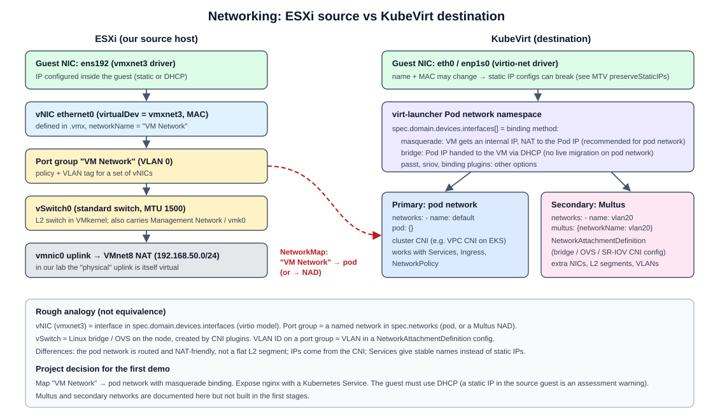

# KubeVirt networking model

Stage 0 learning document for request section 15. Conceptual only. **No Multus networking is built in Stage 0.**

DOCUMENTED: [KubeVirt: Interfaces and Networks](https://kubevirt.io/user-guide/network/interfaces_and_networks/), [Multus CNI](https://github.com/k8snetworkplumbingwg/multus-cni), [Kubernetes cluster networking](https://kubernetes.io/docs/concepts/cluster-administration/networking/).



## 1. The two halves of a VM network in KubeVirt

A KubeVirt VM declares networking in two lists:

- `spec.template.spec.networks`: **where** a NIC connects (the pod network, or a Multus network).
- `spec.template.spec.domain.devices.interfaces`: **how** the NIC is presented to the guest and wired to that network (the **binding**: `masquerade`, `bridge`, `sriov`, or a binding plugin such as `passt`), plus model (`virtio`) and optional MAC.

The important mental model: **the VM lives inside a Pod.** Every VM NIC first lands in the virt-launcher Pod's network namespace. The binding decides how traffic crosses from the guest's virtual NIC into that namespace, and then CNI takes it from there like any Pod.

```
guest eth0 (virtio-net)
  -> QEMU tap device inside the virt-launcher Pod network namespace
  -> binding (masquerade NAT, or in-pod bridge)
  -> pod interface eth0 (from the cluster CNI) or net1 (from Multus)
  -> node networking -> other Pods / Services / outside
```

## 2. Concepts

| Concept | What it is |
|---|---|
| **Pod network** | The cluster's default network provided by the CNI plugin (for example the Amazon VPC CNI on EKS). Every Pod gets one IP. In KubeVirt it is declared as `networks: [{name: default, pod: {}}]`. |
| **masquerade binding** | The guest gets a private address from a small DHCP server inside virt-launcher. Outbound traffic is source-NATed to the pod IP (using nftables). Inbound traffic to declared ports is forwarded to the guest. Works with Services and live migration. Recommended for the pod network. |
| **bridge binding** | The pod interface is bridged to the guest NIC, and the guest takes over the pod's IP (via built-in DHCP). If `interfaces` is omitted entirely, KubeVirt defaults to bridge on the pod network. Bridge on the pod network does not support live migration. Commonly used on secondary networks. |
| **passt** (binding plugin) | User-space networking that maps the guest to the pod IP without privileged NAT rules. |
| **SR-IOV** | Passes a virtual function of a physical NIC to the guest for near-native performance. Needs special hardware. |
| **Multus** | A "meta" CNI plugin that lets a Pod have **extra** interfaces beyond the default one, by calling other CNI plugins. |
| **NetworkAttachmentDefinition (NAD)** | A CRD (from the Network Plumbing WG) that Multus reads. Each NAD holds a CNI config, for example "bridge `br-vlan20` on the node" or "macvlan on `eth1`". |
| **Secondary network** | Any network other than the pod network. In KubeVirt: `networks: [{name: legacy, multus: {networkName: vlan20-nad}}]` with a `bridge` interface. The guest gets an L2 port on that network, often with its original IP plan. |

## 3. Comparison with ESXi

| ESXi | KubeVirt | Similarity | Difference |
|---|---|---|---|
| **vNIC** (VMXNET3/E1000e) | `interfaces[]` entry, model `virtio` | Both are the device the guest sees, with a MAC | Guest driver changes from vmxnet3 to virtio_net. |
| **Port group** (name + VLAN + policy) | `networks[]` entry: `pod: {}` or `multus: {networkName: <NAD>}` | Both are "the named network a NIC plugs into" | The pod network is L3-routed with one IP per Pod, not a VLAN you pick. Only a Multus NAD resembles a port group. |
| **vSwitch** (L2 switch in VMkernel, with uplinks) | The node's CNI dataplane (VPC CNI, OVS, Linux bridge) and the in-pod plumbing | Both forward frames/packets between VMs and the outside | Split between CNI on the node and the binding inside each Pod. No single switch object. |
| VLAN on a port group | NAD using a bridge or macvlan plugin with a VLAN, on a node interface trunked to that VLAN | Same L2 idea | Needs node-level network setup. On AWS, VLAN trunking to instances is not available the way it is in a data center. |
| VMkernel adapter (`vmk0`) | Node IP (not visible to VMs) | Host management traffic | - |
| Distributed switch (vCenter) | CNI config is cluster-wide by nature | Central config | - |

## 4. Mapping VMware networks to KubeVirt destination networks

Every source NIC must be mapped to a destination network before migration, or the VM arrives without connectivity. This is why MTV has a `NetworkMap`, and our CRD has `spec.network.mappings`.

```
VMware network (port group "VM Network", VLAN 0, NIC vmxnet3, MAC 00:0c:29:..)
   |
   v
mapping decision
   |- Pod network + masquerade   (default for our demo: reachable via a Kubernetes Service)
   |- Multus NAD + bridge        (when the VM must keep its L2 segment / IP / MAC)
   v
KubeVirt destination network (interfaces[].masquerade or .bridge, model virtio, optional macAddress)
```

What the mapping has to decide:

1. **Which destination network** per source port group.
2. **Which binding** (masquerade for pod network; bridge for secondary networks).
3. **IP addressing**: with masquerade the guest must use DHCP inside the Pod (a static IP from ESXi will not work as-is). Keeping a static IP needs a secondary network where that subnet exists. MTV's `preserveStaticIPs` handles this for some guests; we will not in v1alpha1.
4. **MAC address**: keep it (licensing, DHCP reservations) or let KubeVirt generate one.
5. **Guest OS config**: the interface name may change (for example `ens192` on VMware to `enp1s0` on virtio). Netplan/NetworkManager configs that match on name or MAC may need fixing. virt-v2v helps with some of this.

## 5. Our plan

- **Demo:** one NIC, pod network, **masquerade** binding, guest uses DHCP, exposed through a Kubernetes `Service`. No Multus.
- **Later (optional):** a Multus secondary network, to learn the "port group" equivalent. Deferred; not needed for cold migration of a single web VM.
- Connectivity lab -> AWS is one-way for cold migration: the lab pushes the converted image to S3 (or uploads to CDI). No VPN is required for that (INFERRED; see [feasibility.md](feasibility.md)).
