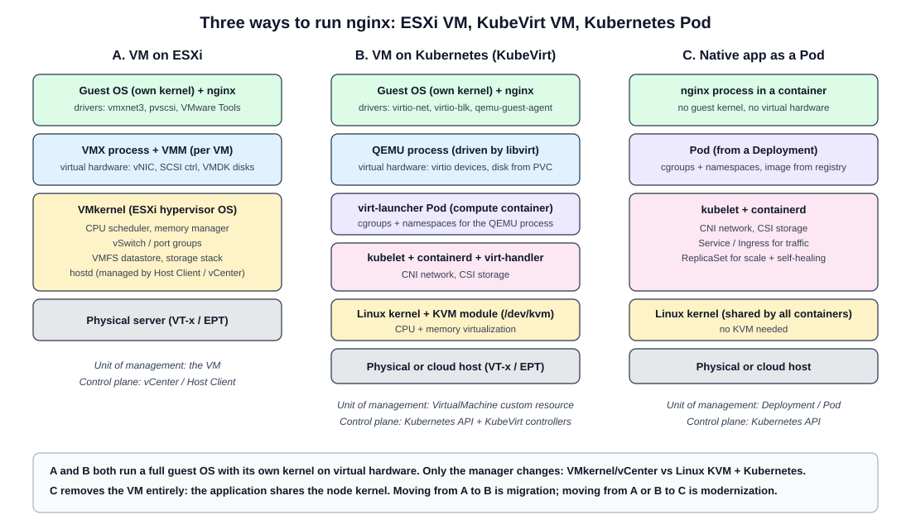
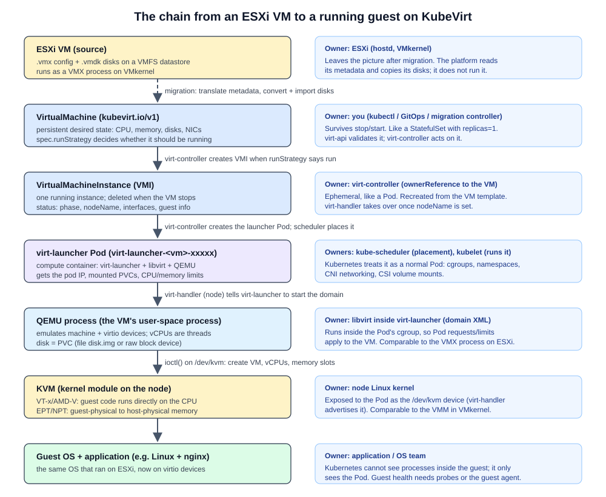
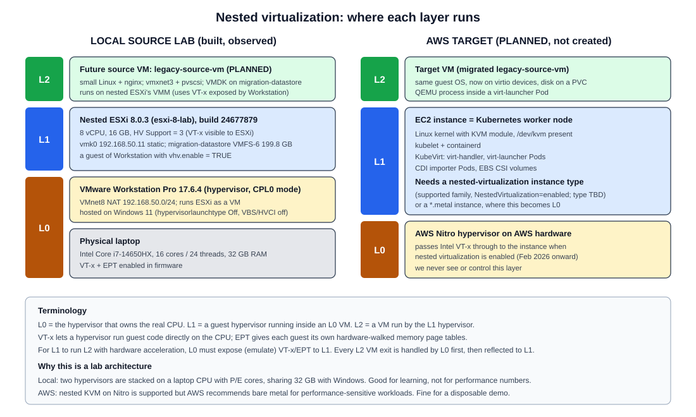

# Virtualization fundamentals: ESXi, KVM, QEMU, libvirt, VirtIO

Stage 0 learning document. It covers request sections 1 (first principle), 2 (KVM / QEMU / libvirt) and 3 (nested virtualization).

Evidence markers used in this document:

- **OBSERVED**: seen in command output from our lab (see [evidence-index.md](evidence-index.md)).
- **DOCUMENTED**: stated by current official documentation (linked inline).
- **INFERRED**: a conclusion drawn from the above. Verify before relying on it.

---

## 1. First principle: three ways to run the same nginx



Take one concrete workload: a small Linux server that runs nginx and serves a static site from `/var/www`.

### A. Traditional VM on ESXi

- ESXi's VMkernel owns the physical CPU, memory, storage and NICs.
- For each VM, ESXi starts a **VMX process** plus a **VMM** (virtual machine monitor). Together they present virtual hardware: vCPUs, a SCSI controller (for example PVSCSI), a vNIC (for example VMXNET3) and a virtual disk backed by a **VMDK** file on a **VMFS datastore**.
- The guest runs its own Linux kernel. nginx is just a process inside that guest.
- You manage the VM as an object in the Host Client or vCenter: power on/off, snapshot, edit settings.
- The unit of management is the **VM**. The control plane is **hostd/vCenter**.

### B. VM managed by Kubernetes through KubeVirt

- The guest is the same kind of thing: a full Linux OS with its own kernel, and nginx inside it.
- The hypervisor is different. The node runs Linux with the **KVM** kernel module. A **QEMU** process per VM provides the virtual hardware. **libvirt** drives QEMU.
- That QEMU process runs inside a normal Kubernetes Pod called **virt-launcher**. The Pod gets scheduled, gets cgroup limits, gets a pod IP, and mounts PVCs like any other Pod.
- You manage the VM as a Kubernetes object: a `VirtualMachine` custom resource that you `kubectl apply`, store in Git, and let controllers reconcile.
- The unit of management is the **VirtualMachine custom resource**. The control plane is the **Kubernetes API plus KubeVirt controllers**.

### C. Native Kubernetes application (Pods)

- There is no VM and no guest kernel. nginx runs as a process in a container, sharing the node's Linux kernel through namespaces and cgroups.
- The "disk" is a container image (read-only layers) plus optional volumes. There is no virtual hardware.
- You manage it with a `Deployment` + `Service`. Scaling is horizontal (more replicas), not bigger VMs.
- The unit of management is the **Deployment / Pod**. The control plane is the **Kubernetes API**.

### The key insight

A and B both run a full guest OS on virtual hardware. **Only the manager changes.** Moving from A to B is **migration** (rehosting). C removes the VM entirely. Moving from A or B to C is **modernization** (see [modernization-model.md](modernization-model.md)).

### The chain from an ESXi VM to a running guest on KubeVirt



```
ESXi VM                         source: .vmx + .vmdk on VMFS; runs as a VMX process on VMkernel
  |  migration: translate metadata, convert + import disks
  v
KubeVirt VirtualMachine (VM)    persistent desired state (kubevirt.io/v1); survives stop/start
  |  virt-controller creates a VMI when spec.runStrategy says "run"
  v
VirtualMachineInstance (VMI)    one running instance; deleted when the VM stops
  |  virt-controller creates the launcher Pod; kube-scheduler places it
  v
virt-launcher Pod               normal Pod: cgroups, namespaces, pod IP, PVC mounts
  |  virt-handler (on the node) tells virt-launcher to define/start the libvirt domain
  v
QEMU process                    user-space process that emulates the machine and its devices
  |  ioctl() calls on /dev/kvm
  v
KVM                             Linux kernel module; runs guest code on the CPU using VT-x/EPT
  |
  v
guest OS                        the same Linux + nginx that ran on ESXi, now on virtio devices
```

### Who owns which layer

| Layer | Owner (who creates / changes it) | Comparable ESXi concept |
|---|---|---|
| ESXi VM (source) | ESXi hostd / VMkernel; our migration platform only reads it | - |
| `VirtualMachine` | You (kubectl, GitOps) or our migration controller | The VM object in inventory (.vmx) |
| `VirtualMachineInstance` | virt-controller (owner reference to the VM) | A powered-on VM |
| virt-launcher Pod | virt-controller creates it; kube-scheduler places it; kubelet runs it | The VMX "world" on a host |
| libvirt domain | virt-handler asks virt-launcher to define it | VMX configuration in memory |
| QEMU process | libvirt inside virt-launcher | VMX process + device emulation |
| KVM | Node Linux kernel | The VMM part of VMkernel |
| Guest OS + app | Application / OS team | Same |

DOCUMENTED: [KubeVirt architecture](https://kubevirt.io/user-guide/architecture/), [KubeVirt components (kubevirt/kubevirt docs/components.md)](https://github.com/kubevirt/kubevirt/blob/main/docs/components.md).

---

## 2. KVM, QEMU, libvirt and VirtIO

Four pieces, each solving one problem. Together they do what ESXi does as one product.

### KVM (Kernel-based Virtual Machine)

- **Problem it solves:** running guest instructions directly on the physical CPU, safely and fast.
- **What it is:** a Linux kernel module (`kvm.ko` plus `kvm-intel.ko` or `kvm-amd.ko`). It turns Linux into a hypervisor and exposes the device file `/dev/kvm`.
- **How it is used:** a user-space program opens `/dev/kvm` and uses `ioctl()` calls to create a VM, add vCPUs and map memory. Each vCPU is a normal Linux thread. When that thread "runs" the vCPU, the CPU switches into guest mode (Intel VT-x "VMX non-root") and executes guest code natively until something needs attention (an I/O access, an interrupt). Then it exits back to KVM, which handles it or passes it to user space.
- **Where CPU virtualization happens:** here, in the kernel, with hardware help from VT-x/AMD-V.
- **Where memory virtualization happens:** here too. KVM manages guest-physical to host-physical mappings using EPT (Intel) or NPT (AMD). Guest RAM itself is ordinary memory allocated by the QEMU process, so the Linux memory manager (and cgroups) accounts for it.
- DOCUMENTED: [Linux kernel KVM API documentation](https://docs.kernel.org/virt/kvm/api.html).

### QEMU

- **Problem it solves:** a VM needs a whole machine, not just a CPU: firmware (BIOS/UEFI), a chipset, disk controllers, NICs, a display, a serial console.
- **What it is:** a user-space machine emulator. With KVM acceleration (`-accel kvm`), QEMU leaves CPU execution to KVM and does device emulation and VM setup itself.
- **Where virtual disks are presented:** QEMU exposes a virtual disk controller (virtio-blk, virtio-scsi, SATA, ...) to the guest and backs it with a file or block device (raw, qcow2, ...).
- **Where the virtual NIC exists:** QEMU exposes the NIC device (virtio-net, e1000, ...) to the guest. The host side is a tap device or similar, which is connected to a bridge or other plumbing. With vhost-net, the packet data path moves into the host kernel for speed.
- One QEMU process per VM. If the process dies, the VM dies.
- DOCUMENTED: [QEMU system emulation docs](https://www.qemu.org/docs/master/system/index.html), [QEMU disk images](https://www.qemu.org/docs/master/system/images.html).

### libvirt

- **Problem it solves:** QEMU command lines are huge and low level. Operators need a stable API to define, start, stop and inspect VMs.
- **What it is:** a management API and daemon. You describe a VM as **domain XML** (CPU, memory, disks, interfaces). libvirt turns that into a QEMU process and manages its lifecycle.
- In KubeVirt, libvirt runs **inside each virt-launcher Pod** and manages only that one VM. KubeVirt generates the domain XML from the VMI spec. You do not write domain XML yourself.
- DOCUMENTED: [libvirt domain XML format](https://libvirt.org/formatdomain.html), [libvirt QEMU driver](https://libvirt.org/drvqemu.html).

### VirtIO

- **Problem it solves:** emulating real hardware (for example an Intel e1000 NIC) is slow, because every register access traps to the hypervisor.
- **What it is:** a standard for **paravirtualized** devices. The guest knows it is virtualized and uses efficient shared-memory queues (virtqueues) to talk to the host.
- Devices: virtio-net (NIC), virtio-blk and virtio-scsi (disks), virtio-balloon, virtio-rng, virtio-serial (used by the QEMU guest agent).
- Linux guests have virtio drivers in the mainline kernel. Windows guests need the virtio-win drivers installed.
- **Why it matters for migration:** a VMware guest uses VMware paravirtual devices (VMXNET3, PVSCSI). After migration it must boot on virtio devices. Linux usually just works if the virtio modules are in its initramfs. This is exactly the problem virt-v2v fixes (see [cdi-storage-model.md](cdi-storage-model.md)).

### How they interact (one VM on a KubeVirt node)

```
virt-launcher Pod
  libvirtd  --(domain XML)-->  QEMU process
                                 |- device emulation: virtio-net, virtio-blk, UEFI/BIOS, ...
                                 |- vCPU threads --(ioctl KVM_RUN)--> /dev/kvm
Node Linux kernel
  KVM module --(VT-x / EPT)--> physical CPU and RAM
  tap / bridge / nftables  <-- host side of the virtual NIC
  block device or file     <-- backing store of the virtual disk (from a PVC)
```

### VMware to KVM/QEMU translation table

This is a conceptual mapping for learning. **KVM and ESXi are not identical.** ESXi is a purpose-built type-1 hypervisor OS where VMkernel does scheduling, memory management, storage and networking. KVM makes a general-purpose Linux kernel into a hypervisor, and many ESXi functions are split across Linux, QEMU, libvirt and (on Kubernetes) KubeVirt and CNI/CSI plugins.

| VMware concept | Closest KVM / QEMU / KubeVirt concept | Important difference |
|---|---|---|
| ESXi (hypervisor product) | Linux + KVM + QEMU + libvirt (+ KubeVirt on Kubernetes) | ESXi is one integrated product. The KVM stack is assembled from parts. |
| VMkernel | Linux kernel with the KVM module | VMkernel is purpose-built. Linux is general-purpose and also runs containers. |
| VMM (inside VMkernel) | KVM (CPU/memory virtualization in the kernel) | Similar role. |
| VMX process (per VM) | QEMU process (per VM) | Both are per-VM user-space processes that emulate devices. |
| `.vmx` file | libvirt domain XML; in KubeVirt the VM/VMI spec | In KubeVirt the source of truth is a Kubernetes object, not a file. |
| VMDK | Disk image: raw or qcow2 file, or a raw block device | CDI converts imported disks to raw. |
| VMFS datastore | Filesystem or block storage behind a PVC/StorageClass | Kubernetes storage is per-volume (PVC), not a shared clustered filesystem. |
| Thin-provisioned VMDK | Sparse raw file or qcow2 | Sparseness can be lost if tools are used carelessly. |
| VM snapshot (delta VMDK chain) | qcow2 backing chain; in KubeVirt `VirtualMachineSnapshot` via CSI snapshots | Different mechanisms. |
| vNIC (VMXNET3, E1000) | virtio-net (or e1000) exposed by QEMU | Guest driver changes from vmxnet3 to virtio_net. |
| PVSCSI controller | virtio-scsi or virtio-blk | Guest driver changes. |
| vSwitch | Linux bridge / OVS / CNI plugin inside the Pod network | In KubeVirt, the VM NIC connects to the Pod's network namespace first. |
| Port group | Kubernetes Pod network, or a Multus `NetworkAttachmentDefinition` | See [networking-model.md](networking-model.md). |
| VMware Tools | QEMU guest agent (`qemu-guest-agent`) | Reports IPs, allows graceful shutdown, freezes filesystems. |
| hostd / Host Client | libvirtd per VM + KubeVirt virt-handler per node | |
| vCenter | Kubernetes API + KubeVirt controllers | Declarative desired state instead of imperative tasks. |
| vMotion | KubeVirt live migration (`VirtualMachineInstanceMigration`) | Needs shared RWX storage or storage migration, and a suitable network binding. |
| DRS placement | kube-scheduler (requests, affinity, taints) | |
| HA restart | `runStrategy: Always` / `RerunOnFailure` + Kubernetes rescheduling | |

---

## 3. Nested virtualization in our lab and on AWS



### L0 / L1 / L2 terminology

- **L0**: the hypervisor that runs on the real hardware.
- **L1**: a guest of L0 that is itself a hypervisor.
- **L2**: a guest of the L1 hypervisor.

### Our source lab (OBSERVED)

```
Physical laptop: Intel Core i7-14650HX, 32 GB RAM, VT-x + SLAT enabled in firmware
  |
Windows 11 Home (Windows hypervisor OFF: hypervisorlaunchtype Off)
  |
VMware Workstation Pro 17.6.4, monitor mode CPL0 (native), hv-vt.vmm + gphys-ept.vmm loaded   <- L0 hypervisor
  |
esxi-8-lab: ESXi 8.0.3 build 24677879, 8 vCPU, 16 GB, vhv.enable = TRUE, HV Support: 3       <- L1 hypervisor
  |
future legacy-source-vm (not created yet)                                                    <- L2 guest
```

Why the Windows hypervisor had to be off (OBSERVED in the handoff): with it running, Workstation ran on top of Hyper-V/WHP, which does not support "Virtualize Intel VT-x/EPT". With it off, Workstation owns VT-x directly and can pass it to ESXi. The cost is that WSL2 and Docker Desktop cannot run.

### Our eventual AWS target (PLANNED, nothing created)

```
AWS Nitro hypervisor on physical host                                    <- L0
  |
EC2 instance with NestedVirtualization=enabled (e.g. m8i / c8i / r8i)    <- L1: Linux + KVM
  |
Kubernetes node (kubelet, containerd) + KubeVirt virt-handler
  |
virt-launcher Pod -> QEMU -> /dev/kvm (KVM in the L1 kernel)
  |
target VM (the migrated legacy-source-vm)                                <- L2
```

DOCUMENTED ([AWS: Use nested virtualization](https://docs.aws.amazon.com/AWSEC2/latest/UserGuide/amazon-ec2-nested-virtualization.html), [AWS What's New 2026-02-16](https://aws.amazon.com/about-aws/whats-new/2026/02/amazon-ec2-nested-virtualization-on-virtual/)):

- Since 2026-02-16, virtual (non-metal) EC2 instances can run KVM or Hyper-V. The Nitro System passes Intel VT-x to the instance.
- AWS names the layers exactly as above: Nitro (L0), your instance (L1), nested VMs (L2).
- Supported families (per the user guide at time of writing) include C8i, M8i, R8i and their `d` / `flex` variants, X8i, C7i, M7i, R7i (and flex variants) and I7i. Always re-check with `aws ec2 describe-instance-types` (look for `nested-virtualization` in `ProcessorInfo.SupportedFeatures`).
- It is enabled per instance with CPU options (`--cpu-options NestedVirtualization=enabled`), or on a stopped instance with `modify-instance-cpu-options`. The launch template API also has a `NestedVirtualization` CPU option ([LaunchTemplateCpuOptionsRequest](https://docs.aws.amazon.com/AWSEC2/latest/APIReference/API_LaunchTemplateCpuOptionsRequest.html)).
- The alternative is a bare-metal (`*.metal`) instance, where KVM runs at L0 on real hardware. AWS recommends bare metal for performance-sensitive workloads.

### VT-x and EPT

- **VT-x** (Intel) / **AMD-V**: CPU instructions and modes that let a hypervisor run guest code directly on the CPU in a restricted mode, and trap back on sensitive operations. Without it, a hypervisor must emulate or binary-translate the guest, which is very slow.
- **EPT** (Extended Page Tables, Intel) / **NPT/RVI** (AMD), generically **SLAT**: a second level of page tables in hardware that translates guest-physical addresses to host-physical addresses. Without it, the hypervisor has to maintain "shadow page tables" in software.
- For nesting, L0 must expose VT-x/EPT to L1 (VMware calls this VHV, "Virtualize Intel VT-x/EPT"; AWS calls it NestedVirtualization). L1 then uses them to run L2. In reality, L0 still does the hardware work and emulates VT-x for L1.

### Why nested virtualization is required

- **Source side:** we have one laptop. To learn the ESXi source model without a spare server, ESXi itself must run as a VM, and its guest VMs are then nested.
- **Target side:** KubeVirt needs `/dev/kvm` on worker nodes for hardware-accelerated VMs. A normal cloud VM does not have it unless the cloud exposes VT-x (nested virtualization) or you pay for bare metal. KubeVirt has a software-emulation fallback (`useEmulation`), which is only useful for functional smoke tests ([KubeVirt installation](https://kubevirt.io/user-guide/cluster_admin/installation/)).

### Performance implications

- Every VM exit from L2 may have to go through L0 and then be reflected into L1. Exits are much more expensive than in a single-level setup, so I/O-heavy and interrupt-heavy workloads suffer most.
- CPU-bound code that stays in guest mode runs close to native speed.
- On the laptop, vCPUs float across hybrid P-cores and E-cores, so timings vary (INFERRED).
- Memory is carved out three times: Windows keeps about 15-16 GB, ESXi gets 16 GB, and L2 guests share the ESXi memory.

### Why this is a lab architecture

- Nested virtualization is fine for learning, functional testing and demos. It is not how you would size or benchmark a production migration.
- The free ESXi edition is officially for **non-production use** with no support ([ESXi 8.0 Update 3e release notes](https://techdocs.broadcom.com/us/en/vmware-cis/vsphere/vsphere/8-0/release-notes/esxi-update-and-patch-release-notes/vsphere-esxi-80u3e-release-notes.html)).
- In production, the source would be ESXi on real servers under vCenter, and the target KubeVirt workers would be bare-metal nodes. Our architecture and concepts transfer. Our performance numbers do not.
