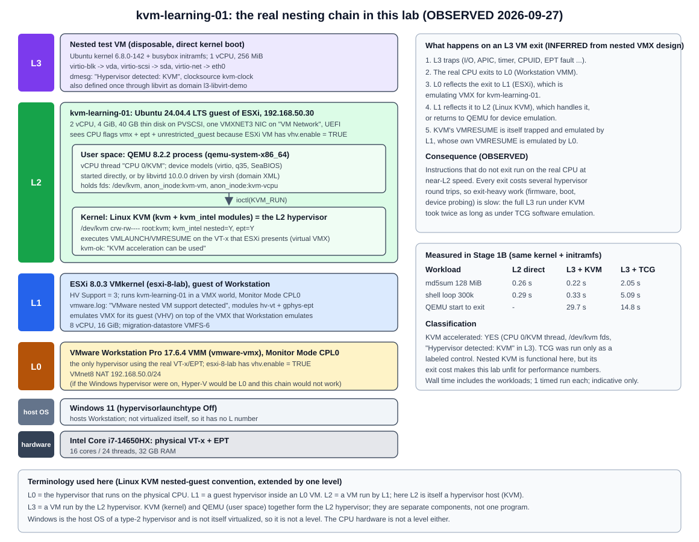

# Nested KVM feasibility inside the ESXi lab

| Field | Value |
|---|---|
| Stage | 1B |
| Date | 2026-09-27 |
| Question | Can Linux KVM run hardware-accelerated guests inside an ESXi guest, which is itself nested in VMware Workstation? |
| Answer | **KVM accelerated: YES** (OBSERVED). Functional, with high VM-exit cost. |
| Closes | Stage 0 item N1 (a nested 64-bit guest boots under our ESXi); adds a nested-KVM result that Stage 0 did not cover |
| Related | [Stage 1B record](stage-1b-kvm-qemu-fundamentals.md), [lab VM](kvm-learning-lab.md), [layer diagram](../diagrams/lab-nested-kvm-layers.svg) |

Labels: **OBSERVED**, **INFERRED**, **NOT TESTED** as in the [Stage 1 index](README.md).

## 1. The layers in this lab

| Level | Component | Role | Evidence |
|---|---|---|---|
| hardware | Intel Core i7-14650HX | Physical VT-x + EPT | Stage 0 audit |
| host OS (no level) | Windows 11, hypervisor launch type Off | Hosts Workstation; not itself virtualized | Stage 0 audit |
| **L0** | VMware Workstation 17.6.4 VMM (`vmware-vmx`) | The only hypervisor on the real VT-x; exposes virtual VT-x to ESXi (`vhv.enable = "TRUE"`) | Workstation `.vmx` (read-only) |
| **L1** | ESXi 8.0.3 (`esxi-8-lab`) | Guest hypervisor; runs `kvm-learning-01` and exposes virtual VT-x to it (`vhv.enable = "TRUE"`) | `HV Support: 3`; ESXi `vmware.log` |
| **L2** | `kvm-learning-01`, Ubuntu 24.04.4 with Linux KVM + QEMU | Guest of ESXi, and itself a KVM hypervisor host | `/dev/kvm`, `kvm_intel` |
| **L3** | Nested test VM (Ubuntu kernel + busybox initramfs) | Guest of Linux KVM | `Hypervisor detected: KVM` |

Terminology follows the Linux kernel's [running nested guests](https://docs.kernel.org/virt/kvm/x86/running-nested-guests.html) document (L0 = host hypervisor on the hardware, L1 = guest hypervisor, L2 = nested guest), extended by one level because this lab stacks three hypervisors. Windows gets no L number because a type-2 host OS is not a virtualization level.

The Stage 0 [nested virtualization diagram](../diagrams/nested-virtualization-layers.svg) shows the planned L2 source VM on ESXi. `kvm-learning-01` sits at that same L2 position. The new part is that it runs a hypervisor, which creates an L3.

## 2. What each layer exposes (OBSERVED)

**ESXi to L2.** ESXi `vmware.log` for `kvm-learning-01` at power-on:

- `IOPL_Init: VMware nested VM support detected`: ESXi knows it is itself a VM.
- `Monitor Mode: CPL0`, and VMM modules `hv-vt.vmm` + `gphys-ept.vmm`: hardware-assisted CPU and EPT memory virtualization, not binary translation.
- `OvhdUser_vhvCachedVMCS`, `OvhdMon_VHV`, `OvhdMon_VHVGuestMSRBitmap`: memory overhead for virtual hardware virtualization (VHV) is reserved.
- `Nested paging A/D bits`, `Mode-based execute control for nested paging`: EPT features exposed to the guest.

**Inside L2, before any package was installed:**

| Check | Result |
|---|---|
| `grep -o -w vmx /proc/cpuinfo` | `vmx` (all CPUs) |
| `vmx flags` | `vnmi invvpid ept_x_only ept_ad tsc_offset vtpr mtf ept vpid unrestricted_guest ple ept_mode_based_exec` |
| `lscpu` | `Virtualization: VT-x`, `Hypervisor vendor: VMware`, `Virtualization type: full` |
| `ls -l /dev/kvm` | `crw-rw---- 1 root kvm 10, 232` |
| `test -e /dev/kvm` | `KVM device exists` |
| `lsmod \| grep kvm` | `kvm_intel`, `kvm`, `irqbypass` (autoloaded by the stock kernel) |
| `/sys/module/kvm_intel/parameters/nested` | `Y` |
| `/sys/module/kvm_intel/parameters/ept` | `Y` |

No module parameters were changed. Ubuntu's kernel loads `kvm_intel` automatically when the CPU reports `vmx`. `nested=Y` means this L2 KVM would in turn expose VMX to its own guests.

**After installing QEMU and cpu-checker:**

- `kvm-ok` reported `INFO: /dev/kvm exists` and `KVM acceleration can be used`.
- `qemu-system-x86_64 -accel help` listed `tcg` and `kvm`.

## 3. The L3 test

**Design.** The smallest guest that proves acceleration while exercising all three VirtIO device types, with no network downloads:

- **Kernel:** the L2 host's own `/boot/vmlinuz-6.8.0-142-generic`, direct kernel boot.
- **Initramfs:** 1.2 MB, containing the host's static `busybox` and a script (`/init`) that:
  - prints kernel, CPU, memory, CPU flags, hypervisor detection, the VirtIO bus, PCI, block devices and NICs;
  - runs two timed CPU-bound workloads (`md5sum` over 128 MiB of zeroes, and a 300,000-iteration shell loop);
  - powers off.
- **VM:** 1 vCPU, 256 MiB, q35 machine, no display, serial console to a file.
- **Devices:**
  - virtio-blk: 64 MiB qcow2
  - virtio-scsi controller + `scsi-hd`: 32 MiB qcow2
  - virtio-net with QEMU user-mode networking (no bridges, no host network changes)

**Runs** (OBSERVED; one run each unless noted):

| Run | QEMU accelerator | Purpose |
|---|---|---|
| 1 | `-accel kvm -cpu host` | Inspect the QEMU process while L3 runs |
| 2 | `-accel kvm -cpu host` | Timed |
| 3 | `-accel tcg -cpu max` | **Control only**: software emulation, run to show the difference, not as a fallback |
| libvirt | domain `type='kvm'`, `host-passthrough` | Same guest started through libvirt (see the [Stage 1B record](stage-1b-kvm-qemu-fundamentals.md#6-libvirt-and-virsh)) |

### 3.1 Proof of acceleration (OBSERVED)

| Signal | KVM runs | TCG control |
|---|---|---|
| QEMU vCPU thread name | `CPU 0/KVM` | `CPU 0/TCG` |
| QEMU open fds | `/dev/kvm`, `anon_inode:kvm-vm`, `anon_inode:kvm-vcpu:0` | none (count 0) |
| L3 dmesg | `Hypervisor detected: KVM`, `kvm-clock: Using msrs 4b564d01 and 4b564d00` | no KVM detection; clocksource `tsc-early` |
| `vmx` flag inside L3 | present (`-cpu host`, and L2 `nested=Y`) | none (`-cpu max` under TCG has no VMX) |
| QEMU RSS in L2 | ~176 MB (256 MiB guest) | not measured |

Any one of the first three rows would be enough. Together they rule out a silent TCG fallback.

### 3.2 VirtIO seen from inside L3 (OBSERVED)

| VirtIO device | virtio device id | Driver | Linux device | PCI ID, direct QEMU (transitional) | PCI ID, via libvirt (modern) |
|---|---|---|---|---|---|
| virtio-blk | 2 | `virtio_blk` | `vda` (64 MiB) | `1af4:1001` | `1af4:1042` |
| virtio-scsi | 8 | `virtio_scsi` + `sd` | `sda` (32 MiB) | `1af4:1004` | `1af4:1048` |
| virtio-net | 1 | `virtio_net` | `eth0` | `1af4:1000` | `1af4:1041` |

The direct QEMU command placed the devices on the q35 root bus, where QEMU presents them as **transitional** devices, compatible with legacy drivers. libvirt placed each one behind its own `pcie-root-port`, where they appear as **modern** VirtIO 1.x devices (0x1040 + device id). Both use the same Linux drivers. See the [VirtIO 1.2 specification](https://docs.oasis-open.org/virtio/virtio/v1.2/virtio-v1.2.html), PCI device discovery.

### 3.3 Performance (OBSERVED, indicative only)

Same kernel and initramfs everywhere. Workload times are measured with the guest clock (`/proc/uptime`); wall time with the L2 clock.

| Measurement | L2 directly | L3 with KVM | L3 with TCG |
|---|---:|---:|---:|
| `md5sum` over 128 MiB | 0.26 s | 0.22 to 0.23 s | 2.05 s |
| Shell loop, 300k iterations | 0.29 s | 0.33 to 0.36 s | 5.09 s |
| L3 uptime at poweroff | - | 11.6 to 13.7 s | 8.65 s |
| QEMU start to exit (wall) | - | 29.71 s | 14.79 s |
| libvirt start to `shut off` (wall) | - | 27.3 s | - |

Interpretation:

- **CPU-bound code runs at near-L2 speed under nested KVM** (OBSERVED). Guest instructions that do not trap run directly on the real CPU. Under TCG the same work is 9x (`md5sum`) to 15x (loop) slower, because QEMU translates every guest instruction in software.
- **Exit-heavy phases are very slow under nested KVM** (OBSERVED + INFERRED). The whole KVM run took twice as long as the TCG run, even though TCG also spent about 7 s on the slow workloads.
  - Most of the gap is before the L3 kernel starts counting uptime: about 17 s under KVM versus about 6 s under TCG (wall time minus L3 uptime). That phase is SeaBIOS firmware plus loading a 15 MB kernel and the initramfs through QEMU's fw_cfg interface, which is port-I/O heavy.
  - Every port I/O, APIC or timer access is a VM exit. At L3 each exit travels hardware to L0 (Workstation), then is reflected to L1 (ESXi, which emulates VMX for L2), then to L2 KVM, possibly up to QEMU. KVM's own VMRESUME is again trapped and emulated by L1 and L0. TCG avoids hardware exits entirely, which is why it wins on this phase.
- Numbers come from single runs on a laptop with hybrid P/E cores and Windows background load. They show orders of magnitude, not benchmarks.

## 4. Classification

| Possible result | This lab |
|---|---|
| **KVM accelerated** | **YES**: `/dev/kvm` present and used, `CPU 0/KVM` thread, L3 detects KVM |
| KVM unavailable | no |
| Software emulation only | no. TCG was run once, clearly labelled as a control, and is not counted as success |

Nested KVM **is functional** in this lab (OBSERVED). Its **exit cost is high** (OBSERVED), so this lab is suitable for learning, functional tests and small conversions, but not for performance claims.

## 5. Stage 0 items this settles

| Item | Stage 0 status | After Stage 1B |
|---|---|---|
| [N1](../stage-0/feasibility.md#not-yet-proven): a nested 64-bit guest (L2) boots under our ESXi | Unvalidated | **Validated (OBSERVED)**: Ubuntu 24.04 x86_64 installed and runs on ESXi |
| Can a Linux guest of the nested ESXi use KVM? (new question) | not covered | **OBSERVED yes**, and it runs an accelerated L3 guest |
| [F17](../stage-0/feasibility.md#2-feasibility-table): conversion host, local option blocked by lab mode | Blocked by current lab mode | A Linux guest on ESXi now exists and runs QEMU tools, so the local option is no longer blocked in principle (INFERRED). The location decision stays **deferred**. |
| Free ESXi API write restrictions ([vmware-source-model](../stage-0/vmware-source-model.md)) | Documented (KB 399823), expected to fail | **OBSERVED** for `CreateScreenshot_Task` and `PutUsbScanCodes` (`vim.fault.RestrictedVersion`); local `vim-cmd` power operations on the host work |

## 6. What this does and does not tell us

- It does tell us that Linux KVM, QEMU and libvirt work unmodified on virtual VT-x provided by VMware VHV. The KVM-side concepts learned here (`/dev/kvm`, vCPU threads, domain XML, VirtIO) are the same ones KubeVirt uses inside `virt-launcher` Pods (INFERRED from Stage 0 research).
- It does **not** predict AWS behaviour. On an EC2 nested-virtualization instance, Nitro is L0 and the EC2 instance is L1 (one level less than here), and exit costs are different. AWS was not touched (NOT TESTED).
- It does **not** decide the conversion host. `kvm-learning-01` could run `qemu-img` or `virt-v2v` locally (Stage 0 option A), but that decision is deferred.
- `vmx` is visible inside L3, so an L4 would be possible in principle. NOT TESTED and not useful.
- Windows guests, UEFI (OVMF) guests and live migration at L3 were NOT TESTED.

## 7. Sources

- Linux kernel: [Running nested guests with KVM](https://docs.kernel.org/virt/kvm/x86/running-nested-guests.html), [KVM API](https://docs.kernel.org/virt/kvm/api.html)
- QEMU: [Introduction to system emulation (accelerators)](https://www.qemu.org/docs/master/system/introduction.html), [Multi-threaded TCG](https://www.qemu.org/docs/master/devel/multi-thread-tcg.html)
- OASIS: [VirtIO 1.2 specification](https://docs.oasis-open.org/virtio/virtio/v1.2/virtio-v1.2.html)
- libvirt: [Domain XML format](https://libvirt.org/formatdomain.html), [QEMU driver](https://libvirt.org/drvqemu.html)
