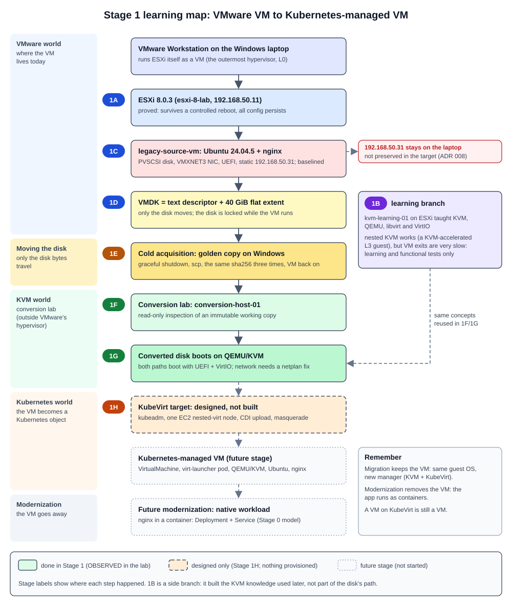

# Stage 1 Learning Summary

**Project 1.5: VM-to-Kubernetes Migration Platform (ESXi -> KubeVirt Migration & VM Modernization)**

This is a teaching document. It retells Stage 1 as one story for a reader who knows VMware and ESXi well but is new to KVM, QEMU, libvirt, VirtIO, virt-v2v, KubeVirt and CDI. It adds no new facts, decisions or status. Every statement comes from the Stage 1 records (and, where noted, Stage 0). The sub-stage records remain the source of truth; when this summary and a record disagree, the record wins.

The evidence labels are kept as the records use them:

- **OBSERVED**: seen in this lab by a command we ran.
- **INFERRED**: reasoned from observations or documentation, not directly tested.
- **NOT TESTED**: deliberately not done.
- **DOCUMENTED**: stated by official documentation (used mainly in Stage 1H, which built nothing).
- Decision states from Stage 1H: **DECIDED**, **DEFERRED**, **UNKNOWN** and **BLOCKED**.



Records this summary is built from: [Stage 1 README](README.md), [1A](stage-1a-esxi-reboot-validation.md), [1B](stage-1b-kvm-qemu-fundamentals.md) (with [kvm-learning-lab.md](kvm-learning-lab.md) and [nested-kvm-feasibility.md](nested-kvm-feasibility.md)), [1C](stage-1c-migration-source.md), [1D](stage-1d-vmware-source-artifacts.md), [1E](stage-1e-cold-acquisition.md), [1F](stage-1f-conversion-host.md), [1G](stage-1g-controlled-conversion.md), [1H](stage-1h-kubevirt-target-feasibility.md), plus Stage 0's [virtualization fundamentals](../stage-0/virtualization-fundamentals.md), [CDI storage model](../stage-0/cdi-storage-model.md), [modernization model](../stage-0/modernization-model.md) and [glossary](../stage-0/glossary.md).

---

## 1. The Problem We Are Solving

Many organizations run their applications on VMware ESXi. They want those workloads on Kubernetes, next to their containers, managed with the same tools (kubectl, Git, controllers). The difficulty is that a VMware VM is not a file you can simply drop into Kubernetes. It is a combination of a disk, a configuration file (`.vmx`), firmware state (`.nvram`), and a guest operating system that was installed and configured for VMware's virtual hardware (PVSCSI disks, VMXNET3 NICs, VMware Tools).

KubeVirt lets Kubernetes run real virtual machines. Underneath, it uses the Linux hypervisor stack: KVM in the kernel, QEMU as the per-VM process, libvirt to drive QEMU. So "moving a VMware VM to Kubernetes" really means three things:

1. **Get the disk out** of VMware without damaging the original.
2. **Make the guest able to run on different virtual hardware** (VirtIO devices under KVM/QEMU instead of VMware's devices under ESXi).
3. **Hand the disk to Kubernetes** so that KubeVirt can run it as a Kubernetes-managed VM.

Project 1.5 is not about copying a VM once. It is about understanding each of those steps well enough to later automate them (a custom controller is planned in ADR 005, not built). A second, separate goal is to show the difference between **migrating** a VM (keep the VM, change its manager) and **modernizing** an application (remove the VM and run the app as containers). Stage 0 puts it in one line: "Migration preserves the VM model; modernization removes it."

Stage 1 is where this moved from theory (Stage 0) to a working lab: a real VMware source VM, a real acquired disk, real conversions and real boots under KVM, and a written design for the Kubernetes target.

## 2. Where We Started

At the end of Stage 0, nothing had been built. What existed (all OBSERVED in Stage 0, read-only):

- A Windows 11 laptop running **VMware Workstation**.
- Inside Workstation, one **nested ESXi 8.0.3** host (`esxi-8-lab`, 192.168.50.11) with a VMFS-6 datastore called `migration-datastore`, **no VMs on it**, and hardware virtualization visible (`HV Support: 3`).
- A set of Stage 0 documents that explained the theory (KubeVirt objects, CDI, disk formats, controllers, the state machine) and a list of things that were **not yet proven**, most importantly:
  - Would ESXi keep its configuration across a reboot? (N2)
  - Could a 64-bit VM even run on this nested ESXi? (N1)
  - Could we get a VMDK out of a free ESXi host, and would virt-v2v work on it?
  - Would a converted VM boot?

Stage 0 also left a list of deferred decisions: where conversion runs, qemu-img versus virt-v2v, EKS versus self-managed Kubernetes, instance type and Region, the version tuple, and the source guest OS.

## 3. Where We Are Going

The whole project path, as the records describe it:

```
VMware ESXi (source host)
  -> VMware source VM (legacy-source-vm: Ubuntu + nginx)
    -> VM disk (VMDK) and other artifacts (.vmx, .nvram: reference only)
      -> cold acquisition (a byte-identical copy of the disk)
        -> conversion and preparation (qemu-img / virt-v2v, network fix)
          -> proven bootable under KVM/QEMU
            -> KubeVirt on Kubernetes (CDI loads the disk into a PVC)
              -> Kubernetes-managed VM (same guest, new manager)
                -> later: modernization into a native Kubernetes workload
                   (nginx as a container image, Deployment, Service)
```

Stage 1 covered everything up to "proven bootable under KVM/QEMU" in the lab (1A to 1G), and **designed** the KubeVirt target on paper (1H). Nothing on AWS or Kubernetes exists yet. Stage 1I is "Not yet defined" in the README.

## 4. Stage 1 in One Story

First we checked the foundation, because every later step depends on the ESXi host being trustworthy. In Stage 1A we rebooted the empty nested ESXi host on purpose and verified that everything came back: hostname, the static management address, routes, DNS, the datastore, SSH and HTTPS. The host was back in about 40 seconds, and NTP resynchronized on its own within about 3.5 minutes. The lesson was not only "it persists". We also learned how to decide that a host is really ready: ping answered before HTTPS did, and maintenance mode survived the reboot and had to be exited by hand.

Once that was proven, we needed to understand the *destination* technology before we tried to move anything to it. KubeVirt runs VMs with KVM, QEMU and libvirt, and none of those were familiar yet. So in Stage 1B we built a learning VM, `kvm-learning-01`, on ESXi and turned on "expose hardware virtualization to the guest" (`vhv.enable`). Inside it we installed QEMU and libvirt and booted a tiny Linux guest. That guest is three hypervisors deep: Workstation, then ESXi, then KVM inside `kvm-learning-01`. The records call these layers L0, L1 and L2, and the tiny guest is L3.

The important discovery here was that nested KVM genuinely works and is genuinely accelerated. We proved it three ways, not with one tool's opinion: QEMU's vCPU thread was named `CPU 0/KVM`, QEMU held open handles on `/dev/kvm`, and the tiny guest itself reported "Hypervisor detected: KVM". The second discovery was about speed. Plain computation ran close to full speed. Anything that makes the guest hand control back to the hypervisor (firmware, boot, device probing: "VM exits") was very slow, and at L3 even slower than pure software emulation. This becomes important later because it tells us the lab is for learning and functional proof, never for performance numbers.

Stage 1B also taught the vocabulary we use for the rest of the project. KVM is the kernel part, QEMU is the per-VM process that provides virtual hardware, and libvirt is the management layer that turns an XML description into a running QEMU. VirtIO is the family of paravirtual devices that KVM guests use. The records give a VMware anchor: domain XML is like a `.vmx`, libvirtd is like hostd, virsh is like `vim-cmd`, and the QEMU process is closest to the VMX process. The records also say where that analogy stops: ESXi's monitor runs inside VMkernel, while QEMU is an ordinary Linux process on top of KVM. One more lesson came out of the device comparison: `kvm-learning-01` had **zero** VirtIO devices, because it runs on ESXi. VirtIO only appeared in the L3 guest under KVM.

With the destination understood, we built the thing we would actually migrate. In Stage 1C we created `legacy-source-vm`, a deliberately ordinary VMware VM: Ubuntu 24.04.5 from a checksum- and signature-verified ISO, UEFI firmware, a PVSCSI disk controller, a VMXNET3 NIC, a static address of 192.168.50.31, and nginx serving a small fixed page (267 bytes, a known sha256). We then recorded a baseline of everything that could matter during a migration. We split it into identifiers expected to survive (filesystem UUIDs, machine-id, SSH host keys) and VMware-specific ones expected to change (disk and NIC drivers, device names, MAC, SMBIOS UUID, NVRAM). Those expectations were INFERRED at that point. The biggest risk found was that the network configuration (netplan) chooses its NIC by the name `ens192`, a name that only exists on VMware hardware. As required, nothing was fixed; the point was to record the "before" picture.

Once the source existed, we had to understand what a VMware VM actually *is on disk* before copying it. Stage 1D was read-only. The disk turned out to be two files: a 541-byte text descriptor and a 40 GiB "flat" data file (only about 3.5 GiB actually allocated, because it is thin). There were no snapshots. The `.vmx` and `.nvram` are separate files that a migration reads for reference but does not carry. The important discovery here was that while the VM runs, ESXi holds an exclusive lock on the flat file, so it cannot be read at all. That forces a **cold** copy (VM powered off), which matches the Stage 0 "cold first" decision, and snapshots were ruled out by the project's rules. Several copy methods were assessed; a plain `scp` of the two files, with sha256 on both ends, was recommended.

Then we did the copy for real, in Stage 1E. The VM was shut down gracefully, the two files were copied with `scp` in 276 seconds to a folder on Windows outside Git, and the data file's sha256 was compared three times: on the source before the copy, on the copy, and on the source after the copy. All three matched. That one check proves two things at once: the copy is byte-identical, and copying did not alter the original. The VM was powered back on and every baseline item matched. Downtime was about 10.5 minutes, shorter than the 15 to 20 minutes estimated in 1D. This stage also corrected a 1D assumption (that a field in the descriptor, the `CID`, would reveal whether the disk had changed). The correction was made openly in the 1D record. That copy is now the **golden artifact**, and nothing is ever run against it directly.

Once we had a trustworthy disk, we needed a safe place to work on it. In Stage 1F we built a dedicated Linux VM, `conversion-host-01`, on the same ESXi host, with the three tools the project cares about: `qemu-img` (disk file formats), `libguestfs`/`guestfish` (look inside a disk image without booting it) and `virt-v2v` (convert a whole VMware guest for KVM). We copied the golden disk to a working copy, locked that copy read-only and immutable, and inspected it at three levels: the disk container, the partitions, and the files inside the guest. The results matched the 1C baseline. We also listed what would need attention in a migration (netplan keyed on `ens192`, VMware Tools enabled, VirtIO drivers already built into Ubuntu's kernel, a UEFI fallback boot loader present) without fixing any of it. A side lesson repeated 1B: libguestfs really uses KVM here, but in this nested lab software emulation boots its helper appliance faster.

With the tools proven, Stage 1G was the first time we changed anything, and even then only on disposable copies. We tried the two paths Stage 0 had deferred. **Path A**, `qemu-img convert` to qcow2, took 5 seconds and changed only the file format; the result compares identical to the original. **Path B**, `virt-v2v`, took 136 seconds. It changed the guest: it removed VMware Tools, rebuilt the initramfs, added a VirtIO hint and installed a first-boot job to install the QEMU guest agent. It did **not** touch netplan, fstab, the boot loader config or the machine's identity.

Both converted disks booted under plain QEMU/KVM, with UEFI and VirtIO storage. The important discovery here was that in **both** cases the guest was healthy but had no network: the new VirtIO NIC was called `enp0s3`, while netplan was still waiting for `ens192`. The 1C prediction was right, and virt-v2v did not fix it. One small change on a second disposable copy, telling netplan to match the NIC by driver (`virtio_net`) instead of by name, brought the network up. nginx then returned the exact source page, with the same hash, on an isolated test network (never using .31). A second discovery: virt-v2v's first-boot job tries to download the guest agent from the internet, so on an isolated network it stalls. This becomes important later because a cluster may not give the guest internet access, so the guest agent must be handled offline.

Finally, with a disk we know boots and a known network fix, we could design the target sensibly. Stage 1H is design only: nothing on AWS or Kubernetes was created. From documentation and release artifacts it chose (ADR 007) a single-node, self-managed kubeadm cluster on one EC2 instance with nested virtualization (`m8i.xlarge`, ap-south-1). The stack is CentOS Stream 9, CRI-O, Kubernetes 1.36, KubeVirt v1.9.0 and CDI v1.66.1, with the CDI pairing still a candidate until tested. EKS was investigated and deferred, not rejected. The network (ADR 008) uses KubeVirt's default pod network with masquerade: the guest will get 10.0.2.2 by DHCP, and a NodePort is the external check. The address 192.168.50.31 is **not** preserved; continuity is proven by content instead. The guest fix (ADR 010) is the 1G netplan change, switched to DHCP. The disk (ADR 009) travels as qcow2, is uploaded through CDI and is stored raw on a 40 GiB gp3 block volume.

The one real blocker is recorded as unknown U15: AWS credentials are not available yet (BLOCKED). Stage 1H is "Done: H1 to H10 PASS, awaiting user review".

This becomes important later because Stage 1 turns every future step into something already rehearsed. We know what the disk is, how to copy it safely, what conversion changes and what it does not, why the network breaks and how to fix it, and what the target should look like. The next stage (not yet defined) can focus on building the target and running the first real KubeVirt boot, not on discovering basics.

## 5. Stage-by-Stage Journey

### Stage 1A: ESXi reboot validation

#### Why did we need this stage?

Everything in the project runs on one nested ESXi host that we reach only over the network. Stage 0 listed "ESXi configuration persists across a controlled reboot" (N2) as unproven. If a reboot could lose the management address, SSH access or the datastore, every later stage would be built on sand.

#### What did we do?

With the host in maintenance mode and no VMs, we ran a graceful `esxcli system shutdown reboot`, then re-checked hostname, build, `vmk0` 192.168.50.11, route, DNS, vSwitch and port groups, the datastore, hardware virtualization, services, SSH, HTTPS and NTP. Before rebooting, we checked that SSH was set to start at boot. Maintenance mode was exited at the end.

#### What did we prove?

OBSERVED: the host returned in about 40 s (cross-checked to be a real reboot, not a Quick Boot), every checked item persisted, the datastore free space was byte-identical, and NTP resynchronized by itself within about 3.5 minutes.

#### What did I learn?

- Ping is not readiness: ping and SSH came back about 16 s before HTTPS.
- Maintenance mode survives a reboot.
- NTP needs a few minutes after boot before it reports synchronized.
- Check the boot policy of the service you depend on (SSH) before rebooting a remote host.
- A suspiciously fast reboot must be proven to be real.

#### Why does it matter for migration?

A migration run shuts things down, copies and restarts them. You need to know what "back and ready" means for the source host, and that the host does not forget its configuration.

#### What came out of the stage?

A validated host baseline, closure of Stage 0 item N2, and the entry criteria for 1B. No VMs were created.

#### One-sentence takeaway

The source host is stable across reboots, and readiness means "every service answers", not "ping works".

### Stage 1B: KVM / QEMU / libvirt / VirtIO fundamentals

#### Why did we need this stage?

KubeVirt runs VMs on KVM, QEMU and libvirt, which were new. Stage 0 also listed "a 64-bit nested guest boots on this ESXi" (N1) as unproven. We had to learn the destination's building blocks hands-on before trying to move a VM onto them.

#### What did we do?

We created `kvm-learning-01` (Ubuntu 24.04.4, 2 vCPU, 4 GB, VMXNET3, UEFI, `vhv.enable = TRUE`) on ESXi. Inside it we installed QEMU 8.2.2 and libvirt 10.0.0 and booted a tiny L3 guest three ways: QEMU with KVM, QEMU with software emulation (TCG, as a labelled control only), and through libvirt (`virsh` plus domain XML). We compared VirtIO devices with VMware's PVSCSI and VMXNET3.

#### What did we prove?

- OBSERVED: a 64-bit VM boots on the nested ESXi (closes N1).
- OBSERVED: `/dev/kvm` exists inside it and `kvm_intel` loads with `nested=Y`.
- OBSERVED: the L3 guest runs KVM-accelerated, shown three independent ways (vCPU thread name, open `/dev/kvm` handles, the guest's own hypervisor detection).
- OBSERVED: virtio-blk, virtio-scsi and virtio-net inside L3.
- OBSERVED: CPU-bound work runs near L2 speed, but exit-heavy phases are very slow (at L3 even slower than TCG).

#### What did I learn?

- KVM, QEMU and libvirt are separate pieces with separate jobs (see section 7).
- VMware anchors from the record: domain XML ~ `.vmx`, libvirtd ~ hostd, virsh ~ `vim-cmd`, QEMU process ~ VMX process. The record calls this imperfect: ESXi's monitor lives in VMkernel, while QEMU is a normal process on top of KVM.
- libvirt adds a lot beyond what the XML says (PCIe root ports, USB controller, security labels).
- A VM on ESXi has no VirtIO devices; VirtIO is what the guest sees under KVM.
- `kvm-learning-01`'s netplan matches the NIC by `driver: vmxnet3`, which would leave a VirtIO NIC unconfigured. UUID-based disk mounts survive a bus change; device-keyed network config does not.
- The free ESXi license blocks console automation through the API, so unattended installs need a seed ISO.
- A secret passed through a PowerShell pipe picked up a trailing carriage return and silently produced a wrong password hash.

#### Why does it matter for migration?

This is the hypervisor stack the migrated VM will run on inside KubeVirt (in a Pod). It also exposed the central migration risk early: guest configuration tied to VMware device names or drivers.

#### What came out of the stage?

The learning VM, `kvm-learning-01` ([kvm-learning-lab.md](kvm-learning-lab.md)), the nested KVM feasibility record ([nested-kvm-feasibility.md](nested-kvm-feasibility.md)) and a diagram of the lab layers. The VM was later powered off at the end of Stage 1C.

#### One-sentence takeaway

KVM works (accelerated) inside our nested ESXi, and the thing most likely to break in a migration is device-specific guest configuration.

### Stage 1C: The VMware migration source

#### Why did we need this stage?

We needed a real, representative VMware VM to migrate, with a measurable "before" state, so that after migration we can prove the same thing is running.

#### What did we do?

We downloaded Ubuntu 24.04.5 and verified its SHA256 and GPG signature. We then created `legacy-source-vm` (Vmid 2: 2 vCPU, 4096 MB, 40 GB thin, UEFI with Secure Boot off, PVSCSI, VMXNET3 on VM Network, static 192.168.50.31) with an unattended install, and set up nginx serving a deterministic 267-byte page containing the marker `p15-stage1c-source-v1`. We recorded a full baseline. Afterwards `kvm-learning-01` was shut down to keep the nested resource budget clear.

#### What did we prove?

- OBSERVED: the VM exists, is reachable from Windows and ESXi, and serves the page with a fixed sha256.
- OBSERVED: the baseline recorded both kinds of identifier listed in section 4.
- INFERRED: which identifiers are expected to survive a move to KubeVirt and which are expected to change. These were expectations, not tests.

#### What did I learn?

- Name the risks before converting. The biggest one: netplan matches the NIC by the **name** `ens192`, so a VirtIO NIC (with a different name) would come up unconfigured.
- UUID-based storage (fstab by UUID) is resilient, so the disk is expected to mount fine under a different controller.
- The UEFI fallback boot loader `/EFI/BOOT/BOOTX64.EFI` is present, which matters because a new VM gets fresh firmware variables.
- Nothing was adapted in the source. It is kept as a realistic "legacy" VM.

#### Why does it matter for migration?

Without a baseline you cannot prove a migration worked. The page hash becomes the final check that the migrated VM serves the same content.

#### What came out of the stage?

`legacy-source-vm` running at .31, a baseline record, a risk list, and a source-lab diagram.

#### One-sentence takeaway

We built an ordinary VMware VM on purpose and wrote down, before touching anything, what should and should not change when it moves.

### Stage 1D: VMware source artifacts and acquisition design

#### Why did we need this stage?

Before copying a VM out of ESXi you must know which files make up the VM, which of them matter, and whether the free ESXi edition lets you read them at all.

#### What did we do?

Read-only investigation of the VM's datastore folder and VMDK. We assessed eight acquisition mechanisms (M1 to M8) and tested the promising ones on a throwaway scratch disk, never on the source. We designed (did not execute) the cold copy and set the source protection rules. The source was verified unchanged before and after.

#### What did we prove?

- OBSERVED: the disk is a `vmfs` VMDK. It is a 541-byte text descriptor plus one thin flat extent (40 GiB logical, 3,487 MiB allocated), with no snapshot chain.
- OBSERVED: while the VM runs, the flat extent is exclusively locked and cannot be read.
- OBSERVED: `scp`, `vmkfstools -i` (including a lossless `2gbsparse` export on a scratch disk) and the HTTPS datastore file service work on this free host.

#### What did I learn?

- A "VM" is several files. Only the disk bytes travel. `.vmx` and `.nvram` are reference only; the target gets fresh configuration and firmware variables.
- Acquisition has to be cold because of the lock, and snapshots are forbidden by the project rules.
- The recommended method is M1 (`scp` of descriptor plus flat extent, sha256 on both ends), with M2 (`vmkfstools` `2gbsparse`) as the fallback.
- One claim in this stage (that the descriptor `CID` would reveal disk changes) was later disproved in 1E and corrected in this record.

#### Why does it matter for migration?

Knowing exactly what to copy, and that the source must be off, defines the downtime window and the integrity check for every future migration.

#### What came out of the stage?

The artifact inventory, the acquisition design, the source protection rules, the 1E entry criteria and a source-artifacts diagram.

#### One-sentence takeaway

A VMware VM's migratable content is its disk, and on this host that disk can only be copied when the VM is off.

### Stage 1E: Cold acquisition

#### Why did we need this stage?

All conversion work needs a trustworthy copy of the real source disk, made without harming the source.

#### What did we do?

With explicit approval, we shut `legacy-source-vm` down gracefully through VMware Tools, confirmed the disk lock was released, and copied the descriptor and flat extent with `scp` to `C:\VMs\legacy-source-vm\stage-1e\` (outside Git) in 276 s. We hashed the flat extent before, during and after the copy, then powered the VM back on and re-validated it.

#### What did we prove?

- OBSERVED: the same sha256 (`72ca45c7...c9e7`) on the source before the copy, on the copy, and on the source after the copy. The copy is byte-identical and the source was not altered.
- OBSERVED: after power-on, networking, nginx and every baseline identifier matched.
- OBSERVED: downtime was about 10.5 minutes.

#### What did I learn?

- Three hashes (before, copy, after) prove both "correct copy" and "untouched source".
- The descriptor `CID` does not track writes on this disk type, so it cannot be used to detect changes. The 1D record was corrected.
- Real downtime was shorter than the 15 to 20 minute estimate.

#### Why does it matter for migration?

This is the cold-migration pattern in miniature: stop, copy, verify, restart. The golden copy lets all later experiments happen without touching the source VM again.

#### What came out of the stage?

The **golden artifact** on Windows (outside Git), the verified source VM back in service, and the 1F entry criteria.

#### One-sentence takeaway

We have a proven, byte-identical cold copy of the source disk, and the source is unchanged.

### Stage 1F: Conversion host and read-only inspection

#### Why did we need this stage?

Conversion tools run on Linux, and we needed a controlled place to run them. We also needed to see what is inside the disk before changing anything. Stage 0 had deferred the "where does conversion run" decision.

#### What did we do?

With approval, we built `conversion-host-01` (Vmid 3: Ubuntu 24.04.5, 4 vCPU, 8 GB, 60 GB, 192.168.50.32, `vhv.enable`) and installed a minimal package set: qemu-img 8.2.2, libguestfs/guestfish 1.52.0 and virt-v2v 2.4.0. We copied the golden artifact to `/srv/migration-lab/working/`, verified its hash, and made it read-only (mode 0444) and immutable (`chattr +i`). Then we inspected it read-only with qemu-img (the container), partition tools (`fdisk`, `blkid`) and libguestfs (`virt-inspector`, `guestfish --ro`) for the guest filesystem. virt-v2v was studied from its documentation only.

#### What did we prove?

- OBSERVED: the working copy matches the golden hash, and the inspection results match the 1C baseline.
- OBSERVED: KVM works inside the conversion host, and the libguestfs appliance really runs under KVM.
- OBSERVED: in this nested lab, TCG boots the appliance faster than KVM.
- Nothing was converted, and the golden artifact and source VM were unchanged.

#### What did I learn?

- Three different tools look at three different levels (see section 7): qemu-img the file container, partition tools the partition table, libguestfs the files inside the guest.
- "libguestfs works", "KVM acceleration works" and "KVM is faster here" are three separate facts.
- Migration-sensitive state was listed, not fixed: netplan keyed on `ens192`, cloud-init disabled, open-vm-tools enabled, VirtIO built into the kernel, UEFI fallback loader present.
- The three workflows were compared on paper: A (manual `qemu-img`), B (`virt-v2v`), C (CDI import).

#### Why does it matter for migration?

Inspecting before converting means we can predict what will break. The protected working copy means experiments can never damage the golden artifact.

#### What came out of the stage?

`conversion-host-01`, a protected working copy, the inspection record and a toolchain diagram. The conversion-host decision was recorded as ADR 006 in 1G.

#### One-sentence takeaway

We now have a safe Linux workbench and a precise picture of what is inside the disk, without having changed a byte.

### Stage 1G: Controlled conversion and boot validation

#### Why did we need this stage?

Stage 0 left "qemu-img only versus virt-v2v" open and said to test both. We also had to find out whether the converted disk actually boots on KVM/QEMU with VirtIO and UEFI, the way it will under KubeVirt.

#### What did we do?

- Recorded ADR 006 (dedicated conversion host).
- Gave the golden artifact the Windows read-only attribute.
- Ran two conversions from the protected working copy into new directories:
  - Path A: `qemu-img convert -f vmdk -O qcow2`.
  - Path B: `virt-v2v -i disk -o local -of qcow2`.
- Booted both under plain QEMU/KVM with OVMF (UEFI firmware, Secure Boot off, fresh variable store) and VirtIO devices.
- Applied one netplan change to a second disposable copy and tested it on an isolated network.

#### What did we prove?

- OBSERVED: Path A took 5 s and changed only the container (`qemu-img compare` reports the images identical).
- OBSERVED: Path B took 136 s. It purged open-vm-tools, rebuilt the initramfs (adding `bochs`), added `alias scsi_hostadapter virtio_blk`, and added a first-boot job to install qemu-guest-agent. It did not touch netplan, fstab, the GRUB config, machine-id or SSH host keys.
- OBSERVED: both disks booted with UEFI on virtio-blk (`vda`). In both, the NIC came up as `enp0s3` while netplan matched `ens192`, so there was no network.
- OBSERVED: the remediated copy (netplan match by driver `virtio_net`, test address 10.0.2.15, never .31) returned HTTP 200 with the source page hash from outside the guest.
- OBSERVED: the first-boot job stalls on an isolated network (apt retries still running after more than 4 minutes).

#### What did I learn?

- "Format conversion is not guest conversion" is real (the Stage 0 statement). But in this case the format-only conversion also booted, because Ubuntu's kernel already contains VirtIO drivers and the UEFI fallback loader was present.
- virt-v2v does useful guest work, but it did not fix the network problem.
- The 1C prediction (network will break because of `ens192`) was correct, and the fix is small: match the NIC by driver.
- A guest that needs the internet at first boot is fragile in an isolated cluster.

#### Why does it matter for migration?

This is the closest Stage 1 got to the real migration: a disk from VMware, converted, booted on the same kind of hypervisor stack KubeVirt uses, serving the same content. It shows exactly which manual fix is needed and why.

#### What came out of the stage?

ADR 006 and three hashed artifacts on `conversion-host-01` in `/srv/migration-lab/stage-1g/`: the qemu-img qcow2 (`08c62ac5...`), the virt-v2v qcow2 plus XML (`94bc1cd6...`), and the network-remediated copy (`5326b130...`). Also a conversion-and-boot diagram. The golden artifact, working copy and source VM are unchanged.

#### One-sentence takeaway

Both conversion paths boot on KVM with UEFI and VirtIO; neither fixes the network; one netplan change does.

### Stage 1H: KubeVirt target feasibility and architecture (design only)

#### Why did we need this stage?

Before building anything on AWS or Kubernetes (which costs money and needs credentials), the target had to be chosen with evidence. Stage 0 had deferred EKS versus self-managed, instance type, Region and the version tuple.

#### What did we do?

From official documentation, release artifacts and KubeVirt's CI configuration (no resources created), we chose the platform, network, storage and guest-remediation designs, recorded ADRs 007 to 010, and listed deferred decisions, unknowns U1 to U15 and risks R1 to R13.

#### What did we prove?

This stage proves feasibility on paper (DOCUMENTED and INFERRED), not in a lab:

- The platform is DECIDED (ADR 007): self-managed kubeadm, single node, `m8i.xlarge` with nested virtualization, ap-south-1, CentOS Stream 9, CRI-O 1.36, Kubernetes 1.36, flannel, EBS CSI, KubeVirt v1.9.0, and CDI v1.66.1 (a candidate until the runtime gate passes).
- EKS is DEFERRED, not blocked. Local hosting was rejected. Metal instances are a fallback. The estimated cost is about USD 0.24 per hour while running.
- The network is DECIDED (ADR 008): pod network, masquerade binding, guest 10.0.2.2 by DHCP, NodePort as the external check. 192.168.50.31 is not preserved.
- The guest remediation is DECIDED (ADR 010): netplan `match: driver: virtio_net` with `dhcp4: true`, applied offline to a disposable copy.
- The storage is DECIDED (ADR 009): gp3, Block mode, RWO, 40 GiB, a standalone CDI upload DataVolume, qcow2 in transit, raw at rest.
- The guest agent becomes an optional, offline pre-install.
- U15 (AWS credentials) is BLOCKED.

#### What did I learn?

- KubeVirt needs `/dev/kvm` on the node. In our design, that comes from EC2 nested virtualization, which is itself unproven until a node exists.
- CDI's job ends when the PVC holds a raw bootable disk; KubeVirt's job starts when a VM references that PVC (Stage 0).
- With masquerade, the guest always sees the same private address (10.0.2.2) and reaches the world through the Pod. That is why the old IP cannot follow the VM, and why the netplan fix switches to DHCP.
- A decision can be DECIDED and still unproven. Stage 1H keeps those two apart.

#### Why does it matter for migration?

It turns "run it on KubeVirt" into a concrete, costed design with a clear data path (qcow2 to CDI upload to PVC to VM) and a clear success check (the same page hash through a NodePort).

#### What came out of the stage?

The Stage 1H record, ADRs 007 to 010, three design diagrams, the Stage 1I entry criteria, and the updated README. No AWS resource, cluster or Kubernetes object exists.

#### One-sentence takeaway

We know what the target should look like and why, but none of it has been built or proven at runtime yet.

## 6. Mental Model

VMware anchors below come from the project glossary and the Stage 1B record. Each one says where the comparison stops being exact.

### VMware Workstation

- **What it is:** A desktop hypervisor on the Windows laptop.
- **Why we care:** It runs our ESXi host as a VM, which is what makes the whole lab "nested".
- **What role it plays in this project:** It is the outermost layer (L0). Every lab VM ultimately runs inside it, which is why exit-heavy work is slow and why a Windows restart or suspend affects the whole lab.

### ESXi

- **What it is:** VMware's bare-metal hypervisor. Here it is ESXi 8.0.3, free edition, host `esxi-8-lab` at 192.168.50.11.
- **Why we care:** It is the source platform we migrate *from*.
- **What role it plays in this project:** It hosts `legacy-source-vm`, `conversion-host-01` and `kvm-learning-01` on `migration-datastore` (L1). The free edition limits the API (no vCenter, restricted automation), which is why acquisition uses SSH and `scp`.

### VMware VM

- **What it is:** A virtual machine defined by a `.vmx`, with its disk (VMDK) and firmware state (`.nvram`), run by ESXi.
- **Why we care:** It is the unit being migrated.
- **What role it plays in this project:** Our VMware VM is `legacy-source-vm`. Only its disk moves. Its configuration is re-created on the target, and its firmware variables are not carried.

### VMDK

- **What it is:** VMware's virtual disk format. Its layout depends on format and provisioning. Ours is a small text descriptor plus a large flat data file.
- **Why we care:** It holds the guest OS and data, so it is the only thing the migration really transports.
- **What role it plays in this project:** It was characterized in 1D, copied cold in 1E, inspected in 1F and converted to qcow2 in 1G. It is locked while the VM runs.

### Ubuntu guest

- **What it is:** The operating system inside `legacy-source-vm` (Ubuntu 24.04.5), with its own kernel, packages and config.
- **Why we care:** The guest must cope with new virtual hardware after migration. Its config (netplan, fstab, boot loader) decides whether it boots and has a network.
- **What role it plays in this project:** It is the thing we keep identical across the move. Its kernel already includes VirtIO drivers, and its netplan keyed on `ens192` is the main thing that breaks.

### nginx

- **What it is:** The web server running in the guest, serving a fixed 267-byte page.
- **Why we care:** It gives a simple, measurable proof that the service works: the same page with the same sha256.
- **What role it plays in this project:** It is the validation check in 1C, 1E and 1G, and the planned check through a NodePort on KubeVirt. Later it is also the example workload for modernization into a container.

### KVM

- **What it is:** The hypervisor built into the Linux kernel, exposed as `/dev/kvm`. It runs guest CPU code on the real CPU and handles VM exits, but emulates no devices.
- **Why we care:** KubeVirt needs it on every node that runs VMs.
- **What role it plays in this project:** Proven nested in 1B and 1F, and used for all 1G boots. Think of it roughly like the monitor inside VMkernel. The analogy stops being exact because KVM is a module in a general-purpose Linux kernel, not a dedicated hypervisor OS.

### QEMU

- **What it is:** A user-space program, one process per VM, that provides the virtual machine's chipset, firmware and devices. It uses KVM for speed, or its own software emulation (TCG) without it.
- **Why we care:** Under KubeVirt, every VM is a QEMU process inside a Pod.
- **What role it plays in this project:** It ran the L3 guests in 1B, the libguestfs appliance in 1F, and the converted disks in 1G. Think of it roughly like the per-VM VMX process. The analogy stops being exact because QEMU is an ordinary Linux process, whereas ESXi's monitor runs inside VMkernel.

### libvirt

- **What it is:** A management daemon and API that turns a domain XML description into a running QEMU process and manages its lifecycle.
- **Why we care:** KubeVirt runs libvirt inside each VM's virt-launcher Pod to drive QEMU.
- **What role it plays in this project:** It was exercised with `virsh` in 1B, and virt-v2v produced libvirt XML in 1G. Think of it roughly like hostd, with domain XML roughly like a `.vmx` and `virsh` roughly like `vim-cmd`. The analogy stops being exact because in KubeVirt there is one libvirt per VM Pod, not one daemon per host managing all VMs.

### qemu-img

- **What it is:** A tool to inspect and convert disk image files (VMDK, qcow2, raw).
- **Why we care:** It changes the disk *container* format without looking at the guest.
- **What role it plays in this project:** It inspected the disk in 1F and was Path A in 1G (VMDK to qcow2 in 5 s, content identical). CDI also uses qemu-img internally to write raw disks.

### libguestfs

- **What it is:** A library and tool set that opens a disk image inside a small helper VM (the "appliance") to read or change files inside the guest safely, without booting the guest.
- **Why we care:** It lets us see and fix guest files offline.
- **What role it plays in this project:** It was used read-only in 1F, and it is the engine under virt-v2v. It is the planned way to apply the netplan fix and pre-install the guest agent offline.

### guestfish

- **What it is:** An interactive shell on top of libguestfs for browsing and editing files inside a disk image.
- **Why we care:** It is a hands-on way to look inside a disk without booting it.
- **What role it plays in this project:** It was run as `guestfish --ro` (read-only) on the working copy in 1F to confirm the guest filesystem matched the baseline.

### virt-v2v

- **What it is:** A tool that converts a whole guest from VMware (and others) to run on KVM. It is built on libguestfs.
- **Why we care:** It does guest-level changes that qemu-img does not.
- **What role it plays in this project:** It was Path B in 1G (136 s). It removed VMware Tools, rebuilt the initramfs, added VirtIO hints and a first-boot guest-agent job, but did not fix netplan. It was used with `-i disk` (from the local copy), not by connecting to ESXi.

### VirtIO

- **What it is:** The standard family of paravirtual devices for KVM guests: virtio-blk and virtio-scsi for disks, virtio-net for network.
- **Why we care:** The migrated guest will see VirtIO devices instead of VMware's, so it needs the drivers and config that match.
- **What role it plays in this project:** It was seen in L3 in 1B (and absent in L2 on ESXi). It was the boot disk (`vda`) and NIC (`enp0s3`) in 1G, and it is the planned device model in KubeVirt. Think of it roughly like PVSCSI and VMXNET3. The analogy stops being exact because they are different devices with different drivers, names and MAC prefixes.

### KubeVirt

- **What it is:** A Kubernetes add-on that runs VMs as Kubernetes objects (`VirtualMachine`), using KVM, QEMU and libvirt inside a Pod per running VM.
- **Why we care:** It is the destination manager for the migrated VM.
- **What role it plays in this project:** Its target version (v1.9.0), node OS and network model were chosen in 1H. It is not installed anywhere yet. The glossary anchors it roughly to "vSphere, as a Kubernetes add-on". The analogy stops being exact because the VMs are managed through the Kubernetes API and controllers, not a separate management server.

### CDI

- **What it is:** Containerized Data Importer, a Kubernetes add-on that fills a PVC with a VM disk image (import, upload or clone) and converts it to raw.
- **Why we care:** A new PVC is empty. CDI is how the converted disk gets into Kubernetes storage.
- **What role it plays in this project:** The 1H design uses a CDI upload DataVolume to load the qcow2 into a 40 GiB gp3 Block PVC, stored raw. Candidate version v1.66.1. It is not installed anywhere yet.

### Kubernetes

- **What it is:** The container orchestration platform: an API, controllers that keep reality matching desired state, and nodes that run Pods.
- **Why we care:** It is the platform everything should end up managed by, VMs and containers alike.
- **What role it plays in this project:** 1H designed a single-node kubeadm cluster (Kubernetes 1.36) on EC2. It hosts KubeVirt and CDI, and later the modernized nginx Deployment. None of it exists yet.

## 7. Do Not Confuse These

### ESXi vs KVM

| | ESXi | KVM |
|---|---|---|
| What it is | A complete bare-metal hypervisor OS from VMware | A hypervisor module inside the Linux kernel |
| Devices | Provides VMware devices (PVSCSI, VMXNET3) itself | Emulates no devices; QEMU provides them |
| In this project | The source platform | The engine under the destination (and under the conversion tests) |

### KVM vs QEMU

| | KVM | QEMU |
|---|---|---|
| Where it runs | Linux kernel | User space, one process per VM |
| Job | Runs guest CPU code on real hardware; handles VM exits | Provides firmware, chipset and devices; asks KVM to run the vCPUs |
| Alone? | Does nothing without a program like QEMU | Can run alone with software emulation (TCG), slowly |
| Proof in our lab | `/dev/kvm` handles, "Hypervisor detected: KVM" | vCPU thread `CPU 0/KVM` (or `CPU 0/TCG` without KVM) |

### QEMU vs libvirt

| | QEMU | libvirt |
|---|---|---|
| Role | Actually runs the VM | Manages QEMU: turns domain XML into a QEMU command line and handles lifecycle |
| Interface | Command-line arguments | API, daemon, `virsh`, domain XML |
| VMware anchor (imperfect) | VMX process | hostd (and `virsh` ~ `vim-cmd`) |

### qemu-img vs virt-v2v

| | qemu-img | virt-v2v |
|---|---|---|
| Changes | The disk container format only | The guest inside the disk (drivers, initramfs, tools, first boot) as well as the format |
| Looks inside the guest? | No | Yes (through libguestfs) |
| 1G result | 5 s, content identical, booted, no network | 136 s, VMware Tools removed, initramfs rebuilt, booted, no network |
| Fixed netplan? | No | No |

### VMDK vs VM

| | VMDK | VM |
|---|---|---|
| What it is | The disk image files (descriptor + flat extent here) | The whole machine: config (`.vmx`), firmware state (`.nvram`), disk(s) and runtime |
| Moves in a migration? | Yes, the disk bytes are copied | No; its configuration is translated and re-created on the target |

### VMware VM vs KubeVirt VM

| | VMware VM | KubeVirt VM |
|---|---|---|
| Defined by | `.vmx` on a datastore | A `VirtualMachine` object in the Kubernetes API |
| Runs as | A VMX process on ESXi | A QEMU process inside a virt-launcher Pod, on KVM |
| Devices | PVSCSI, VMXNET3 | VirtIO (virtio-blk, virtio-net) |
| Guest OS | Ubuntu + nginx | The same Ubuntu + nginx (that is the point of migration) |
| Network identity | 192.168.50.31 on VMnet8 | 10.0.2.2 inside the Pod (masquerade); .31 not preserved (ADR 008) |

### KubeVirt VM vs Pod

| | KubeVirt VM | Pod |
|---|---|---|
| Kernel | Its own guest kernel | Shares the node's kernel |
| Relationship | Runs *inside* a Pod (virt-launcher) that holds its QEMU process | A normal Pod: containers, cgroups, a pod IP, volumes |
| Scaling | One VM, sized vertically | Replicas, horizontal scaling |

### VM migration vs application modernization

| | VM migration (rehost) | Application modernization |
|---|---|---|
| What moves | The whole machine, guest OS included | Only the application and its content/config |
| Result | A KubeVirt `VirtualMachine` | A container image run by a Deployment |
| App changes | None | Some (packaging, config, logging, probes) |
| Stage 1 status | Rehearsed up to a KVM boot; KubeVirt target designed | Not started (Stage 0 model only) |

Stage 0: "A VM on KubeVirt is still a VM." Migrating it does not modernize it.

### CDI vs KubeVirt

| | CDI | KubeVirt |
|---|---|---|
| Job | Put a bootable raw disk into a PVC (import, upload, clone) | Run a VM that uses that PVC as its disk |
| Knows about CPUs, NICs, boot? | No | Yes |
| Where it ends / begins | Ends when the DataVolume succeeds | Begins when a `VirtualMachine` references the PVC |

## 8. Key Discoveries From Our Lab

Each item is from a Stage 1 record. Where the record does not state an expectation in so many words, "what we expected" is the natural assumption the stage was testing.

### 1. A fast ESXi reboot had to be proven real (1A)

- **What we expected:** A reboot takes a while, as on physical hardware.
- **What we actually observed:** The host was back in about 40 s. That looked too quick, so it was cross-checked with uptime, hostd boot time and logs: it was a real reboot, not a Quick Boot.
- **Why it matters:** Nested timings are not production timings, and surprising results must be verified before they are trusted.

### 2. Ping is not readiness, and maintenance mode persists (1A)

- **What we expected:** When the host answers ping, it is back.
- **What we actually observed:** Ping and SSH returned about 16 s before HTTPS, and the host came back still in maintenance mode.
- **Why it matters:** Any automated migration step must check real services (TCP 22, TCP 443, a login), and must not assume host state resets after a reboot.

### 3. Nested KVM works, but speed is bimodal (1B)

- **What we expected:** KVM acceleration makes guests fast, three layers deep or not.
- **What we actually observed:** CPU-bound work was near L2 speed (TCG was 9x to 15x slower there). Exit-heavy phases such as firmware and boot were so slow that the whole KVM run took about twice as long as the TCG control.
- **Why it matters:** The lab proves function, never performance. Lab timings must not be quoted as capacity numbers.

### 4. libguestfs uses KVM, yet TCG is faster here (1F)

- **What we expected:** The libguestfs appliance boots faster with KVM.
- **What we actually observed:** It really ran under KVM (three independent signs), but its kernel milestone took 12.7 s under KVM versus 1.4 s under TCG.
- **Why it matters:** "Works", "accelerated" and "faster" are separate claims. The record changed no setting and noted `force_tcg` as an option to evaluate (NOT TESTED for long conversions).

### 5. A VM on ESXi has no VirtIO devices (1B)

- **What we expected:** Not stated. The stage set out to observe and explain VirtIO.
- **What we actually observed:** `kvm-learning-01` has zero VirtIO devices (PVSCSI and VMXNET3). virtio-blk, virtio-scsi and virtio-net appeared only in the L3 guest under KVM.
- **Why it matters:** The source guest has never used VirtIO hardware. The migration is the first time it meets it.

### 6. Secrets through a PowerShell pipe get corrupted (1B)

- **What we expected:** Piping a password into a Unix tool produces the right hash.
- **What we actually observed:** A trailing carriage return silently changed the value, giving a wrong password hash. It was fixed with a rescue boot.
- **Why it matters:** Tooling on Windows can silently alter data. Verify secrets and hashes before relying on them.

### 7. The network config is keyed to VMware names (1B, 1C)

- **What we expected (INFERRED in 1C):** Storage survives the move because fstab uses UUIDs. The network does not, because netplan matches `ens192` (on `kvm-learning-01`, it matches `driver: vmxnet3`).
- **What we actually observed:** Confirmed in 1G (see item 11).
- **Why it matters:** This is the single biggest guest-level migration risk the lab found.

### 8. The running disk cannot be read at all (1D)

- **What we expected:** Stage 0 already said "cold first". 1D checked what the free host allows.
- **What we actually observed:** While the VM runs, the flat extent is exclusively locked and unreadable.
- **Why it matters:** Acquisition must be cold (VM off). With snapshots forbidden, downtime is part of every migration of this kind.

### 9. The descriptor CID does not track writes (1D, corrected in 1E)

- **What we expected:** 1D assumed the descriptor `CID` would change when the disk changed, making it a cheap change detector.
- **What we actually observed:** 1E showed it does not track writes on this disk type. The 1D record was corrected.
- **Why it matters:** Integrity must be proven with content hashes (sha256), not with metadata fields.

### 10. Real downtime was shorter than estimated (1E)

- **What we expected:** 15 to 20 minutes of downtime (1D estimate).
- **What we actually observed:** About 10.5 minutes, with `scp` taking 276 s and three matching hashes.
- **Why it matters:** Downtime estimates for cold migration can be grounded in a measured run, for this disk size and this lab only.

### 11. Format-only conversion booted, but neither path had network (1G)

- **What we expected:** Stage 0 says format conversion is not guest conversion. 1F noted VirtIO in the kernel and a UEFI fallback loader, suggesting a boot was likely (INFERRED).
- **What we actually observed:** Both the qemu-img and virt-v2v disks booted with UEFI on virtio-blk. Both had no network, because the NIC was `enp0s3` and netplan still matched `ens192`.
- **Why it matters:** For this guest, booting is not the hard part; networking is. A migration must include a network remediation step.

### 12. virt-v2v did not fix netplan (1G)

- **What we expected:** virt-v2v's documented job includes fixing a guest for KVM, so it might fix the network too.
- **What we actually observed:** It removed VMware Tools, rebuilt the initramfs and added a first-boot job, but left netplan, fstab, the GRUB config and identity untouched.
- **Why it matters:** Even the full conversion tool needs an extra, project-specific fix. That fix (match by driver `virtio_net`) is recorded in ADR 010.

### 13. One netplan change restores the service (1G)

- **What we expected:** Matching the NIC by driver instead of name would bring the network up (the 1C risk analysis).
- **What we actually observed:** On a disposable copy, nginx answered HTTP 200 with the source page hash, on an isolated network using 10.0.2.15, never .31.
- **Why it matters:** The fix is small, offline and repeatable, and the page hash proves it is the same service.

### 14. virt-v2v's first-boot job stalls without internet (1G)

- **What we expected:** Not stated. It was a side finding.
- **What we actually observed:** The job ran `apt-get update` to install qemu-guest-agent. With no DNS it was still retrying after more than 4 minutes, and the system stayed in `starting`. nginx and SSH were already up.
- **Why it matters:** The 1H design makes the guest agent optional and installed offline, and removes the first-boot install.

### 15. The free ESXi API blocks console automation (1B)

- **What we expected:** Screenshots and key injection through the API would allow scripted installs.
- **What we actually observed:** The free license returns `RestrictedVersion` for those calls.
- **Why it matters:** Unattended installs use a seed ISO, and API-based VMware integrations (such as the VDDK paths in Stage 0) remain a risk on this host.

## 9. What I Don't Need to Deep-Dive Yet

These topics appear in the repository but are deferred, out of scope, or background detail for now.

- **Warm migration, snapshots and CBT (changed block tracking).** Deferred (ADR 003); cold first. You only need to know the role of this topic for now.
- **CDI's VDDK import and MTV/Forklift.** Studied in Stage 0 as references; API-based paths are a risk on free ESXi. You only need to know the role of this topic for now.
- **KubeVirt live migration and RWX storage.** Deferred in 1H; not needed for a cold migration, and EBS is RWO. You only need to know the role of this topic for now.
- **Multus, secondary networks, bridge binding and passt.** Deferred in 1H; masquerade is enough. You only need to know the role of this topic for now.
- **Secure Boot.** Off in the source and in all 1G tests; enabling it is deferred. You only need to know the role of this topic for now.
- **The custom migration controller and the `VirtualMachineMigration` CRD.** Planned (ADR 005), later stages. You only need to know the role of this topic for now.
- **Terraform and GitOps delivery.** Later stages. You only need to know the role of this topic for now.
- **The EKS comparison.** Deferred to a later comparison stage (1H). You only need to know the role of this topic for now.
- **CRI-O, SELinux enforcing and CentOS Stream 9 node internals.** Decided in 1H, but there is no hands-on work yet. You only need to know the role of this topic for now.
- **VM exit mechanics and TCG internals.** Explain the nested performance shape (1B), but they are not needed to follow the migration. You only need to know the role of this topic for now.
- **VirtIO transitional versus modern PCI IDs, and libvirt's generated extras (QMP, security labels).** Seen in 1B. You only need to know the role of this topic for now.
- **CDI StorageProfiles, scratch space and DataVolume phases.** Stage 0 detail, used by the 1H design. You only need to know the role of this topic for now.
- **KubeVirt instancetypes and preferences, MAC preservation, cloud-init.** Deferred in 1H. You only need to know the role of this topic for now.
- **Bare-metal EC2 instances.** A fallback only if nested virtualization fails. You only need to know the role of this topic for now.
- **Moving the qcow2 from the laptop to AWS.** Explicitly a Stage 1I detail in 1H. You only need to know the role of this topic for now.
- **Windows-side resource accounting (for example `vmware-vmx` working set versus assigned memory).** Measured in 1B, background only. You only need to know the role of this topic for now.

## 10. What I Must Understand Now

1. **The migration path:** ESXi VM, then disk, then cold copy, then conversion, then KVM boot, then CDI into a PVC, then a KubeVirt VM.
2. **A KubeVirt VM is still a VM:** same guest OS; only the manager changes.
3. **KVM, QEMU and libvirt are three different layers:** kernel engine, per-VM process with the devices, and the manager that drives it.
4. **VirtIO replaces PVSCSI and VMXNET3:** the guest meets new hardware, so drivers and device-keyed config matter.
5. **Only the disk moves:** `.vmx` and `.nvram` are reference; the target gets new config and fresh firmware variables.
6. **The VMDK layout:** a text descriptor plus a flat extent, thin, and locked while the VM runs.
7. **Why acquisition is cold:** the lock, the free ESXi edition, and the no-snapshot rule.
8. **Integrity by sha256:** before, copy and after; not by metadata like the descriptor `CID`.
9. **The golden artifact is never modified:** all work happens on hashed, protected copies.
10. **qemu-img changes containers, virt-v2v changes guests, CDI imports into PVCs.**
11. **The netplan problem:** `ens192` becomes `enp0s3`; the fix is to match by driver `virtio_net` (DHCP in the target design).
12. **UEFI details that make boot work:** OVMF, Secure Boot off, fresh variable store, fallback loader `/EFI/BOOT/BOOTX64.EFI`.
13. **CDI ends at the PVC, KubeVirt starts at the VM:** the PVC is the seam.
14. **Masquerade networking:** the guest sees 10.0.2.2, the old IP is not preserved, and service continuity is proven by the same page hash.
15. **Evidence labels and decision states:** OBSERVED versus INFERRED versus DOCUMENTED, and DECIDED is not the same as proven.

## 11. Current Lab State

This table follows the current [Stage 1 README](README.md) ("Current source host state (after Stage 1H)"). It is the documented state. Live power states can differ after ad-hoc operations outside the stages.

| Stage | Status | What exists | Purpose |
|---|---|---|---|
| 1A | Complete (PASS), 2026-09-27 | ESXi 8.0.3 `esxi-8-lab`, `vmk0` 192.168.50.11, `migration-datastore` (VMFS-6), NTP synced, SSH key login, maintenance mode disabled | The trusted source host |
| 1B | Complete (PASS), 2026-09-27 | `kvm-learning-01` (Vmid 1), **powered off** per the README, 192.168.50.30 when running | KVM/QEMU/libvirt learning VM |
| 1C | Complete (PASS), 2026-09-27 | `legacy-source-vm` (Vmid 2), **powered on**, 192.168.50.31, nginx on :80, no snapshots | The migration source |
| 1D | Complete (PASS), 2026-09-27 | Artifact inventory and acquisition design (documents only) | Know what to copy and how |
| 1E | Complete (PASS), 2026-09-27 | Golden cold copy at `C:\VMs\legacy-source-vm\stage-1e\` (outside Git, Windows read-only attribute since 1G), sha256 `72ca45c7...c9e7` | Trusted input for all conversion work |
| 1F | Complete (PASS), 2026-09-27 | `conversion-host-01` (Vmid 3), **powered on**, 192.168.50.32; working copy in `/srv/migration-lab/working/` (read-only, immutable) | Safe Linux workbench and inspection |
| 1G | Complete (PASS), 2026-09-28 | ADR 006; artifacts in `/srv/migration-lab/stage-1g/`: qemu-img qcow2 (`08c62ac5...5447`), virt-v2v qcow2 + XML (`94bc1cd6...91c6`), remediated copy (`5326b130...d3d6`); ovmf installed; no QEMU guest running | Proven conversion and KVM boot |
| 1H | Done: H1 to H10 PASS, awaiting user review | ADRs 007 to 010, design record and diagrams. **No AWS resource, cluster or Kubernetes object exists.** | The chosen KubeVirt target, on paper |
| 1I | Not yet defined; not started, awaiting user approval | Entry criteria only (1H record, section 28) | Next step |

Historical versus current, where older documents describe an earlier moment:

- [kvm-learning-lab.md](kvm-learning-lab.md) describes `kvm-learning-01` as powered on at .30 and says `legacy-source-vm` does not exist yet. That was true at the end of 1B. The README's current state is: powered off since 1C, and `legacy-source-vm` exists.
- The 1C README paragraph says "The conversion host remains deferred." That was true then. It was built in 1F and recorded as ADR 006 in 1G.
- The 1D record's original claim about the descriptor `CID` was disproved in 1E, and the 1D record carries the correction.
- The 1F record deliberately did not change the golden artifact's attributes. In 1G it was given the Windows read-only attribute (content unchanged).
- 1G's network test used a static test address (10.0.2.15) on an isolated network. The current target design (ADR 010) uses DHCP, with the guest getting 10.0.2.2 under masquerade (ADR 008).
- Stage 0's one-line architecture mentions S3 staging. The Stage 1H design moves the qcow2 to the node and uses a CDI upload (ADR 009). The route to AWS is left to Stage 1I.

## 12. Why the Stages Were Ordered This Way

- **1A -> 1B:** We could not sensibly create VMs on ESXi before understanding whether the host itself survives a reboot with its configuration intact.
- **1B -> 1C:** We could not sensibly build a source VM for KubeVirt before understanding what KVM, QEMU, libvirt and VirtIO would expect from its guest.
- **1C -> 1D:** We could not sensibly study VMware disk artifacts before a real, baselined source VM existed to study.
- **1D -> 1E:** We could not sensibly copy the disk before understanding which files make up the VM, that the running disk is locked, and which copy method works on free ESXi.
- **1E -> 1F:** We could not sensibly inspect or convert anything before we had a byte-identical golden copy that would never need to be taken from the source again.
- **1F -> 1G:** We could not sensibly run conversions before understanding what is inside the disk and having a protected working copy and proven tools.
- **1G -> 1H:** We could not sensibly design the KubeVirt target (storage format, network model, guest remediation) before knowing that the converted disk boots with UEFI and VirtIO, and exactly what breaks.
- **1H -> 1I:** Stage 1I is not yet defined. The 1H record lists its entry criteria, including recovering AWS credentials (U15, BLOCKED).

## 13. Stage 1 One-Page Cheat Sheet

**Project goal:** Learn, step by step, how a VMware VM becomes a KubeVirt-managed VM on Kubernetes, and later show how its application could be modernized into containers.

**Starting point:** An empty nested ESXi 8.0.3 host on VMware Workstation, plus the Stage 0 theory.

**Destination:** The same Ubuntu + nginx guest running as a KubeVirt `VirtualMachine` on a single-node kubeadm cluster on EC2 (designed in 1H, not built), then a containerized nginx later.

**Stage flow:**

```
1A reboot proof -> 1B learn KVM -> 1C build source -> 1D study disk
-> 1E cold copy -> 1F workbench + inspect -> 1G convert + boot -> 1H design target
```

**15 key terms:**

1. ESXi: the VMware hypervisor we migrate from.
2. VMDK: the VMware disk; descriptor + flat extent.
3. Golden artifact: the byte-identical cold copy; never modified.
4. KVM: the Linux kernel hypervisor (`/dev/kvm`).
5. QEMU: the per-VM process that provides the devices.
6. libvirt: the manager that drives QEMU from XML.
7. VirtIO: KVM's paravirtual devices; they replace PVSCSI and VMXNET3.
8. qcow2: the QEMU disk format used in transit.
9. qemu-img: changes the disk container only.
10. libguestfs / guestfish: read or edit guest files offline.
11. virt-v2v: converts the guest for KVM; did not fix netplan.
12. OVMF: UEFI firmware for QEMU (Secure Boot off here).
13. KubeVirt: runs VMs as Kubernetes objects, in Pods.
14. CDI / DataVolume / PVC: CDI fills a PVC with a raw disk.
15. Masquerade: pod networking; guest sees 10.0.2.2; old IP not kept.

**10 critical lessons:**

1. Ping is not readiness; check real services.
2. Nested KVM works but is slow on VM exits: function, not performance.
3. A VM on ESXi has no VirtIO; migration introduces it.
4. Only the disk moves; config is re-created.
5. The running disk is locked: acquisition is cold.
6. Prove integrity with sha256 before, copy and after; not with the `CID`.
7. Never work on the golden artifact; use protected copies.
8. Both conversion paths boot; neither fixes networking.
9. Netplan must match by driver (`virtio_net`), not by name (`ens192`).
10. Anything needing internet at first boot can stall; install the guest agent offline.

**Migration flow:**

```
legacy-source-vm (ESXi, PVSCSI/VMXNET3, .31)
   | graceful shutdown, scp, sha256 x3            [1E, done]
   v
golden VMDK (Windows) -> working copy (read-only) [1F, done]
   | virt-v2v -> qcow2 ; netplan match virtio_net  [1G, done on copies]
   v
boots on QEMU/KVM + OVMF + VirtIO, same page hash [1G, done]
   | CDI upload DataVolume -> gp3 Block PVC (raw)  [1H, designed]
   v
KubeVirt VirtualMachine -> virt-launcher Pod -> QEMU/KVM
   | masquerade 10.0.2.2, NodePort check           [1H, designed]
   v
same nginx page, same sha256                      [future stage]
```

**Remember this:** Stage 1 did not migrate the VM to Kubernetes yet. It proved, one safe step at a time, every part of the path that could be proven without a cluster. The source host is stable, and the source VM is baselined. Its disk is safely copied and understood, and a converted copy boots under the same hypervisor stack KubeVirt uses and serves the same page once one netplan line is fixed. The Kubernetes target is designed, costed and justified, but not built: that is the next stage's job, once it is defined and AWS credentials are available. A VM on KubeVirt is still a VM; modernization is a separate, later step.
