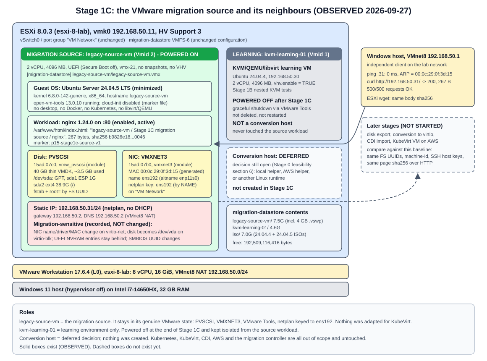

# Stage 1C: the VMware migration source VM (`legacy-source-vm`)

| Field | Value |
|---|---|
| Project | Project 1.5: VM-to-Kubernetes Migration Platform |
| Stage | 1C |
| Date | 2026-09-27 (all times UTC) |
| Result | **All gates C1 to C10 PASS**. `legacy-source-vm` built, serving nginx at 192.168.50.31 and baselined; `kvm-learning-01` powered off |
| Diagram | [stage-1c-source-lab.svg](../diagrams/stage-1c-source-lab.svg) |
| Related | [Stage 1 index](README.md), [Stage 1B record](stage-1b-kvm-qemu-fundamentals.md), [Stage 0 feasibility](../stage-0/feasibility.md) |

Labels: **OBSERVED** = seen in this lab by a command we ran. **INFERRED** = reasoned from observations or documentation, not directly tested. **NOT TESTED** = deliberately not done.



## 1. Objective

Create the VMware-side migration source VM, `legacy-source-vm`: a small Ubuntu server on the nested ESXi host running nginx behind a static IP. Then record everything a later migration needs to preserve or re-create, so a future KubeVirt copy can be compared against it.

The VM deliberately keeps a genuine VMware configuration: PVSCSI disk, VMXNET3 NIC, VMware Tools, and netplan keyed to the VMware interface name. Those properties are what make a VMware-to-KubeVirt migration non-trivial. Stage 1C records them and does not "fix" them.

## 2. Scope

In scope, and done:

- One new ESXi guest VM, `legacy-source-vm` (Vmid 2), with the fixed specification in section 4.
- Download of the official Ubuntu 24.04.5 live-server ISO from `releases.ubuntu.com`, with SHA256 and signature verification, and upload to `migration-datastore/iso/`.
- Unattended install, static network, nginx with a deterministic validation page.
- A VMware-side and guest-side baseline, and a written analysis of migration-sensitive properties.
- Graceful power-off of `kvm-learning-01` after the baseline.
- This document, one diagram, and updates to the Stage 1 index, root README, glossary and interview notes.

## 3. Change boundary

| Changed (allowed) | Not changed (as required) |
|---|---|
| New VM `legacy-source-vm` on `migration-datastore` (folder `legacy-source-vm/`) | ESXi networking (vmk0, vSwitch0, port groups), datastore configuration, NTP, host CPU/RAM |
| One ISO added to `migration-datastore/iso/` (Ubuntu 24.04.5, 4,080,486,400 bytes); the temporary seed ISO was deleted from the datastore after install | Windows virtualization, VMnet settings, VMware Workstation VM `esxi-8-lab` |
| Packages and files inside the new guest (nginx, validation page, a few admin tools) | `kvm-learning-01`, apart from the graceful power-off at the end |
| `kvm-learning-01` power state: on -> off | No snapshots on either VM; no extra disks or NICs |
| Project documentation in this repository | No Kubernetes, KubeVirt, CDI, AWS, conversion host or migration controller; no disk conversion; no migration |
| | No new SSH keys on ESXi or GitHub; the Stage 0 decisions and the handoff file are unchanged |

The installer media and seed ISO, the admin password and its hash, and all raw evidence files stay outside the repository in a local working folder (`C:\VMs\legacy-source-vm\`).

## 4. Fixed VM specification

| Property | Required | Built (OBSERVED) |
|---|---|---|
| Name | `legacy-source-vm` | `legacy-source-vm`, Vmid 2 |
| vCPU | 2 | 2 (1 socket x 2 cores) |
| Memory | 4096 MB | 4096 MB |
| Disk | 40 GB, thin | 40 GB (42,949,672,960 bytes), thin (`thinProvisioned = true`) |
| Firmware | UEFI | `firmware = "efi"`, Secure Boot off |
| Disk controller | PVSCSI | `ParaVirtualSCSIController` ("VMware paravirtual SCSI") |
| NIC | One VMXNET3 on "VM Network" | One `VirtualVmxnet3` on "VM Network" |
| Datastore | `migration-datastore` | `[migration-datastore] legacy-source-vm/legacy-source-vm.vmx` |
| Guest OS | Ubuntu Server 24.04.5 LTS, minimal, no desktop | Ubuntu 24.04.5 LTS, `ubuntu-server-minimal` source, no desktop packages |
| Hostname | `legacy-source-vm` | `legacy-source-vm` |
| Users | One administrative user | `labadmin` only (sudo); password login over SSH disabled, key login enabled |
| Network | Static 192.168.50.31/24, gateway 192.168.50.2, lab DNS | Static via netplan; DNS 192.168.50.2 (same as every other lab system) |
| Workload | nginx, enabled, on port 80, deterministic page | nginx 1.24.0, enabled, active, `0.0.0.0:80` and `[::]:80` |
| Nested virtualization | Not required | Not enabled (`nestedHVEnabled = false`); this VM is not a hypervisor |

**Spec reconciliation.** Two parts of the Stage 1C request disagreed:

- The installation section says "Ubuntu 24.04.4", but the OS and ISO section fixes Ubuntu Server 24.04.5 LTS from `releases.ubuntu.com/24.04`.
- Gate C2 says "existing ISO identified/verified". No 24.04.5 ISO existed locally, and the Stage 1B ISO on the datastore is 24.04.4.

The explicit OS/ISO section was followed: 24.04.5 was downloaded from the official source and verified. Gate C2 is therefore evaluated as "official Ubuntu 24.04.5 ISO identified, downloaded and verified".

## 5. ISO identification and SHA256

All OBSERVED.

| Item | Value |
|---|---|
| Source URL | `https://releases.ubuntu.com/24.04/ubuntu-24.04.5-live-server-amd64.iso` (official Canonical release server; no mirror, torrent or third-party site) |
| Checksum list | `https://releases.ubuntu.com/24.04/SHA256SUMS` plus `SHA256SUMS.gpg` |
| Download | 13:18 to 13:28, 596 s, about 7 MB/s, to the local working folder (not the repository) |
| Size | 4,080,486,400 bytes |
| SHA256 (computed) | `97f3d7ffb032c3eb3b23d2c8be9cc76e60c2c1f2c0146ba5ba9fe01cafae0fd8` |
| SHA256 (official list) | Same value, entry `*ubuntu-24.04.5-live-server-amd64.iso`: **MATCH** |
| Signature on SHA256SUMS | `gpg --verify`: "Good signature from Ubuntu CD Image Automatic Signing Key (2012)", primary key fingerprint `8439 38DF 228D 22F7 B374 2BC0 D94A A3F0 EFE2 1092`. A temporary keyring was used, so gpg's "not certified with a trusted signature" warning is expected. |
| Upload | 17 s to `[migration-datastore] iso/ubuntu-24.04.5-live-server-amd64.iso`; `sha256sum` on ESXi gave the same value |

If the checksum had not matched, the stage would have stopped here.

## 6. ESXi VM configuration

The VM was created from the ESXi shell with the same method as Stage 1B ([install method](kvm-learning-lab.md#4-installation-method-unattended-no-console-input)): `vmkfstools -c 40G -d thin`, then a hand-written `.vmx`, then `vim-cmd solo/registervm`.

VMware-side baseline, taken at 13:44:01 (OBSERVED):

| Property | Value |
|---|---|
| Name / Vmid | `legacy-source-vm` / 2 |
| Power state | Powered on |
| Config path | `[migration-datastore] legacy-source-vm/legacy-source-vm.vmx` |
| Hardware version / guest ID | `vmx-21` / `ubuntu64Guest` ("Ubuntu Linux (64-bit)") |
| CPU / RAM | 2 vCPU (`numCoresPerSocket = 2`) / 4096 MB |
| Firmware | `efi`; `efiSecureBootEnabled = false`; NVRAM file `legacy-source-vm.nvram` (270,840 bytes) |
| Disk | "Hard disk 1", `legacy-source-vm.vmdk` + `legacy-source-vm-flat.vmdk`, 42,949,672,960 bytes provisioned, 3487 MB allocated, thin, `diskMode = persistent` |
| Disk UUID (VMware metadata) | `6000C295-f147-b6a3-1fb2-1bd9e7ae2d9c` (`ddb.uuid`) |
| Controller | "SCSI controller 0", VMware paravirtual SCSI (PVSCSI), guest PCI slot 160 |
| NIC | "Network adapter 1", VMXNET3, port group "VM Network", guest PCI slot 192 |
| MAC | `00:0c:29:0f:3d:15`, `addressType = generated` (derived from the BIOS UUID) |
| BIOS UUID | `564d4dac-f69d-9739-d366-17bc250f3d15` |
| Other devices | IDE 0 and IDE 1 (default, empty), PS/2, SIO, VMCI, SVGA video; floppy disabled; the SATA CD-ROM used for install was removed |
| Snapshots | None (`.vmsd` is 0 bytes) |
| VMware Tools | `guestToolsRunning`, `guestToolsUnmanaged` (distribution open-vm-tools) |
| Folder on datastore | 7.5G, including a 4 GB `.vswp` (exists only while powered on) and an 86 MB VMX swap file |

VMDK descriptor notes (OBSERVED):

- `createType="vmfs"`, `RW 83886080 VMFS "legacy-source-vm-flat.vmdk"`, `ddb.thinProvisioned = "1"`.
- `ddb.adapterType = "lsilogic"` is the `vmkfstools` default and only a descriptor hint. The controller the guest actually sees is defined in the `.vmx` and is PVSCSI.
- INFERRED: conversion tools read the `.vmx`, so this hint should not matter, but it is recorded so nobody mistakes it for the real controller.

## 7. Guest configuration

### Installation (OBSERVED)

| Time | Step |
|---|---|
| 13:18 to 13:21 | Pre-change ESXi and resource baseline; 192.168.50.31 proven unused (section 8) |
| 13:28 | ISO verified and uploaded; VMDK created, `.vmx` written, VM registered (Vmid 2) |
| 13:29:18 | Powered on from the ISO plus a small NoCloud seed ISO (autoinstall + temporary installer-only SSH user) |
| 13:37:30 | Autoinstall confirmed through the installer's local API (the free license blocks console input) |
| 13:40:21 | Install finished, including security updates; VM powered itself off about 30 s later |
| 13:41 | Install media removed from the `.vmx`; seed ISO deleted from the datastore |
| 13:41:07 | First boot from disk; SSH as `labadmin` at 13:41:22 |
| 13:42:46 | nginx active |

Install choices, all in the autoinstall file:

- Source `ubuntu-server-minimal`, storage layout `direct` (GPT, ESP plus one ext4 root, no LVM).
- Security updates applied during install; `open-vm-tools` requested explicitly.
- Static network (section 8); SSH server with key login only.

The temporary installer user existed only in the live installer environment and is absent from the installed system.

The installer log contains one harmless traceback: `getpwnam(): name not found: 'installer'`. It appears because the seed replaced the live environment's default user list. The install result was SUCCESS.

### Guest baseline (OBSERVED)

| Area | Value |
|---|---|
| OS | Ubuntu 24.04.5 LTS (noble) |
| Kernel / arch | `6.8.0-142-generic` #142, `x86_64` |
| Boot | UEFI; `systemd-detect-virt` = `vmware`; firmware `VMW201.00V.24504846.B64.2501180339` |
| CPU | 2 (1 socket x 2 cores), Intel i7-14650HX model string; no `vmx` flag (no nested virtualization, as intended) |
| Memory | MemTotal 4,009,372 kB (3915 MiB); swap file `/swap.img` 3.8G, unused |
| systemd | `running`, no failed units |
| Time | UTC, synchronized (systemd-timesyncd, `ntp.ubuntu.com`) |
| Packages | 494 after install, 500 after Stage 1C additions; no desktop, Docker, containerd, Kubernetes, libvirt or QEMU packages |
| Added in Stage 1C | nginx, nginx-common, iputils-ping, less, vim-tiny, vim-common (installed with `--no-install-recommends`) |
| Users | `labadmin` only (groups adm, cdrom, sudo, dip, plugdev, lxd); `/etc/sudoers.d` has only the README |
| SSH | `passwordauthentication no`, `pubkeyauthentication yes`, one authorized key |
| VMware Tools | open-vm-tools 13.0.10, `open-vm-tools.service` active, `vgauth` enabled |
| cloud-init | `status: disabled` (disabled by marker file after install); datasource `DataSourceNone`, instance-id `iid-datasource-none` |
| APT sources | `in.archive.ubuntu.com`, `security.ubuntu.com` |

### Disk and filesystem layout (OBSERVED)

| Item | Value |
|---|---|
| Disk | `/dev/sda`, 83,886,080 sectors (40 GiB), vendor `VMware`, model `Virtual disk`; GPT, disk GUID (PTUUID) `ebeb0ebf-f2f7-4507-b842-6db77a2d14a1` |
| Partition 1 | `sda1`, 1G, vfat, FS UUID `C340-CD01`, PARTUUID `408d91cb-0067-4b02-860a-3aaafc305364`, mounted `/boot/efi` |
| Partition 2 | `sda2`, 38.9G, ext4, FS UUID `db8b3bb3-e776-42e8-902e-89124606b2f6`, PARTUUID `b701fe8c-f9fd-4fb2-a54b-ca0afedb63ce`, mounted `/` (6.2G used) |
| `/etc/fstab` | Both filesystems by `/dev/disk/by-uuid/...`; swap by path `/swap.img` |
| Kernel command line | `root=UUID=db8b3bb3-e776-42e8-902e-89124606b2f6` |
| GRUB | `search --fs-uuid` in `/boot/grub/grub.cfg`; the ESP stub `EFI/ubuntu/grub.cfg` uses `search.fs_uuid db8b3bb3-...` |
| `/dev/disk/by-id` | Empty: the VMware virtual disk exposes no serial or WWN |
| `/dev/disk/by-path` | `pci-0000:03:00.0-scsi-0:0:0:0` (PVSCSI at PCI 03:00.0 behind bridge 00:15.0) |

Nothing on the boot path refers to `/dev/sda` by name.

### Boot chain (OBSERVED)

- `efibootmgr`: BootCurrent `0005` "Ubuntu" = `HD(1,GPT,408d91cb-...)/File(\EFI\ubuntu\shimx64.efi)`. The other entries are "EFI Virtual disk" (`PciRoot(0x0)/Pci(0x15,0x0)/Pci(0x0,0x0)/SCSI(0,0)`), a SATA CD-ROM, network (MAC) and EFI shell.
- ESP contents: `EFI/BOOT/BOOTX64.EFI`, `EFI/BOOT/fbx64.efi`, `EFI/BOOT/mmx64.efi`, `EFI/ubuntu/{BOOTX64.CSV, grub.cfg, grubx64.efi, mmx64.efi, shimx64.efi}`.
- `EFI/BOOT/BOOTX64.EFI` is byte-identical to `EFI/ubuntu/shimx64.efi` (same SHA256). This is the removable-media fallback path.
- `mokutil --sb-state`: SecureBoot disabled.

### Loaded platform drivers (OBSERVED)

| PCI ID | Device | Driver | Built as |
|---|---|---|---|
| `15ad:07c0` at 03:00.0 | VMware PVSCSI | `vmw_pvscsi` | module (`CONFIG_VMWARE_PVSCSI=m`), included in the initramfs |
| `15ad:07b0` at 0b:00.0 | VMware VMXNET3 | `vmxnet3` | module (`CONFIG_VMXNET3=m`), included in the initramfs |
| `8086:7111` | PIIX4 IDE (empty) | `ata_piix` | - |

The same kernel has `CONFIG_VIRTIO_PCI=y`, `CONFIG_VIRTIO_BLK=y`, `CONFIG_SCSI_VIRTIO=y` and `CONFIG_VIRTIO_NET=y`: the VirtIO drivers are built in, not modules. There are 0 VirtIO devices today.

## 8. Network configuration

### Address selection (OBSERVED, 13:21)

Before anything was created, 192.168.50.31 was checked from every vantage point:

- ESXi `vmkping`: 100% loss.
- Windows `ping`: no reply; ARP entry stayed "Incomplete"; no answer on TCP 22 or 80.
- The VMnet8 DHCP server has no lease or reservation for it, and .31 is outside the DHCP pool (.128 to .254).
- `vmrun list` showed only `esxi-8-lab`, and the only ESXi guest used .30.

The address was free, so no alternative had to be chosen.

### Configuration inside the guest (OBSERVED)

`/etc/netplan/50-cloud-init.yaml` (root, mode 600), written by the installer:

```yaml
network:
  version: 2
  ethernets:
    ens192:
      addresses:
      - "192.168.50.31/24"
      nameservers:
        addresses:
        - 192.168.50.2
      dhcp4: false
      routes:
      - to: "default"
        via: "192.168.50.2"
```

| Item | Value |
|---|---|
| Interface | `ens192`, altname `enp11s0` |
| Driver | `vmxnet3` |
| MAC | `00:0c:29:0f:3d:15` |
| Address | 192.168.50.31/24, static |
| Default route | via 192.168.50.2, `proto static` |
| DNS | 192.168.50.2 (systemd-resolved) |
| Renderer | systemd-networkd; generated file `/run/systemd/network/10-netplan-ens192.network` |

**How netplan identifies the NIC** (the key migration finding):

- The netplan key `ens192` has no `match:` block, so netplan matches **by interface name only**. The generated networkd file contains `[Match] Name=ens192`. Nothing in it refers to the MAC or the driver.
- The name `ens192` comes from systemd's predictable naming. udev reports `ID_NET_NAME_SLOT=ens192` (the PCI slot number VMware assigns to `ethernet0`), `ID_NET_NAME_PATH=enp11s0` and `ID_NET_NAME_MAC=enx000c290f3d15`.
- The default link policy (`99-default.link`) picks the slot name. There are no custom `.link` files or udev rules.
- A second copy of the same network config sits in `/etc/cloud/cloud.cfg.d/90-installer-network.cfg`. cloud-init is disabled, so it is inactive today.

So the static address is bound to "whatever interface the kernel names `ens192`". Section 11 explains why that breaks on a different NIC model. As required, this was **not** changed.

### Reachability (OBSERVED, 13:41 to 13:43)

- From Windows (192.168.50.1): `ping` 0 ms; ARP `Reachable`, `00-0C-29-0F-3D-15`; TCP 22 connected.
- From ESXi (192.168.50.11): `vmkping` average 0.71 ms; the ESXi ARP table shows the same MAC.
- VMware Tools reports `hostName = legacy-source-vm`, `ipAddress = 192.168.50.31` on "VM Network".

## 9. nginx workload

| Item | Value (OBSERVED) |
|---|---|
| Package | `nginx` 1.24.0-2ubuntu7.18 (and `nginx-common`), from the Ubuntu archive |
| Version string | `nginx/1.24.0 (Ubuntu)` |
| Service | `nginx.service` enabled, active (running) since 13:42:46; one master and two workers (2 vCPU, `worker_processes auto`) |
| Sockets | `0.0.0.0:80` and `[::]:80` (LISTEN, nginx) |
| Main config | `/etc/nginx/nginx.conf`, sha256 `48c6a4ec1e1fd28ccf968490f07e34a1d7f755793b2108a3ed8670b1ee2a0aa2` (unmodified package file) |
| Site | `/etc/nginx/sites-enabled/default` -> `/etc/nginx/sites-available/default`, sha256 `ce0901350a021608139b5639cf4ccd7717bef8c3a9e4f79031eb46386b67b03f` (unmodified): `listen 80 default_server`, `root /var/www/html`, `server_name _` |
| Document root | `/var/www/html` |
| Validation page | `/var/www/html/index.html`, root:root 0644, 267 bytes, sha256 `b9826e18a06a354d6ba97e3419e266b1453cb2a3b0038d4b3dcd45c96c170046` |

The validation page is plain static HTML with no timestamps or hostnames generated at request time. The same bytes must come back after any migration:

```html
<!DOCTYPE html>
<html>
<head><title>legacy-source-vm</title></head>
<body>
<h1>legacy-source-vm</h1>
<p>Stage 1C migration source</p>
<p>nginx</p>
<p>Project 1.5: VM-to-Kubernetes Migration Platform</p>
<p>validation-marker: p15-stage1c-source-v1</p>
</body>
</html>
```

Validation (OBSERVED):

| Check | Result |
|---|---|
| `systemctl is-enabled nginx` / `is-active nginx` | `enabled` / `active` |
| `ss -ltnp` | nginx on `0.0.0.0:80` and `[::]:80` |
| `curl -i http://localhost/` inside the guest | `HTTP/1.1 200 OK`, `Server: nginx/1.24.0 (Ubuntu)`, `Content-Length: 267`, body sha256 `b9826e18...0046` |
| `curl.exe http://192.168.50.31/` from Windows | 200, 267 bytes, body sha256 matches |
| `wget -O - http://192.168.50.31/` from ESXi | body sha256 matches |
| 500 sequential requests from Windows | 500/500 OK in 15.2 s |
| After `kvm-learning-01` power-off (13:45) | Windows 200 / 267 bytes; ESXi body sha256 matches |

## 10. Baseline evidence

Sections 6 to 9 hold the VMware-side and guest-side baseline. This section collects the **identifiers**, with a statement of which are expected to survive a VMware-to-KubeVirt migration and which will change. "Survive" and "change" are INFERRED: they come from how the identifiers are produced and how KubeVirt presents devices. Nothing has been migrated or tested.

### Stable identifiers (live in the disk contents)

| Identifier | Value (OBSERVED) | Expected after migration (INFERRED) |
|---|---|---|
| Root FS UUID | `db8b3bb3-e776-42e8-902e-89124606b2f6` | **Survives**: stored in the ext4 superblock, copied with the disk |
| ESP FS UUID | `C340-CD01` | **Survives** (vfat volume ID) |
| PARTUUIDs | `408d91cb-...5364` (ESP), `b701fe8c-...63ce` (root) | **Survive** (GPT partition entries) |
| Disk GUID (PTUUID) | `ebeb0ebf-f2f7-4507-b842-6db77a2d14a1` | **Survives** (GPT header) |
| machine-id | `d90f169b005444be82a1d703193f8324` | **Survives** (`/etc/machine-id`), unless a tool deliberately resets it |
| SSH host keys | ED25519 `SHA256:7Nw9FkUR5yM0EheEz43F+hbI0DwtfRiKbCj0MPS46mY`; ECDSA `SHA256:9z1UPwZWYC6SbS+VELxFD6H5stA/++MfzNKOa8JHWe8`; RSA 3072 `SHA256:UXiyMja/NVO5fmVHP7nhigmU6PZCSRD0HyOrlnkniYg` | **Survive**. cloud-init is disabled, so nothing regenerates them on first boot. |
| Hostname | `legacy-source-vm` | **Survives** (`/etc/hostname`) |
| nginx config | `nginx.conf` `48c6a4ec...0aa2`, `sites-available/default` `ce090135...b03f` | **Survive** (file checksums) |
| Validation page | `/var/www/html/index.html` `b9826e18...0046`, 267 bytes | **Survives**; the HTTP body must hash the same |
| Users / packages | `labadmin` only; 500 packages | **Survive**, unless the converter adds or removes packages (virt-v2v typically removes VMware Tools; INFERRED) |
| Netplan file content | As in section 8 | **Survives unchanged**. That is exactly the problem, see section 11. |

### Identifiers that belong to the VMware platform

| Identifier | Value (OBSERVED) | Expected after migration (INFERRED) |
|---|---|---|
| Disk device name | `/dev/sda` (via PVSCSI) | **Changes** to `/dev/vda` with a virtio-blk disk. It may stay `sda` with virtio-scsi or SATA. Never an identity. |
| `/dev/disk/by-path` | `pci-0000:03:00.0-scsi-0:0:0:0` | **Changes** (new PCI topology) |
| `/dev/disk/by-id` | none | May **appear**: KubeVirt can pass a disk serial; virtio-blk exposes `virtio-<serial>` |
| Disk controller / driver | PVSCSI, `vmw_pvscsi` | **Changes** to virtio-blk or virtio-scsi (built into this kernel) |
| NIC model / driver | VMXNET3, `vmxnet3` | **Changes** to virtio-net, `virtio_net` (built in) |
| Interface name | `ens192` (altname `enp11s0`) | **Changes**. It follows the new PCI slot/path, typically `enp1s0` on KubeVirt's q35 machine (INFERRED, not tested). |
| MAC | `00:0c:29:0f:3d:15` (VMware OUI, generated) | **Changes** unless explicitly set on the KubeVirt interface (`macAddress`) |
| IP address | 192.168.50.31 static | **Depends on the target network**; see section 11 |
| SMBIOS system UUID | `ac4d4d56-9df6-3997-d366-17bc250f3d15` (byte-swapped form of VMware `uuid.bios` `564d4dac-...`) | **Changes** unless set in the KubeVirt spec (`firmware.uuid`) |
| SMBIOS serial / vendor | `VMware-56 4d 4d ac ...`, vendor VMware | **Changes** (KubeVirt/QEMU values, or a chosen `firmware.serial`) |
| `systemd-detect-virt` | `vmware` | **Changes** to `kvm` |
| UEFI boot entries | In `legacy-source-vm.nvram` on the datastore (Boot0005 "Ubuntu" -> shimx64.efi) | **Lost**: NVRAM is a separate VMware file and is not part of the disk. Boot relies on the fallback path, see section 11. |
| VMDK UUID / descriptor | `ddb.uuid 60 00 C2 95 ...`, `ddb.adapterType lsilogic` | **Gone**: VMware metadata only; a raw or qcow2 image has none of it |
| VMware Tools status | `guestToolsRunning` | **Not applicable** on KubeVirt; the service should stay inactive (INFERRED) |
| ESXi Vmid / `.vmx` path | 2 / `[migration-datastore] legacy-source-vm/legacy-source-vm.vmx` | **Not applicable**: the source VM keeps its identity on ESXi; the target is a new KubeVirt object |

**Source VM unambiguous identity** for later stages: ESXi host `esxi-8-lab` (192.168.50.11), Vmid 2, name `legacy-source-vm`, config path above, BIOS UUID `564d4dac-f69d-9739-d366-17bc250f3d15`, MAC `00:0c:29:0f:3d:15`, IP 192.168.50.31, root FS UUID `db8b3bb3-...`, page marker `p15-stage1c-source-v1`.

## 11. Migration-sensitive properties

Recorded only. **No adaptation was made in Stage 1C**, and none should be made to the source VM before the migration design decides where it belongs: in the source, during conversion, or in the target spec.

| Property | Source today (OBSERVED) | On KubeVirt (INFERRED) | Risk and where it could be handled |
|---|---|---|---|
| Disk bus | PVSCSI, `vmw_pvscsi` module in the initramfs | virtio-blk (or virtio-scsi) | **Low**. The VirtIO drivers are built in (`=y`), so no initramfs rebuild should be needed. PVSCSI simply stops being used. |
| Disk name | `/dev/sda` | `/dev/vda` (virtio-blk) | **Low**. fstab, `root=` and GRUB all use FS UUIDs. Would be high if anything used `/dev/sda`. |
| NIC model | VMXNET3, `vmxnet3` | virtio-net, `virtio_net` | Driver present (built in); the device itself is fine |
| Interface name | `ens192` | e.g. `enp1s0` | **High**. netplan matches `Name=ens192`, so the new NIC gets **no configuration**: no IP, no route. The VM would boot but be unreachable. Options for later: a `match: macaddress:` / `set-name`, or a conversion-time rewrite, or a target-side config. Deliberately not fixed. |
| MAC | `00:0c:29:0f:3d:15` | New random MAC unless set | **Medium**. Matters for any MAC-based matching, DHCP reservations or licensing. KubeVirt can set `macAddress` explicitly. |
| Static IP | 192.168.50.31/24 via 192.168.50.2 | Depends on the network binding | **High**. KubeVirt's default pod network with masquerade binding hands the guest a private address by DHCP; a static 192.168.50.x config does not fit there. Keeping .31 needs a bridged L2 network (for example a Multus secondary network), or re-addressing plus a Service. This is a design decision for later stages. |
| UEFI NVRAM | Entries live in the VMware `.nvram` file | Fresh or empty variable store (KubeVirt NVRAM is not persistent by default) | **Low to medium**. `EFI/BOOT/BOOTX64.EFI` (= shim) exists, so firmware should find it through the fallback path. shim then runs `fbx64.efi`, which recreates the "Ubuntu" entry from `BOOTX64.CSV`. |
| Secure Boot | Off in VMware | KubeVirt EFI defaults to Secure Boot **on** unless set otherwise | **Low**. shim, GRUB and the kernel are Canonical-signed, so it should boot either way. The target should still state the setting explicitly, and it needs SMM when Secure Boot is on. |
| SMBIOS UUID / serial | VMware-derived | KubeVirt-generated unless set | **Low** for this guest: nothing in it keys off the SMBIOS UUID. Can be pinned with `firmware.uuid` / `serial` if needed. |
| VMware Tools | open-vm-tools running | Useless | **Low**. It should not start off VMware; virt-v2v normally removes it. Equivalent: qemu-guest-agent (not installed). |
| cloud-init | Disabled by marker; `90-installer-network.cfg` holds the same `ens192` config | Disabled, if the marker survives | **Medium**, if someone re-enables cloud-init or the target injects a NoCloud/ConfigDrive datasource: it could rewrite network config, SSH keys or the hostname. |
| Disk allocation | 40 GB virtual, about 3.5 GB allocated (thin) | Target PVC size and sparseness | **Low**. The target must be at least 40 GiB. A sparse-aware copy moves about 3.5 GB instead of 40 GB. |

These match the Stage 1B lesson: UUID-based storage is resilient, and name- or driver-keyed network config is not.

## 12. Known risks

1. **Unreachable after migration.** The combination of name-keyed netplan and a static address outside any KubeVirt pod network is the most likely first failure (section 11). Detecting it needs console access on the target, so the later plan should include a serial/VNC console check.
2. **Laptop memory budget.** With both VMs on, Windows had about 10 GiB free and `vmware-vmx` held a 10.1 GiB working set. Workstation does not give guest pages back when an ESXi VM powers off (OBSERVED: the working set stayed 10.13 GiB after `kvm-learning-01` stopped). Starting more VMs later must be planned against this.
3. **Free ESXi API limits.** Console screenshot and key injection are blocked, and export paths may be restricted (Stage 0 N6). This stage worked around the console limit with a seed ISO plus the installer's local API. Disk export for migration is still an open question for Stage 1D and later.
4. **Security updates drift.** The guest runs unattended-upgrades. Package versions may move between this baseline and a migration. Kernel `6.8.0-142` and nginx `1.24.0-2ubuntu7.18` are the baseline values; a later comparison should expect patch-level drift rather than treat it as a migration defect.
5. **Two Ubuntu point releases on the datastore.** `kvm-learning-01` is 24.04.4 and `legacy-source-vm` is 24.04.5. Both ISOs remain in `iso/` (7.0G). This is harmless, but it must not be confused in evidence.
6. **Installer-side artefacts.** The benign `getpwnam(installer)` traceback, and the cloud-init installer files under `/etc/cloud/cloud.cfg.d/`, are part of the source state. They are recorded, not cleaned up.
7. **Datastore headroom.** 179.3 GB free now (192,509,116,416 bytes; GB = 2^30 bytes). Enough for an exported copy of the 40 GB disk, but every later artefact on the datastore should be accounted for.

## 13. Resource impact

All values OBSERVED. ESXi CPU values are quickStats averages and lag short bursts. Windows per-process CPU uses 100% = one logical CPU (24 in total). See [Stage 1B section 9](stage-1b-kvm-qemu-fundamentals.md#9-resource-observations) for how to read these layers.

| Moment (UTC) | Windows free RAM | `vmware-vmx` CPU / working set | ESXi host CPU / memory | `kvm-learning-01` | `legacy-source-vm` | Datastore free (bytes) |
|---|---|---|---|---|---|---|
| Before (13:21) | 11.8 GiB | 5.4% / 8.44 GiB | 334 MHz / 3422 MB | on; host mem 1574 MB | does not exist | 200,268,578,816 |
| During install (13:39) | 9.9 GiB | 159.7% / 10.00 GiB | 745 MHz / 7539 MB | on; 1573 MB | 557 MHz; host mem 4116 MB; guest (active) 2211 MB | 189,425,254,400 |
| nginx idle (13:44) | 10.2 GiB | 0.0% / 10.13 GiB | 600 MHz / 4704 MB | on; 1574 MB | 194 MHz; host mem 1268 MB; overhead 36 MB | 188,128,165,888 |
| nginx, 500 requests (13:44) | 10.2 GiB | 14.8% / 10.13 GiB (Windows total 13.9%) | 504 MHz / 4689 MB | on; 1573 MB | 59 MHz; 1268 MB | 188,128,165,888 |
| Final (13:45) | 9.9 GiB | 8.6% / 10.13 GiB | 833 MHz / 3118 MB | **off** | 29 MHz; 1268 MB | 192,509,116,416 |

Inside the guest, nginx idle: `free -m` used 421 MiB, buff/cache 630, available 3494 of 3915 MiB; load 0.23. The largest resident processes were `multipathd`, `unattended-upgrades` and `packagekitd`, not nginx.

How to read this:

- **Install is the expensive moment.** `vmware-vmx` used about 1.6 logical CPUs, and ESXi backed 4116 MB for the new VM, because the installer touched almost all of its RAM.
- **The power cycle after install released those pages.** After first boot the VM is backed by only 1268 MB.
- **nginx is negligible.** 500 sequential requests moved the guest's quickStats by nothing measurable. The Windows-side increase is mostly the request loop itself.
- **Datastore:** 200,268,578,816 -> 192,509,116,416 bytes (-7.23 GiB net). That is the 24.04.5 ISO (3.80 GiB) plus the thin VMDK (about 3.4 GiB) plus the running VM's swap files (about 4.1 GiB). It is offset by `kvm-learning-01`'s 4 GiB `.vswp` being deleted at power-off (+4.08 GiB between 13:44 and 13:45).
- **Powering off `kvm-learning-01`** dropped ESXi memory use from about 4.7 GB to 3.1 GB. Windows did not get memory back, because Workstation keeps pages ESXi has touched.

## 14. Final lab state

OBSERVED at 13:45:12.

| Item | State |
|---|---|
| ESXi host | `esxi-8-lab`, vmk0 192.168.50.11 static, vSwitch0 (uplink vmnic0) with "Management Network" and "VM Network", NTP enabled, HV Support 3, maintenance mode off. **Unchanged.** |
| `legacy-source-vm` (Vmid 2) | **Powered on**, 192.168.50.31, nginx 200 with the expected page, 0 snapshots |
| `kvm-learning-01` (Vmid 1) | **Powered off** through a graceful guest shutdown (`vim-cmd vmsvc/power.shutdown 1` at 13:44:54, off by 13:45:00; `.vmx` shows `cleanShutdown = "TRUE"`). 0 snapshots, not deleted, not restarted, otherwise unmodified. |
| Conversion host | **Not created. Decision explicitly DEFERRED** ([Stage 0 feasibility section 6](../stage-0/feasibility.md)). `kvm-learning-01` has not been repurposed. |
| `migration-datastore` | 192,509,116,416 bytes free; folders `legacy-source-vm/` 7.5G, `kvm-learning-01/` 4.6G, `iso/` 7.0G |
| Kubernetes / KubeVirt / CDI / AWS / controller | None installed, created or started |
| Migration | Not started; no disk exported or converted |

## 15. Explicit non-goals

Stage 1C did **not**, by design:

- install Kubernetes, KubeVirt or CDI, or create any AWS infrastructure;
- create a conversion host or the migration controller, or choose a conversion approach;
- export, copy or convert the VM disk, or start any migration;
- adapt the source VM for KubeVirt: netplan is still keyed to `ens192`; open-vm-tools, VMXNET3 and PVSCSI are kept; no virtio drivers or qemu-guest-agent were added;
- create snapshots, or change ESXi networking or datastore configuration;
- modify `kvm-learning-01` beyond powering it off;
- tune, harden or load-test nginx beyond the simple validation.

## 16. Stage 1D entry criteria

Stage 1D is not defined here. Stage 1D may begin only when all of the following hold:

1. The user has reviewed this Stage 1C record and explicitly approved Stage 1D, with its objective, scope and change boundary written down.
2. **`legacy-source-vm` remains healthy**: powered on, `systemctl is-system-running` = `running`, no failed units, reachable at 192.168.50.31 from Windows and ESXi.
3. **nginx responds successfully**: `http://192.168.50.31/` returns 200, 267 bytes, body sha256 `b9826e18a06a354d6ba97e3419e266b1453cb2a3b0038d4b3dcd45c96c170046`.
4. **The baseline is complete** (sections 6 to 10) and still matches:
   - FS UUIDs `db8b3bb3-...` and `C340-CD01`;
   - MAC `00:0c:29:0f:3d:15`;
   - netplan file unchanged;
   - nginx config checksums unchanged.
5. **The source VM is identified unambiguously**: `esxi-8-lab` Vmid 2, `[migration-datastore] legacy-source-vm/legacy-source-vm.vmx`, BIOS UUID `564d4dac-f69d-9739-d366-17bc250f3d15`.
6. **Disk and network migration risks are documented** (sections 11 and 12) and have not been silently fixed in the source VM.
7. **The conversion-host decision remains explicit**: either still recorded as DEFERRED, or taken in an ADR before any conversion work. It is never implied by reusing `kvm-learning-01`.
8. **`kvm-learning-01` remains isolated from the source workload**: powered off (or, if Stage 1D needs it, powered on only by an explicit decision), not used to touch `legacy-source-vm`'s disk or network identity.
9. **No Kubernetes, KubeVirt or CDI work has started**, and no AWS infrastructure exists for the project.
10. **No source VM migration has occurred**: no export, copy, conversion or cut-over of `legacy-source-vm`; no snapshots on it.
11. The host is still in its recorded state: ESXi networking and datastore configuration unchanged, NTP synchronized, maintenance mode off, datastore free about 179.3 GB (192,509,116,416 bytes; GB = 2^30 bytes, as in Stage 1A) or any change explained.

## Gates

| Gate | Requirement | Result | Evidence (OBSERVED) |
|---|---|---|---|
| C1 | Repository and Stage 1B state verified | **PASS** | `main` clean and equal to `origin/main` at `2bf53f3`. ESXi pre-state 13:18 to 13:21: one VM (`kvm-learning-01`, on, 0 snapshots), vmk0 static .11, both port groups, NTP on, maintenance off, 200,268,578,816 bytes free. |
| C2 | Official Ubuntu 24.04.5 ISO identified, downloaded and verified (see section 4 reconciliation) | **PASS** | `releases.ubuntu.com/24.04`; SHA256 `97f3d7ff...0fd8` matches SHA256SUMS; SHA256SUMS signature good (key `8439 38DF ... EFE2 1092`); same hash on ESXi after upload |
| C3 | VM created with the fixed specification | **PASS** | Vmid 2; 2 vCPU, 4096 MB, 40 GB thin, EFI, PVSCSI, one VMXNET3 on "VM Network", `migration-datastore`; no snapshots (section 6) |
| C4 | VM boots | **PASS** | Unattended install SUCCESS 13:40:21. First boot from disk 13:41:07: Ubuntu 24.04.5, kernel 6.8.0-142, UEFI, systemd `running`, no failed units, no desktop. |
| C5 | Static network reachable | **PASS** | 192.168.50.31/24 static, gateway and DNS .2. Ping, ARP and TCP 22 from Windows; `vmkping` from ESXi. VMware Tools reports the IP (section 8). |
| C6 | nginx healthy | **PASS** | nginx 1.24.0 enabled and active on :80. `curl localhost` 200; Windows and ESXi fetch the page with matching sha256; 500/500 requests OK (section 9). |
| C7 | Baseline captured | **PASS** | VMware and guest baselines plus the stable-identifier table (sections 6, 7, 8, 10). Raw evidence files 01 to 23 are kept locally. |
| C8 | VMware-specific migration-sensitive configuration recorded | **PASS** | PVSCSI/VMXNET3 modules and PCI IDs, `ens192` name-match in netplan and networkd, MAC, SMBIOS UUID, NVRAM boot entries and fallback loader, Secure Boot off, open-vm-tools, cloud-init state (sections 10 and 11). Nothing adapted. |
| C9 | `kvm-learning-01` off | **PASS** | Graceful shutdown 13:44:54 to 13:45:00; `cleanShutdown = TRUE`; Vmid 1 powered off, Vmid 2 powered on, both 0 snapshots |
| C10 | Docs and diagram complete | **PASS** | This document (16 sections), [diagram](../diagrams/stage-1c-source-lab.svg), Stage 1 index, root README, glossary and interview notes updated; docs validated (ASCII, links, SVG parse, secret scan) before commit |

## Sources

- Ubuntu: [24.04 release directory](https://releases.ubuntu.com/24.04/), [autoinstall reference](https://canonical-subiquity.readthedocs-hosted.com/en/latest/reference/autoinstall-reference.html), [netplan reference](https://netplan.readthedocs.io/en/stable/netplan-yaml/), [how to verify an Ubuntu download](https://ubuntu.com/tutorials/how-to-verify-ubuntu)
- systemd: [predictable network interface names](https://www.freedesktop.org/software/systemd/man/latest/systemd.net-naming-scheme.html)
- KubeVirt user guide: [interfaces and networks](https://kubevirt.io/user-guide/network/interfaces_and_networks/), [virtual hardware (firmware, UUID, serial, EFI)](https://kubevirt.io/user-guide/compute/virtual_hardware/), [disks and volumes](https://kubevirt.io/user-guide/storage/disks_and_volumes/)
- UEFI shim: [fallback boot loader (fbx64.efi) README](https://github.com/rhboot/shim/blob/main/README.fallback)
- Broadcom: [KB 399823 (free ESXi API limits)](https://knowledge.broadcom.com/external/article/399823)
