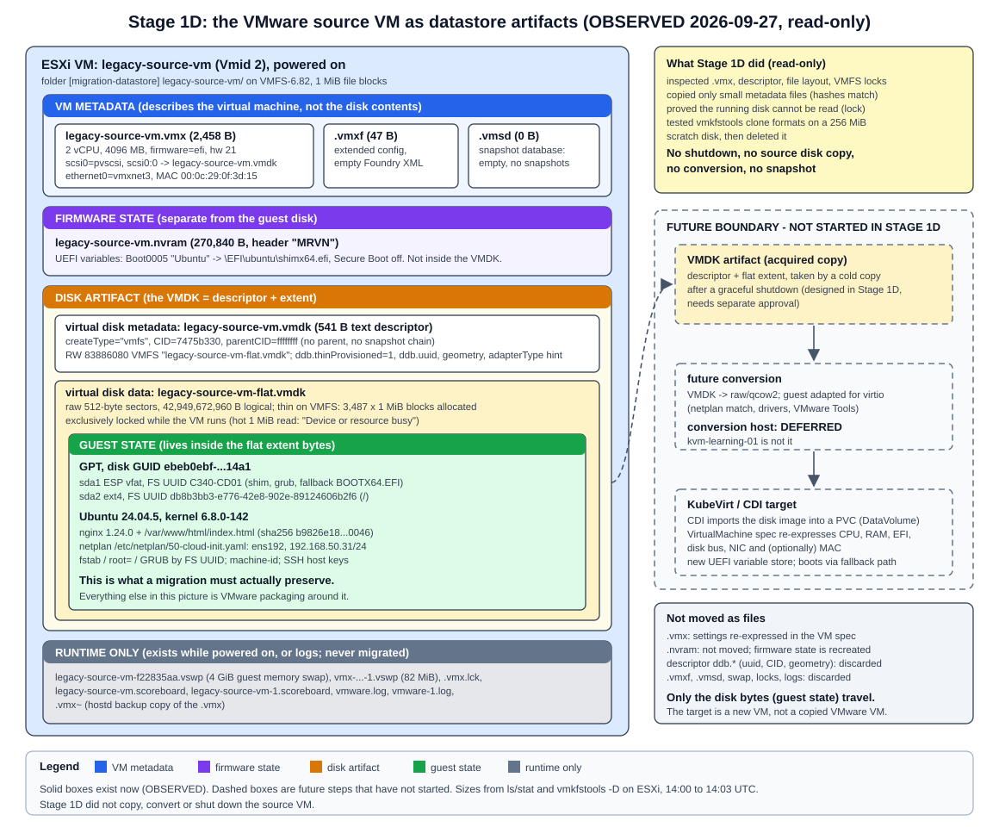

# Stage 1D: VMware source artifact acquisition and VMDK understanding

| Field | Value |
|---|---|
| Project | Project 1.5: VM-to-Kubernetes Migration Platform |
| Stage | 1D |
| Date | 2026-09-27 (all times UTC; lab work 14:00 to 14:03) |
| Result | **All gates D1 to D10 PASS**. Source artifacts characterized read-only; cold-copy procedure designed, **not executed** |
| Diagram | [stage-1d-source-artifacts.svg](../diagrams/stage-1d-source-artifacts.svg) |
| Correction | The claim that the descriptor `CID` tracks disk writes was disproved by the Stage 1E acquisition and is corrected below ([Stage 1E section 10](stage-1e-cold-acquisition.md#10-correction-to-stage-1d-the-descriptor-cid-is-not-a-write-indicator-here)) |
| Related | [Stage 1 index](README.md), [Stage 1C record](stage-1c-migration-source.md) (the source VM and its baseline), [CDI storage model](../stage-0/cdi-storage-model.md#vmdk-vmware) |

Labels: **OBSERVED** = seen in this lab by a command we ran. **INFERRED** = reasoned from observations or documentation, not directly tested. **NOT TESTED** = deliberately not done.



## 1. Objective

Understand exactly what the VMware source VM `legacy-source-vm` consists of on the ESXi datastore. Separate what a future cold VMware-to-KubeVirt migration must move from what is VMware packaging. Work out how the disk can be taken off a **free** ESXi host.

Stage 1D is an investigation and acquisition-planning stage. It designs the cold copy but does not perform it.

## 2. Scope

| Done (read-only unless stated) | Not done (as required) |
|---|---|
| Verified repository state and source VM health before and after the investigation | No shutdown of `legacy-source-vm`; no copy of the 40 GB source disk |
| Read the `.vmx`, the VMDK descriptor, the file layout, VMFS lock and allocation metadata, and `vmware.log` | No conversion, compaction, repair or rewrite of any source file |
| Read VM properties through a local-ticket API session (read-only property reads) | No snapshots; no change to VM configuration, guest OS, packages, netplan, nginx or VMware Tools |
| Copied four small metadata files (descriptor, `.vmx`, `.vmxf`, `.nvram`) to the local evidence folder, outside Git | No Kubernetes, KubeVirt, CDI, AWS, conversion host or migration controller |
| Measured SSH throughput by streaming 1 GiB of the **non-source** 24.04.4 ISO | `kvm-learning-01` not touched (still powered off) |
| **Scratch test:** created a 256 MiB thin scratch disk in a separate folder, cloned it with `vmkfstools` into three formats, then deleted everything. Datastore free space returned to the exact byte count. | No ESXi networking, datastore configuration or module changes (the `multiextent` module was deliberately not loaded) |

The scratch test is the only write in Stage 1D. It never touched the source VM's folder or disk. It was needed to prove the `vmkfstools` export path without copying the source disk.

## 3. Current source state

OBSERVED at 14:00 (before) and again at 14:03 (after the investigation):

| Check | Before (14:00) | After (14:03) |
|---|---|---|
| Power state / boot time | Powered on / `bootTime 2026-09-27T13:41:07Z` | Same (no reboot) |
| Snapshots | 0 (and 0 on `kvm-learning-01`, which is powered off) | 0 / 0 |
| HTTP from Windows | 200, 267 bytes, sha256 `b9826e18...0046` | Same |
| HTTP from ESXi (`wget`) | sha256 `b9826e18...0046` | Same |
| IP / MAC / tools | 192.168.50.31, `00:0c:29:0f:3d:15`, `guestToolsRunning` | Same |
| `.vmx` sha256 | `19a1a410f82fe5bf2d32b83f5ac95381b852311ffe8609640fa723551b209bc3` | Same |
| Descriptor sha256 / CID | `5b407e06ec29cac925a4504978ca3cef5d231398536ab476bcd03acbdc5de9ff` / `7475b330` | Same |
| `.nvram` / `.vmxf` sha256 | `e99a76eb...2646` / `2905a1b9...e4ab` | Same |
| Flat extent allocation | `nb 3487` (3,487 x 1 MiB blocks) | Same |

Guest-side comparison with the [Stage 1C baseline](stage-1c-migration-source.md#10-baseline-evidence) (OBSERVED 14:00, read-only SSH session, stdin-fed script, no files written to the guest):

- Identity and state: hostname, kernel `6.8.0-142-generic`, system `running`, 0 failed units.
- Disk: PTUUID, both FS UUIDs and both PARTUUIDs identical; fstab and `root=UUID=` unchanged.
- Network: `ens192` with driver `vmxnet3`, same MAC, 192.168.50.31/24, default via .2, DNS .2.
- Netplan file content identical to Stage 1C. Its sha256 was recorded for the first time: `bd449fd7afbc5e0dc47205da3c54f5ccd96099717e12fba11c45fa28f6f4b253`.
- nginx: enabled and active on :80; `nginx.conf`, `sites-available/default` and `index.html` checksums identical; `curl localhost` 200.
- machine-id and all three SSH host key fingerprints identical.
- 500 packages, no `reboot-required`; the APT history shows nothing after the Stage 1C nginx install. open-vm-tools active; cloud-init disabled.

The SSH logins and the single `sudo` read (netplan is mode 600) leave entries in the guest's journal and login records. That is the only guest footprint. It touches no baseline-relevant state.

## 4. VMware VM configuration

Read with `cat` on the `.vmx`, `vim-cmd vmsvc/get.config` / `get.filelayout`, and a local-ticket pyVmomi property read (OBSERVED). Three kinds of information are kept apart below.

### 4.1 VM configuration metadata (`.vmx`, 2,458 bytes)

| Item | Value |
|---|---|
| VMX path / datastore | `[migration-datastore] legacy-source-vm/legacy-source-vm.vmx` / `migration-datastore` (VMFS-6.82) |
| Hardware version / guest OS | `virtualHW.version = "21"` (`vmx-21`) / `guestOS = "ubuntu-64"` |
| CPU / memory | `numvcpus = "2"`, `cpuid.coresPerSocket = "2"` / `memSize = "4096"` |
| Disk controller | `scsi0.virtualDev = "pvscsi"`, PCI slot 160, `scsi0.sasWWID = "50 05 05 6c f6 9d 97 30"` (generated) |
| Disk attachment | `scsi0:0.deviceType = "scsi-hardDisk"`, `scsi0:0.fileName = "legacy-source-vm.vmdk"` (points at the **descriptor**, not the data file); `scsi0:0.redo = ""` (no redo log) |
| NIC | `ethernet0.virtualDev = "vmxnet3"`, `networkName = "VM Network"`, PCI slot 192, `startConnected = "TRUE"` |
| MAC | `ethernet0.addressType = "generated"`, `generatedAddress = "00:0c:29:0f:3d:15"` |
| VM identity | `uuid.bios` and `uuid.location` = `56 4d 4d ac f6 9d 97 39-d3 66 17 bc 25 0f 3d 15`; no `instanceUuid` (no vCenter) |
| Snapshot/suspend/log directories | All the VM folder; `swapPlacement = inherit` |
| Changed block tracking | `changeTrackingEnabled = false` (no CBT; warm migration would need it, cold does not) |

### 4.2 Disk representation (as the VM sees it)

| Item | Value |
|---|---|
| Device | "Hard disk 1", controller key 1000 (PVSCSI), unit 0 |
| Backing type | `VirtualDisk.FlatVer2BackingInfo` (descriptor + flat extent) |
| Descriptor file | `[migration-datastore] legacy-source-vm/legacy-source-vm.vmdk` |
| Capacity | 42,949,672,960 bytes (40 GiB) |
| Allocation | `thinProvisioned = True`, `eagerlyScrub = False`; `diskMode = persistent`; no parent (no snapshot chain); `sharing = None` |
| Disk UUID | `6000C295-f147-b6a3-1fb2-1bd9e7ae2d9c` (same as descriptor `ddb.uuid`) |
| Content ID (API, live) | `e499afe839e682ad2038f5b55c84c946`. It differs from the descriptor's on-disk `ddb.longContentID` (`dc2d48eb...7475b330`) because the running VM has written to the disk since it was opened. Corrected after Stage 1E: the on-disk descriptor was **not** updated at shutdown (`CID` stayed `7475b330`), so for this `vmfs` disk the descriptor `CID` does not track writes. |

### 4.3 Firmware / NVRAM state

| Item | Value |
|---|---|
| Firmware | `firmware = "efi"`; `uefi.secureBoot.enabled = "FALSE"` (vmware.log: `pvnvram: SecureBootMode value: 0`) |
| NVRAM path | `nvram = "legacy-source-vm.nvram"`, in the VM folder |
| NVRAM file | 270,840 bytes, binary, header `MRVN` followed by `CMOStimA`/`CMOStimB` records. It holds the UEFI variable store, including the Boot0005 "Ubuntu" entry recorded in Stage 1C. |

## 5. Actual datastore file layout

`ls -las`, `stat` and `du -k` in `/vmfs/volumes/migration-datastore/legacy-source-vm/`, VM powered on (OBSERVED 14:00):

| File | Size (bytes) | Allocated | Category | Exists when powered off? |
|---|---:|---:|---|---|
| `legacy-source-vm.vmx` | 2,458 | 4 KiB | VM metadata (configuration) | Yes |
| `legacy-source-vm.vmx~` | 2,458 | 4 KiB | VM metadata backup (copy written when the host edits the `.vmx`; INFERRED) | Yes |
| `legacy-source-vm.vmxf` | 47 | 4 KiB | VM metadata (extended config: `<Foundry><VM/></Foundry>`, empty) | Yes |
| `legacy-source-vm.vmsd` | 0 | 0 | VM metadata (snapshot database, empty) | Yes |
| `legacy-source-vm.nvram` | 270,840 | 1 MiB | Firmware state | Yes |
| `legacy-source-vm.vmdk` | 541 | 4 KiB | Disk artifact: **descriptor** | Yes |
| `legacy-source-vm-flat.vmdk` | 42,949,672,960 | 3,570,688 KiB = 3,487 MiB | Disk artifact: **data extent** | Yes |
| `legacy-source-vm-f22835aa.vswp` | 4,294,967,296 | 4 GiB | Runtime: guest memory swap (= `memSize`, no reservation) | No, deleted at power-off (seen for `kvm-learning-01` in Stage 1C) |
| `vmx-legacy-source-vm-21a60b2e...-1.vswp` | 85,983,232 | 82 MiB | Runtime: VMX process overhead swap | No (INFERRED) |
| `legacy-source-vm.vmx.lck` | 0 | 0 | Runtime: VM lock file | No (INFERRED) |
| `legacy-source-vm.scoreboard`, `legacy-source-vm-1.scoreboard` | 7,316 each | 64 KiB each | Runtime statistics (`vmxstats.filename`) | Left over, not needed |
| `vmware.log`, `vmware-1.log` | 112,050 / 156,111 | 1 MiB each | Logs: current run and previous run (the install) | Yes |

Observations:

- The layout is **descriptor + flat extent** (ESXi `vmfs` type), not a monolithic sparse file. `vim-cmd vmsvc/get.filelayout` lists exactly one disk file (the descriptor). The property API's `layoutEx.disk` chain has two files: descriptor and extent.
- The API's `layoutEx.file` sizes are **stale**. It reports the extent at 3,470,786,560 bytes (3,310 MiB, the Stage 1C install-time value) and the `.vmx` at 2,456 bytes. The filesystem shows 3,487 MiB and 2,458 bytes. Evidence must use `ls`/`stat`/`vmkfstools -D` on the datastore, not cached API sizes.
- Folder total: 7.5G, of which about 4.1 GiB is runtime swap that disappears at power-off.

## 6. Actual VMDK structure

Tools used: `cat` of the descriptor, `vmkfstools -D` (VMFS lock and allocation dump), `vmkfstools -Ph`, `vmware.log` (all read-only). `qemu-img` is **not installed** on Windows or ESXi (OBSERVED). The only copy in the lab is on `kvm-learning-01`, which must stay powered off and isolated, so it was not used.

### 6.1 Descriptor (`legacy-source-vm.vmdk`, 541 bytes, text)

```text
# Disk DescriptorFile
version=1
encoding="UTF-8"
CID=7475b330
parentCID=ffffffff
createType="vmfs"

# Extent description
RW 83886080 VMFS "legacy-source-vm-flat.vmdk"

# The Disk Data Base
#DDB

ddb.adapterType = "lsilogic"
ddb.geometry.cylinders = "5221"
ddb.geometry.heads = "255"
ddb.geometry.sectors = "63"
ddb.longContentID = "dc2d48eb61aee3399ed03ee37475b330"
ddb.thinProvisioned = "1"
ddb.toolsInstallType = "0"
ddb.toolsVersion = "2147483647"
ddb.uuid = "60 00 C2 95 f1 47 b6 a3-1f b2 1b d9 e7 ae 2d 9c"
ddb.virtualHWVersion = "14"
```

| Field | Meaning |
|---|---|
| `createType="vmfs"` | ESXi's native layout: this text descriptor plus one flat extent on VMFS. Not `monolithicSparse`, not `twoGbMaxExtentSparse`, not `streamOptimized`. |
| `RW 83886080 VMFS "..."` | One read-write extent of 83,886,080 sectors x 512 bytes = 42,949,672,960 bytes, stored as a VMFS file (the flat file) |
| `CID` / `parentCID=ffffffff` | Content ID of this disk; `ffffffff` = no parent. There is no snapshot or delta chain. `CID` is the last 8 hex digits of `ddb.longContentID`. |
| `ddb.thinProvisioned = "1"` | The flat file is thin on VMFS |
| `ddb.geometry.*` | Legacy CHS geometry (5221/255/63 covers 83,875,365 sectors, slightly less than the disk). vmware.log: `BIOS Geo (0/0/0)`. Irrelevant for a UEFI/GPT guest. |
| `ddb.adapterType = "lsilogic"` | Hint written by `vmkfstools` at creation. The real controller comes from the `.vmx` (PVSCSI). |
| `ddb.virtualHWVersion = "14"` | Disk-format compatibility level written by `vmkfstools`. It is not the VM's hardware version (21). |
| `ddb.uuid`, `ddb.longContentID`, `ddb.tools*` | VMware bookkeeping. Meaningless outside VMware. |

### 6.2 Flat extent (`legacy-source-vm-flat.vmdk`)

- **Format:** raw sector data, with no header and no metadata. Byte 0 of the file is byte 0 of the virtual disk (the protective MBR, then the GPT). Outside VMware, this file on its own is a valid raw disk image (INFERRED from the flat layout; the running disk could not be read to show it).
- **Size:** logical 42,949,672,960 bytes. `vmkfstools -D`: `len 42949672960, nb 3487 ... bs 1048576`, i.e. 3,487 allocated 1 MiB VMFS file blocks (3.41 GiB, 8.5% of capacity). `tbz 0`: no lazily zeroed blocks, as expected for thin. `du`: 3,570,688 KiB.
- **Thin is a VMFS property, not a VMDK format property.** Unwritten regions are holes in the VMFS file and read back as zeros. If the flat file is copied with a normal file copy, the zeros are transferred and written: the copy is 40 GiB unless the destination tool recreates holes (INFERRED).
- **Allocated is not "used":**
  - The guest reported 6.2G used on `/` in Stage 1C, but only 3.41 GiB is allocated on VMFS. `/swap.img` (3.8G) was preallocated by the installer and never written, so VMFS never allocated it (INFERRED).
  - Conversely, blocks the guest freed stay allocated unless the guest discards them (fstrim).
- **Lock:** `vmkfstools -D` shows `mode 1` (exclusive) with the ESXi host as owner while the VM runs. The descriptor is `mode 0` (unlocked). A 1 MiB `dd` read of the flat file failed with `can't open ...: Device or resource busy` (OBSERVED). **The running disk cannot be read at all**, so a hot copy without a snapshot is impossible, and snapshots are forbidden.
- **vmware.log at power-on:** `DISK: OPEN scsi0:0 '.../legacy-source-vm.vmdk' persistent R[]`, then `DISKLIB-VMFS : ".../legacy-source-vm-flat.vmdk" : open successful (10) size = 42949672960 ... Type 3`.

### 6.3 What is essential when moving the disk outside ESXi

1. **Both files, together:** the descriptor and the flat extent. The descriptor alone contains no data. The flat extent alone is a usable raw image, but tools that expect a VMDK need the descriptor, and the extent name inside it must match.
2. The **full logical size** (42,949,672,960 bytes). A target smaller than 40 GiB would truncate the GPT backup header at the end of the disk.
3. The **disk must be closed**: VM powered off, lock released.
4. Nothing else in the folder is needed to reproduce the disk contents. The `.vmx` and `.nvram` are needed only as *reference* for building the target VM definition.
5. INFERRED from QEMU documentation, not tested here: `qemu-img` reads both `vmfs` (descriptor + flat) and `twoGbMaxExtentSparse` VMDKs. CDI accepts VMDK or raw input ([Stage 0 CDI model](../stage-0/cdi-storage-model.md#vmdk-vmware)).

## 7. Metadata boundaries

| Layer | Elements (this VM) | Where it lives | In a future migration |
|---|---|---|---|
| **VMware VM metadata** | CPU, RAM, hardware version, PVSCSI controller, VMXNET3 NIC, MAC, PCI slots, `uuid.bios`, guest OS type | `.vmx` (+ empty `.vmxf`, empty `.vmsd`) | **Not copied.** Re-expressed (by a person or the future controller) as a KubeVirt `VirtualMachine` spec: CPU, memory, EFI firmware, virtio disk bus, virtio NIC, optionally the same MAC and SMBIOS UUID. |
| **Firmware state** | UEFI variable store: boot entries, Secure Boot mode | `.nvram` (separate binary file) | **Not moved.** The target starts with a new variable store and boots through the ESP fallback loader (`\EFI\BOOT\BOOTX64.EFI`, confirmed present in Stage 1C). |
| **Disk artifact** | Descriptor (`createType`, CID, extent list, `ddb.*`), flat extent container, VMFS thin allocation | `legacy-source-vm.vmdk` + `legacy-source-vm-flat.vmdk` | **The transport.** Acquired as-is by a cold copy. The descriptor's VMware bookkeeping (`ddb.uuid`, CID, geometry, adapter hint) is discarded when converted to raw/qcow2. |
| **Guest filesystem / guest state** | GPT (PTUUID `ebeb0ebf-...`), ESP (`C340-CD01`) with shim/GRUB, ext4 root (`db8b3bb3-...`), Ubuntu, packages, nginx config and page, netplan, machine-id, SSH host keys | The byte contents of the flat extent | **What the migration actually moves.** Must arrive byte-identical before conversion. The conversion step may deliberately edit it afterwards, for example netplan and VMware Tools removal. |
| **Runtime** | Guest swap `.vswp`, VMX swap, `.vmx.lck`, scoreboards, logs | VM folder, while powered on | **Discarded.** Logs may be kept as evidence only. |

What a future migration moves: **the contents of one 40 GiB virtual block device**. The VMware VM is not transferred as a collection of files. The target is a new KubeVirt VM whose definition is written from the `.vmx` facts, whose disk is imported from the acquired extent, and whose firmware state is created fresh.

## 8. Acquisition mechanisms

All candidates were evaluated for this lab: free ESXi 8.0.3 (license "vSphere 8 Hypervisor", edition `esx.hypervisor.cpuPackageCoreLimited`), SSH key access, no vCenter. Supporting measurements (OBSERVED):

- ESXi-to-Windows SSH stream: 1 GiB in 7.5 s, about **137 MiB/s**.
- ESXi `sha256sum`: 1 GiB in 8 s, about **128 MiB/s**.
- Windows `C:` has **405.7 GiB free** (NTFS).
- Datastore free: 192,509,116,416 bytes.

| # | Mechanism | Prerequisites | Consistency | Data moved / destination size | Source must be off? | Risk to source | Preserves disk representation? | Verdict |
|---|---|---|---|---|---|---|---|---|
| M1 | **`scp` of descriptor + flat extent** from ESXi to Windows (OpenSSH on both ends, OBSERVED) | ESXi SSH (enabled), key login (works), 40+ GiB free at the destination | Clean, if taken after a graceful guest shutdown | About 40 GiB over the wire (holes read as zeros), about 5 min at 137 MiB/s (INFERRED). Destination file 40 GiB, not sparse. | **Yes**: the flat file cannot even be opened while running (OBSERVED) | Read-only open of source files | **Yes, byte-exact**: the same `vmfs` descriptor + raw extent. Verifiable by comparing the sha256 of the flat file on both ends. | **Recommended** |
| M2 | **`vmkfstools -i <src> -d 2gbsparse`** into a staging folder on the datastore, then `scp` the sparse files | Datastore space about equal to allocated data (about 3.5 GiB); staging folder | Clean (cold) | About 3.5 GiB over the wire (INFERRED from 3,487 MiB allocated). Destination about 3.5 GiB in `twoGbMaxExtentSparse` files. | Yes (source disk lock) | Source opened read-only by `vmkfstools`. On the scratch disk the source sha256, `CID` and mtime were unchanged (OBSERVED). | Contents yes, container no: re-encoded as sparse grains. Lossless on the scratch disk (round trip back to thin gave an identical sha256). Checking the copy needs a VMDK-aware tool. | **Alternative**, when bandwidth or space matter |
| M3 | **HTTPS datastore file service** `/folder/...?dcPath=ha-datacenter&dsName=migration-datastore` | An authenticated session: root password or session cookie. Unauthenticated: HTTP 401 (OBSERVED). | Clean (cold) | Same as M1 (40 GiB) | Yes: GET of the locked flat file returned **HTTP 500**, while the descriptor and `.nvram` returned 200 (OBSERVED, local-ticket session) | Read-only GET | Yes (same files as M1) | Viable but no advantage over M1. Needs password or session handling instead of the existing SSH key. |
| M4 | **`vmkfstools -i -d thin`** clone on the same datastore | Datastore space (about 3.5 GiB) | Clean (cold) | Stays on VMFS | Yes | Read-only source open (scratch proof) | Yes (thin clone, identical bytes on the scratch disk) | Not an acquisition by itself (the copy is still inside ESXi). Useful as a staging step or an optional on-host safety copy. |
| M5 | **OVF export** (`ovftool.exe` is bundled with Workstation, OBSERVED present) / API export lease | Credentials; the vSphere export API on free ESXi | Clean (cold) | streamOptimized VMDK (about the allocated size) | Yes | Low | No: re-encodes to streamOptimized | **NOT TESTED.** It depends on the API, which free ESXi restricts ([KB 399823](https://knowledge.broadcom.com/external/article/399823)), and it changes the format. Not pursued. |
| M6 | **Hot copy** of the running disk | A snapshot to release the base disk | Crash-consistent at best | - | No | Creates a snapshot | - | **Excluded**: snapshots are forbidden, and the base disk is exclusively locked (OBSERVED) |
| M7 | **Guest-side copy** (`dd` of `/dev/sda` over SSH from inside the running guest) | Root in the guest | Inconsistent (live, mounted filesystem) | 40 GiB | No | Touches the guest | No | **Excluded** |
| M8 | Direct import by a future conversion tool over SSH (for example virt-v2v `-i vmx -it ssh`, nbdkit) | A conversion host | Clean (cold) | Streamed | Yes | Read-only | Tool-dependent | **Deferred** with the conversion-host decision. Not an option for Stage 1E. |

Workstation's `vmware-vdiskmanager.exe` exists on Windows (OBSERVED). Its read-only `-e` chain check reported "Disk chain is consistent." on the transferred scratch 2gbsparse copy, with the file hash unchanged afterwards. It could serve as a VMDK-aware check for M2 copies on Windows.

**Recommendation for the first acquisition: M1.** It keeps the exact ESXi representation (descriptor + raw extent), needs only the SSH access already in use, and allows the strongest and simplest integrity proof: the same sha256 of the 40 GiB extent on both ends. The cost is 40 GiB of transfer and destination space, about 5 minutes on this laptop. That fits comfortably in the 405 GiB free on `C:`. M2 stays the documented fallback.

## 9. Recommended future cold-copy procedure

**Designed only. Not executed in Stage 1D.** It needs a separately approved stage (Stage 1E or an explicit operation) and an agreed downtime window.

Destination (proposed): `C:\VMs\legacy-source-vm\acquisition\<UTC timestamp>\` on the Windows host, outside the repository, since no conversion host exists yet. Expected downtime: about 15 to 20 minutes, including two full hashes (INFERRED from the 1 GiB measurements).

| Step | Action (designed commands) | Pass condition | If it fails |
|---|---|---|---|
| 0 | Confirm approval, window, destination space (at least 45 GiB), `kvm-learning-01` off, no snapshots | All true | Do not start |
| 1 | nginx health: `curl.exe` from Windows, `wget` from ESXi | 200, 267 bytes, sha256 `b9826e18...0046` | Stop; investigate the source, no shutdown |
| 2 | Record the baseline: guest identifiers (stdin-fed read-only script as in section 3), plus on ESXi the sha256 of `.vmx`, descriptor, `.nvram` and `.vmxf`, descriptor `CID`, `vmkfstools -D` (`len`, `nb`, `Addr`), `stat` of all files | Matches section 3 | Stop; explain the difference first |
| 3 | Graceful shutdown: `vim-cmd vmsvc/power.shutdown 2` (VMware Tools guest shutdown) | Accepted | **No hard power-off without explicit approval**; stop and report |
| 4 | Confirm fully off: poll `vim-cmd vmsvc/power.getstate 2` until "Powered off" (timeout 5 min). Then check that the `.vswp` files and `.vmx.lck` are gone, and that `vmkfstools -D` on the flat file shows lock `mode 0` / owner all zeros. Record descriptor sha256 and `CID`, and `stat`. Compute **sha256 of the flat extent on ESXi** (about 5.5 min). | Powered off, lock released, pre-copy hash recorded | Power the VM back on (step 7); nothing was copied |
| 5 | Acquire: `scp` the descriptor and flat extent (plus `.vmx`, `.nvram`, `.vmxf` as reference copies) to the destination | Both copies complete; sizes 541 and 42,949,672,960 bytes | Delete the partial copy; go to step 7 |
| 6 | Verify: `Get-FileHash` of the local flat file equals the ESXi pre-copy hash; local descriptor equals the source descriptor. **Source unchanged:** re-hash the flat file on ESXi (about 5.5 min) or at least check descriptor sha256, flat `stat` mtime/size and `vmkfstools -D` `nb`/`Addr`. | Hashes equal; source metadata identical to step 4 | Keep the source untouched; discard the copy; report |
| 7 | Power on: `vim-cmd vmsvc/power.on 2` | Powered on, tools running | Read `vmware.log`; do not edit the source; report |
| 8 | Networking: ping and ARP MAC `00:0c:29:0f:3d:15` from Windows, `vmkping` from ESXi, tools IP 192.168.50.31 | Reachable | Console check; report |
| 9 | nginx: HTTP from Windows and ESXi | 200, 267 bytes, sha256 `b9826e18...0046` | Report; the verified copy remains the fallback |
| 10 | Compare with the Stage 1C baseline: rerun the guest script and diff UUIDs, machine-id, host keys, netplan sha256, nginx checksums, package count | Identical, except expected runtime changes (boot time, logs, flat mtime and allocation) | Report the difference before any further stage |

## 10. Integrity strategy

What each piece of evidence proves, and what it costs:

| Evidence | Proves | Cost | Limits |
|---|---|---|---|
| sha256 of the flat extent on ESXi (VM off), before and after the copy | Source disk bytes unchanged by the acquisition | About 5.5 min per pass (40 GiB at about 128 MiB/s) | Only valid for the powered-off window |
| sha256 of the local copy equals the ESXi hash | The copy is byte-identical to the source disk | About 5 min transfer plus a local hash | Proves copy fidelity, **not** that the guest filesystem is consistent. That comes from the clean shutdown; an `e2fsck -n` on the copy is possible later on a conversion host. |
| Descriptor sha256 and `CID` / `longContentID` | The descriptor file itself is unchanged | Seconds | **Corrected after Stage 1E:** not a write indicator. The `CID` stayed `7475b330` across a run that wrote to the disk and a clean shutdown. Use the flat mtime, size and `nb` as cheap indicators instead. |
| `stat` size/mtime and `vmkfstools -D` (`len`, `nb`, `Addr <4, 26, 1>`) | Same file object, same size and allocation, not rewritten or replaced | Seconds | mtime has 1 s resolution; it cannot detect an in-place rewrite of identical allocation |
| `.vmx`, `.nvram`, `.vmxf` sha256 before and after | VM configuration and firmware state untouched | Seconds | `.nvram` may legitimately change on the next boot (firmware writes variables) |
| `vim-cmd` power state and `bootTime`; `vmware.log` timestamps | Power history: exactly one shutdown and one power-on, with times | Seconds | - |
| Snapshot count and empty `.vmsd` | No snapshot was created | Seconds | - |
| Guest UUIDs, machine-id, SSH host keys, netplan and nginx checksums after power-on | The same guest came back unchanged in baseline-relevant state | About 10 s (read-only SSH) | Leaves log entries in the guest |
| nginx page sha256 over HTTP | The application works and serves identical content | Seconds | Application-level only |

Cannot be proven, and must not be claimed:

- That the disk after the source is powered back on equals the disk before shutdown. Booting writes the journal, logs, timestamps and possibly NVRAM variables. "Source unchanged" is only provable for the powered-off window, between the two ESXi hashes.
- End-to-end byte integrity through conversion. Conversion to raw/qcow2 and guest adaptation deliberately change bytes. Later stages must verify at the guest and application level (FS UUIDs, machine-id, host keys, nginx page hash), not by comparing disk hashes.
- The cheap checks (flat mtime, size, `nb`, metadata hashes) are strong indicators but not proof. Only the full hash proves byte identity.

In Stage 1D, the cheap checks were applied to the investigation itself (section 3). The full hash of the source extent was not computed, because the running disk is locked and a shutdown was out of scope.

## 11. Source protection rules

These are in force for every future stage until the migration design says otherwise:

- `legacy-source-vm` is a controlled migration subject. No package installs, no netplan, nginx, VMware Tools, controller, NIC, MAC or IP changes, no snapshots, and no conversion, compaction or repair of its disk.
- Guest inspection uses read-only commands fed over stdin: no files are copied into the guest. `sudo` is used only to read root-only files.
- The source disk is opened only while the VM is powered off, and only read-only (`scp`, `sha256sum`, `vmkfstools -i` from source to a new target). Never `vmkfstools -x repair`, `-K` (punch zero), `-X` (extend), `-U` or `-E`, and never any write to the source folder.
- Shutdown only through the guest (`power.shutdown`); a hard power-off only with explicit approval.
- Copies and scratch work go to a separate folder or host, never next to the source files.
- Acquired copies, `.vmx`/`.nvram` reference copies and raw evidence stay outside Git.

Stage 1D observed these rules. The only write on the datastore was the scratch test in its own folder, which was removed afterwards with the free space verified back to 192,509,116,416 bytes.

## 12. What Stage 1D proves

1. The source VM is healthy and still matches its Stage 1C baseline, before and after the investigation (section 3).
2. The exact on-datastore layout: an ESXi `vmfs` descriptor plus one thin flat extent (40 GiB logical, 3,487 MiB allocated), no snapshot chain, and separate `.vmx`, `.nvram`, `.vmxf` and `.vmsd` files (sections 4 to 6).
3. The running source disk is exclusively locked and unreadable. A consistent copy requires a cold (powered-off) window, and hot copying without snapshots is impossible (section 6.2).
4. On this free ESXi host, SSH/`scp`, `vmkfstools -i` (including `2gbsparse` output and reading it back) and the authenticated HTTPS `/folder` file service all work. Unauthenticated `/folder` access is refused.
5. `vmkfstools -i` opens its source read-only and reproduces bytes exactly (scratch disk: identical sha256, unchanged source hash, `CID` and mtime).
6. Transfer and hashing rates on this laptop (about 137 and 128 MiB/s) make an M1 cold copy a 15 to 20 minute downtime event.

## 13. What Stage 1D deliberately does not prove

- That the **source** disk can be copied: no source bytes were read, and no shutdown happened.
- That the flat extent is a valid raw image outside ESXi, or that `qemu-img`/CDI read this exact artifact. This is INFERRED; it needs the acquired copy and a conversion or inspection environment.
- That the guest boots after conversion, or that the network risks from Stage 1C are real on KubeVirt.
- The time and space the M2 path takes for the real 40 GiB disk. Scratch timings (under 1 s) do not scale linearly.
- That OVF/API export works or fails on free ESXi (NOT TESTED).
- Anything about the conversion host, Kubernetes, KubeVirt, CDI or AWS.

## 14. Stage 1E entry criteria

Stage 1E may begin only when:

1. The user has reviewed this Stage 1D record and **explicitly approved Stage 1E**, with objective, scope and change boundary written down. If Stage 1E executes the cold copy, the approval must name the **downtime window** and the **acquisition method** (M1 recommended, M2 fallback).
2. `legacy-source-vm` is healthy: powered on, HTTP 200 with sha256 `b9826e18a06a354d6ba97e3419e266b1453cb2a3b0038d4b3dcd45c96c170046` from Windows and ESXi, VMware Tools running (the graceful shutdown depends on it).
3. The source still matches the baseline in section 3: `.vmx` sha256 `19a1a410...9bc3`, descriptor sha256 `5b407e06...e9ff`, 0 snapshots, FS UUIDs, MAC, netplan sha256 `bd449fd7...b253`, nginx checksums. Any difference is explained first.
4. The destination is decided and has at least 45 GiB free (proposed: `C:\VMs\legacy-source-vm\acquisition\`, outside Git). If the conversion-host decision is taken first, the destination may instead be that host, recorded in an ADR.
5. The integrity plan in section 10 is accepted, including which checks run (full ESXi re-hash or cheap checks) and the explicit limits of what they prove.
6. Rollback is understood: there is **no snapshot safety net**. The acquisition is read-only, and rollback means powering the source back on. The verified copy becomes the only independent copy of the disk.
7. Hard power-off is excluded unless separately approved.
8. The conversion host remains explicitly **DEFERRED** (or decided in an ADR). `kvm-learning-01` stays powered off and is not used.
9. No Kubernetes, KubeVirt, CDI or AWS work has started, and no disk conversion has been performed.
10. The ESXi host is still in its recorded state: networking and datastore configuration unchanged, datastore free about 179.3 GB (192,509,116,416 bytes; GB = 2^30 bytes), NTP synchronized, maintenance mode off.

## Gates

| Gate | Requirement | Result | Evidence (OBSERVED) |
|---|---|---|---|
| D1 | Repository / Stage 1C state verified | **PASS** | `main` clean, `8691d90c21cd4120021c9b2c471815345a95cf29` = `origin/main` = `git ls-remote` |
| D2 | Source VM health verified | **PASS** | Powered on since 13:41:07; HTTP 200 + page sha256 from Windows and ESXi; IP/MAC/tools; guest baseline identical to Stage 1C (section 3) |
| D3 | VMware VM configuration inspected | **PASS** | `.vmx`, `get.config`, `get.filelayout`, API properties (section 4), split into VM metadata, disk representation and firmware/NVRAM |
| D4 | Datastore artifact layout identified | **PASS** | All 14 files with size, allocation and category (section 5); stale API sizes identified |
| D5 | VMDK structure understood | **PASS** | Descriptor fields, `vmfs` createType, thin allocation `nb 3487`, exclusive lock and failed hot read (section 6); `qemu-img` absence recorded |
| D6 | VM metadata versus disk-data boundaries documented | **PASS** | Section 7 table; `.nvram` treated separately; "what the migration moves" stated |
| D7 | Free-ESXi acquisition mechanisms investigated | **PASS** | Eight mechanisms (section 8). Tests: metadata `scp` with matching hashes; `/folder` 401 unauthenticated, 200 with a session, 500 on the locked extent; 137 MiB/s stream; scratch `vmkfstools` clones, all lossless |
| D8 | Cold-copy procedure designed | **PASS (design)** | Section 9: ten steps with pass and fail actions. Not executed. |
| D9 | Source integrity and rollback procedure documented | **PASS** | Section 10 evidence table with costs and limits; rollback in sections 9 and 14; applied to Stage 1D itself (before/after table) |
| D10 | Documentation and evidence complete | **PASS** | This document, [diagram](../diagrams/stage-1d-source-artifacts.svg), Stage 1 index, root README, glossary, interview notes. Raw evidence in `C:\VMs\legacy-source-vm\stage-1d\` (not in Git). Docs validated before commit. |

## Sources

- QEMU: [disk image formats (VMDK subformats)](https://www.qemu.org/docs/master/system/images.html), [qemu-img](https://www.qemu.org/docs/master/tools/qemu-img.html)
- KubeVirt: [Containerized Data Importer](https://github.com/kubevirt/containerized-data-importer), [virtual hardware (firmware, EFI)](https://kubevirt.io/user-guide/compute/virtual_hardware/)
- Broadcom: [KB 399823 (free ESXi API limits)](https://knowledge.broadcom.com/external/article/399823)
- Project: [Stage 0 CDI storage model](../stage-0/cdi-storage-model.md), [Stage 1C baseline](stage-1c-migration-source.md)
